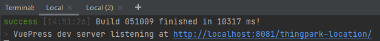

y# Overview
The Thingpark Location Engine documentation is a VuePress project.
All modifications could be done on all Markdown files, available in the docs folder.

## Prerequisites

Before running the project, you need to install the following:
* [NodeJS](https://nodejs.org/en/download/), needed to compile the VuePress project into an HTML website.
* [VisualStudio Code](https://code.visualstudio.com/download) or other IDE.

## Running the project

The following commands are all commands used to run the project.
These commands can be found in the package.json. 

* If you want to execute all the commands from the package.json, run the following command: ```npm run```

```json
{
  "docs:build:abeeway": "vuepress build docs abeeway",
  "docs:dev:abeeway": "vuepress dev docs abeeway",
  "docs:build": "vuepress build docs",
  "docs:dev": "vuepress dev docs"
}
```

Follow these steps in order to get your project working:

1. Install all the dependencies:

```
    npm install
```
2. Build the project with the following command:

```
    npm run-script docs:build
```
   
3. Open a new terminal and run the project with the following commands:

```
    npm run-script docs:dev
```

* You can access to the website by the link given in your terminal.


