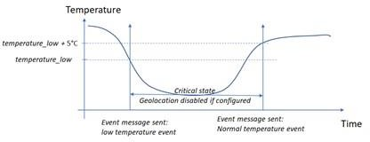

# Temperature monitoring

 This feature is supported by all Abeeway trackers.

This feature is designed to report temperature events when the temperature measured by the device is above or below the configured thresholds, *temperature_high* and *temperature_low* parameters. 
Each threshold is used independently.
The value 255 is used to disable the threshold and the temperature monitoring.
A specific action can be taken if the temperature exceeds one of the configured thresholds. Example: The geolocation can be deactivated. This action is configured via the parameter *temperature_action* which uses the thresholds *temperature_high* and *temperature_low*.
The temperature monitoring is enabled if one of the two thresholds is not set to the **disabled** value.
The temperature measurement is done periodically. If one of the configured thresholds is reached, a matching event is sent, and a critical state is entered until the temperature comes back to an acceptable value (refer to the [Temperature event](/AbeewayRefGuide/functioning/event-messages#temperature-event-all-operating-modes) section for details).

:::tip Notes
1.  The temperature measurement periodicity is 10 minutes if the tracker is in the critical state and 2 minutes otherwise. See the definition of critical state below.
2.  To come back in a normal state, the temperature should be either above the *temperature_low* + 5°Celsius or below the *temperature_high* - 5°Celsius.
3.  Disabling the geolocation during the critical state (configured via the parameter *temperature_action*) could be useful to preserve the battery.
4.  Temperature event payloads are sent only on state changes unless the geolocation has been disabled. In this case, geolocation uplinks are replaced by temperature event messages.
:::

Temperature Monitoring data is reported with an Event payload described in section: [Event message](/AbeewayRefGuide/uplink-messages/event/readme.md).