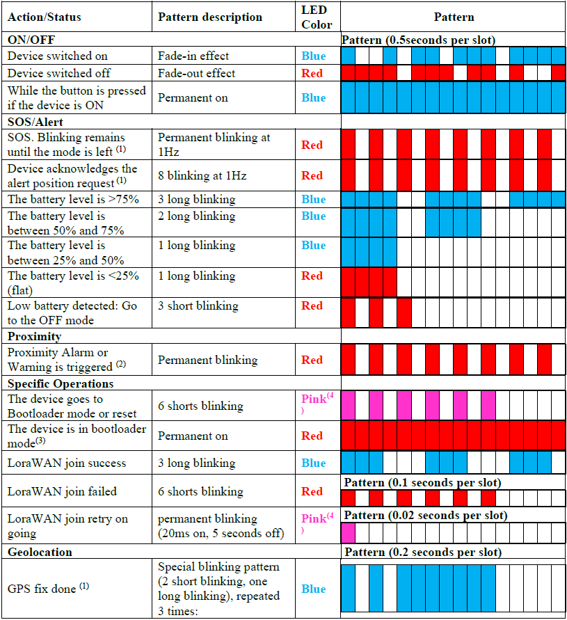

# User interfaces

 Depending on the trackers, some user interfaces can be unmounted.

|  User interfaces |  Trackers             |
|----------------------|----------------------------|
|  **Button**          |  Micro tracker Smart badge |
|  **LEDs**            |  Micro tracker Smart badge |
|  **buzzer**          |  Micro tracker Smart badge |
|  **Reed switch**     |  Compact tracker           |

## Button management

 The interface between the user and the tracker is performed via a
 button. It is configurable using a new parameter called
 *button_mapping.*

 3 actions are not configurable:

|  Sequence      |  Action         |  Output        |
|---------------------|---------------------|---------------------|
|One **press** when device OFF and good battery (3)|  Switch ON the tracker    |  LED pattern (See next section)  |
|One **long press** when device ON (4)               |  Go to the OFF mode, except if mode disabled or if the tracker is in SOS   |  Buzzer melody      |
|While the button is pressed when the device is ON   |                      |  Blue LED ON        |

5 actions are configurable:

| Action|Output           |
|-------------------------------------|---------------------|
|Battery level is shown with the LEDs |  LED pattern (See next section) |
|Trigger a start/ end of the SOS      |  LED pattern (see next section) |
|Trigger a position alert             |  LED pattern (see next section) |
|Add a tracker in the whitelist contact (proximity feature) (1) | None|
|Angle detection manual trigger (2)  |                                 |
|Special Sequence start               |  Buzzer "bip" and led blinking in Red and blue  |

**Notes**

(1) Refer to the dedicated application note [AN-007_proximity feature](https://actilitysa.sharepoint.com/:f:/t/aby/EgbhcfgQ-bZPrkYbQ7isqYYBPZkOHvKjhwmED46IDtiimA?e=m0AYsd) for more details

(2) For more details, please refer to the application note [AN-010_Angle Detection](https://actilitysa.sharepoint.com/:f:/t/aby/Evqx0qp6AQ1OqrI7-2DoIxsB1wKjLBjykfPh2p7Lo8mP7g?e=VrNdaS)

 Sequences for the above actions are the following:
-   Long press
-   Single short press
-   Double short press
-   3 or more short presses

The *press_duration* is also configurable via the *button_mapping* parameter. 

Special sequences that can be done after the "special Sequence start" button action has been done.

|  Sequence     |  Action         |  Output         |
|---------------------|---------------------|---------------------|
|1x click, Triple click or more, 1x Press (2)(7)|Enter the BLE bootloader|BLE firmware can be updated|
|1x click, Double-click, 1x Press (2)(3)(6)    |Enter the MCU bootloader|MCU firmware can be updated|
|1x click, 1x click, 1x Press (2)(3)           |Remove the BLE bond information|                    |

The tracker exits this mode if:
-   No button action is done within 10 seconds
-   a wrong sequence is performed

A "bip" is heard while the tracker is in special sequence mode. The LED is also blinking.

**Between 2 button sequences, a delay of 20 seconds must be respected**. If this delay is not respected the second sequence won't be considered.

:::tip Notes

(1) Refer to the [Low battery management](/functioning/low-battery-management/readme.md) topic for more details.

(2) **Click**: Press the button for less than 1 second

(3) **Press**: Press the button between 1 and *press_duration* +3 seconds

(4) **Long Press**: Press the button between (*press_duration +3) and (*press_duration* +7) seconds

(5) **Very Long Press or ESC Sequence:** Press the button **more than 14 seconds**. The tracker will play a beep every second during this time.

(6) **Double-click:** Press the button 2 times (The duration **between** the clicks is **less than 1 second**).

(7) **Triple-click:** Press the button 3 times (The duration **between** the clicks is **less than 1 second**).

(8) The default value of *press_duration* is 1 second (configurable via *button_mapping* parameter)
:::

## LED interface

The end user can observe the behavior of tracker via the LED interface. Several patterns have been defined for different outputs.

LED blinking patterns

:::tip Notes

1.  If configured on *config_flags* parameter.
2.  Refer to the dedicated application note [AN-007_proximity feature](https://actilitysa.sharepoint.com/:f:/t/aby/EgbhcfgQ-bZPrkYbQ7isqYYBPZkOHvKjhwmED46IDtiimA?e=m0AYsd) for more details.
3.  Only if bootloader is entered using the associated CLI command (Refer to the application note [AN-013_CLI_description](https://actilitysa.sharepoint.com/:f:/t/aby/Evqx0qp6AQ1OqrI7-2DoIxsB1wKjLBjykfPh2p7Lo8mP7g?e=VrNdaS))
4.  In some trackers you can have blue + red colors instead of pink color.
:::

## Buzzer melodies

The second interface from the tracker to the user is done via a buzzer. The volume can be managed using *buzzer_volume* parameter. Different melodies have been defined:

|  Meaning        |Explanation|  Melody         |
|---------------------|----|---------------------|
|**Device is resetting/ going to bootloader**||  Device reset|
|**Device is starting** ||  Switch on (Major rising scale)   |
|**Device is going to OFF mode** ||Switch off (Major falling scale)|
|**Low battery detected** || Low battery     |
|  **Tracker in SOS** ||  SOS                |
|  **SOS is left**    ||  SOS stop           |
|  **LoraWAN join success**||Join success melody (1)|
|  **Proximity**      |  Warning alert is triggered   |  Proximity warning  |
|                     |  Alarm alert state is triggered  |  Proximity alert    |
|                     |  A warning reminder is triggered |  proximity reminder 1 beep |
|                     |  An alert reminder is triggered  |  proximity reminder 2 beeps|
|**BLE communication**|  The tracker is not bound and waits for a bond|  BLE advertising    |
|                     |  Bond process unsuccessful or bond deleted       |  BLE bond failure or deleted  |
|                     |  Bond process successful      |  BLE bond success   |
|                     |  Alert activated from connected device using BLE or BLE link loss    |  BLE Link Loss/alert (2)|
|  **BLE geozoning**  |  Entering a hazardous area        |  BLE geozoning alert   |

:::tip Notes
(1) It is only played for micro tracker, Smart badges et compact trackers for their **first** join.

(2)  BLE Link Loss/alert melody has been modified in applicative firmware 2.3
:::

A zip file containing the different sounds (except proximity) can be found in the same folder as this document.

Refer to the dedicated application note [AN-007_proximity feature](https://actilitysa.sharepoint.com/:f:/t/aby/EgbhcfgQ-bZPrkYbQ7isqYYBPZkOHvKjhwmED46IDtiimA?e=m0AYsd) for more details about proximity feature.

## Reed switch interface

A reed switch is a physical switch operated by an applied magnetic field. The reed switch is only present inside the compact tracker. It is used when no button is mounted on the tracker. It can be configured with the *reed_switch_configuration* parameter (2):

-   **Act as a button**, the reed switch behaves as described in the Button management section above. A short magnetic field input is recognized as a short press, and a long input, as a long press.
-   **Specific behavior**, the reed switch sequence (1) generates a device reset:
-   **BLE connectivity**: The reed switch sequence (1) turns on the BLE advertisement (regardless the setting of the advertised bit in the *config_flags* parameter)

:::tip Notes

(1) In the configuration other than \"**Act as a button**\", the reed switch sequence is the following:
    -   A long activation of the reed switch (between 3 to 6 seconds)
    -   A long time without activation of the reed switch (between 3 to 6 seconds)
    -   A long activation of the reed switch (between 3 to 6 seconds)

(2)  In **Startup** mode, only one action is available and doesn't follow the configuration. The sequence described above is used to exit the **shipping** mode.
:::