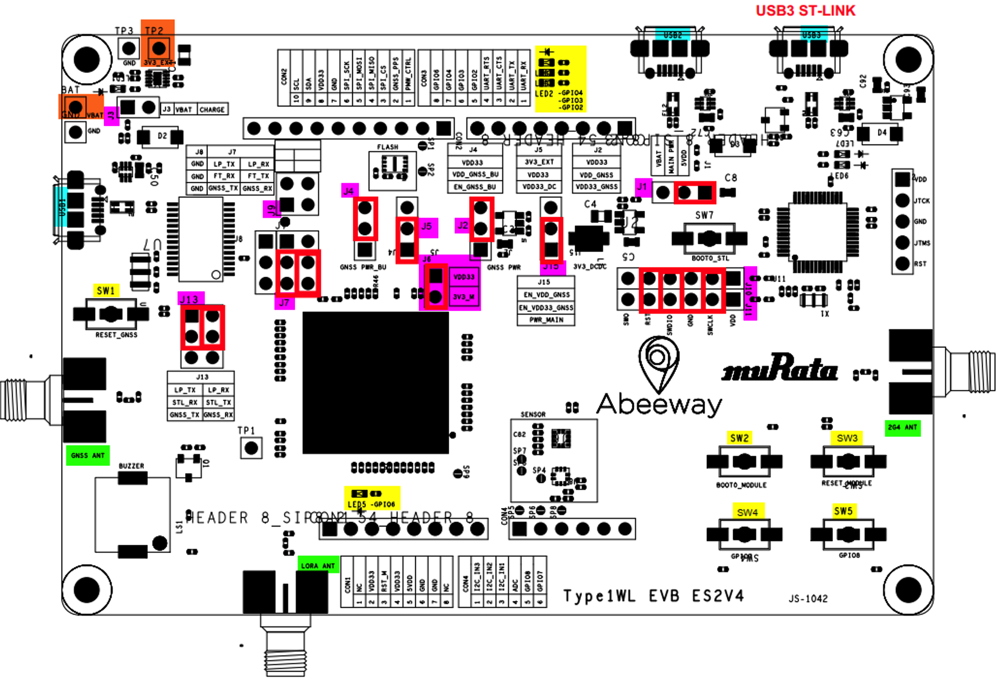
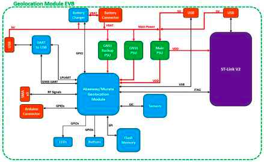

# Module Evaluation Kit Board (EVK) Introduction

The EVK is the evaluation kit for the ultra-low power geolocation module co-developed by [Murata](http://www.murata.com) and [Abeeway](http://www.abeeway.com). This kit allows to evaluate the geoloc module and develop the application firmware. The board gives a full access to all the functionalities of the module including: 

* 3 radio systems accessible with SMA connectors: Sub GHz, 25GHz, GNSS
* Digital interfaces such as I2C, LPUART, UART, SPI attached to a flash memory  
* GPIOs connected to arduino style connector, buttons and LEDs 
* Rich power management circuit with LDO adn charger to support external dc source, primary or secondary battery
* MEMS : accelerometer and pressure sensor attached to I2C interface  
* 3x USB port to supply board, ST-LINK interfaces to output data. 


## Flash the pre-compiled application

The easiest way to get started with the discovery kit is to flash the pre-compiled demo application on the module. Here are the key steps:
1.	Place the jumpers correctly as shown in the diagram below



2.	Download and install [STM32CubeProgrammer](https://www.st.com/en/development-tools/stm32cubeprog.html)
3.	Download the pre-compiled binary from [GitHub](https://github.com/Abeeway/abeeway-geolocation-module)
4.	Connect the Evaluation board through USB3 micro-USB port
5.	Flash the module binary into the board using STM32CubeProgrammer

::: warning WARNING
* For the detailed instructions on flashing the pre-compiled application into the EVK board, visit [here](https://actilitysa.sharepoint.com/:f:/t/aby/Evu48ACuFjhMmrAus6F6Kr8Bdn5Roz5ug5M67MHuVqpFqg?e=nI7vlE)
:::

## Using the Abeeway module SDK

The SDK on [GitHub](https://github.com/Abeeway/abeeway-geolocation-module) has example applications that can be compiled and loaded on the Evaluation Kit. 

Here are the main steps to compile and load the SDK into the module.

### Installing the Development Environment

#### Install the project files and set up the STM32CubeIDE project on your computer

1. Install [STM32CubeIDE](https://www.st.com/en/development-tools/stm32cubeide.html) on your computer

2. Clone the Abeeway Module SDK repository:

```
git clone https://github.com/Abeeway/abeeway-geolocation-module
```

3. Import the project into STM32CubeIDE

- Select the **File > Import > Existing Project** Into Workspace menu item
- Select the folder of the cloned **abeeway-geolocation-module** repo


#### Compile the demo app and install it on the Module

1. Compile the code by clicking on the 'Hammer' icon on the top of the STM32CubeIDE screen
2. Connect the Evaluation Board to your computer with an USB cable through USB_3 port.
3. Download the compiled firmware to the Abeeway Geolocation Module through the built-in ST-Link debugger
- Select the **Run > Run** menu item in STM32CubeIDE
4. Check that after the download was done, the device restarted and LED_3 is Blinking

#### Configure the Module for LoRaWAN connectivity
1. Use a Serial Terminal tool (e.g.: Teraterm, Putty, etc.) to connect your computer to the board and see the command line interface
- The serial port must be set to 57600 bauds, 8 data bits, no parity, one stop bit (8N1).
- The login pin is either **123** or **456**, The former provides normal user access, the latter provides super-user access, making different sets of CLI commands available.
- Use the help command to see the available command/parameter options. Commands may be abbreviated as long as they remain unambiguous.

2. Set the LoRaWAN connectivity parameters of the Module executing the following CLI commands:
- Erase the current config and set factory default configuration
```
settings erase
settings factory
```
- Set the your LoRaWAN region. (You see the possible region options by the the settings set region help command)
```
settings set region EU868
```

- Set the your selected activation type (OTAA or ABP)
```
settings set activation otaa
```

- Set the your JoinEUI and AppKey Feel free to change appkey/nwkkey. The AppKey and NwkKey must be the same!
```
settings set joineui 20635f000a000001
settings set appkey 00000000000000000000000000000000
settings set nwkkey 00000000000000000000000000000000
```

- Display your configuration and save it in the flash memory
```
settings display
settings save
```

3. Test the LoRaWAN connectivity
Provision your Module on your LoRaWAN Network Server, (Please note that its DevEUI was shown by the settings display command)
Open a new LoRaWAN connection on the module, join the network and check if the join was sucsessful. Execute the following CLI commands:
```
lora open
lora join 
lora status
```

4. Send a LoRaWAN test message (and chek in the logs of the network server if it has arrived correctly)
```
lora send aabbcc
```

::: warning WARNING
* For more details on the example applications and their usage, visit [here](https://github.com/Abeeway/abeeway-geolocation-module/blob/master/README.md)
:::

## Documentation

* [EVK First Flash instructions](https://actilitysa.sharepoint.com/:f:/t/aby/Evu48ACuFjhMmrAus6F6Kr8Bdn5Roz5ug5M67MHuVqpFqg?e=CYoNzT)
* [EVK User Guide](https://actilitysa.sharepoint.com/:f:/t/aby/EiX2Y8y8xhFCnn4DE78bWtkBpk2KVE9mOXlT7qOH0DFyyA?e=YS9t6h)
* [EVK Datasheet](https://actilitysa.sharepoint.com/:b:/t/aby/Eat2H1zqEbtEl8VBFMaOicIBk0q_FNdnkcAgFkY_unyISA?e=wda8xv)
* [Flashing the firmware](https://actilitysa.sharepoint.com/:b:/t/aby/ET5cthwckEFBtsDKI7FViYYBvYnug1R_VcTYmS9Hnbn2-A?e=GBDMXU)

## EVK Board Accessories datasheet
* [ISM antenna datasheet](https://actilitysa.sharepoint.com/:b:/t/aby/EboESMeA--hFrTeQ-DC5OOwBPwmW9nkFpLUL6Hl9_tj0zw?e=CqUdE5)
* [2.4GHz antenna datasheet](https://actilitysa.sharepoint.com/:b:/t/aby/EbOxQ_vr4wlGmPy9BSc_xtgB5GvzugESPLdeR9Wk9TJfVQ?e=pmuJc2)
* [GNSS antenna datasheet](https://actilitysa.sharepoint.com/:b:/t/aby/Een_GJ2bq7hAmshljs2QSaABRKdt5qDZXNH-F_3Cfm0B8w?e=S82SZH)


<figure>
  
</figure>
<center> EVK Block Diagram </center>