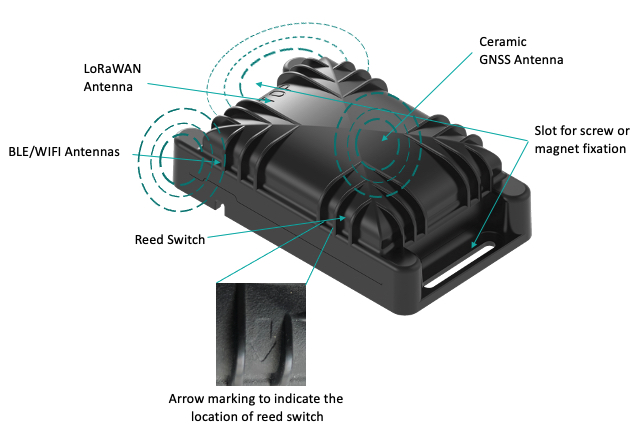

# Industrial Manageable ATEX Beacon

The beacon is a rugged, manageable, long lifetime beacon with Bluetooth and
LoRaWAN capabilities, designed for use in harsh and hazardous
environments. A versatile tool for various tracking and asset
monitoring applications that can be used in areas requiring
compliance with ATEX/IECEx safety standards. This innovative industrial beacon can be configured through BLE
using the Abeeway mobile app and managed over the air using
any LoRaWAN network, so supervision (e.g. battery level) and
configuration can be centralized. The intrinsically safe design
supports the stringent requirements of IECEx/ATEX zone 0,
including both Gas and Dust risks. Support for the Bluetooth®
5.0 standard makes the beacons compatible with all popular
smartphones and tablets.

## Applications
- Scalable Real-time Location Tracking (RTLS). Long battery life and centralized status monitoring of
beacon battery and other parameters over LoRaWAN reduces OPEX.
- Ideal manageable BLE anchor for indoor geolocation use cases for person or equipment tracking.Ideal
for use in hazardous and explosive environments which require IECEx/ATEX Zone 0/ Zone II certification.

## Key product features
- Support for Eddystone / iBeacon / Altbeacon / Quuppa beaconing
- Temperature and battery level monitoring
- LoRaWAN® Class A radio
- Waterproof enclosure (IP68); shock resistant (IK08)
- Firmware upgradable
- Replaceable AA batteries
- Modular fixation
- Abeeway mobile app for beacon configuration
- ATEX/IECEx certification

### Reed switch
The beacon is equipped with a magnet-activated reed switch (see figure above on the placement of reed switch on the beacon) which requires the end user to place and remove a magnet (in a specific sequence), next to the arrow to exit the shipping mode and trigger the LoRaWAN Join procedure.

#### Key precautions for activation of the beacon with a magnet
* Do not attempt to activate the beacon when in proximity of strong magnetic fields (ie, magnetic mounts)
* Use a strong enough magnet, and make sure you know where are the poles. A magnet that has been successfully tested with the reed switch can be purchased from [ThingPark Market](https://market.thingpark.com/abeeway-compact-tracker-magnets-reed-switch.html)
* You should always start the sequence with the magnet far away from the beacon to avoid false detection of the reed switch

#### Magnet sequence to activate the beacon
For MCU FW 2.2 and above, you need to carry out the following sequence with the magnet next to the reed switch:
::: warning WARNING
* The sequence below can be carried out multiple times without any interruption
* The latest beacons from the factory are activated by default in the join state. They need not be activated. However, if you do the above magnet sequence, it will restart the join procedure. You can also request [Abeeway support](../../../D-Reference/FAQ_R/) if the beacon is activated or not before being shipped to the customer.
* Once the beacon is activated with magnet, it will make LoRaWAN joins indefinately. There is delay between different join attempts which range from 15 minutes to 1 hour.
:::

* A long activation of the reed switch (between 3 to 6 seconds)
* A long time without activation of the reed switch (between 3 to 6 seconds)
* A long activation of the reed switch (between 3 to 6 seconds)

The example video below demonstrates the operation.
<html><iframe type="text/html" frameborder="0" allowfullscreen="1" src="https://www.youtube.com/embed/2t8zI3cbfys?" height="150px" width="300px"/></html>

::: warning WARNING
* For more information on the battery lifetime of the beacon, visit [here](../../D-Reference/PowerConsumption_R)
* For more information on beacon firmware documentation, visit [here](../../D-Reference/DocLibrary_R/AbeewayTrackers_R.md#TrackersRefGuide).
:::

### Standards and certifications

* LoRa Alliance: EU868, US915, AS923, AU915
* Radio: EC, FCC, IC, TELEC
* ATEX zone 0 (ordering option)
  - II 1G Ex ia IIC T4 Ga Ta -20 °C ... +40 °C
  - II 1D Ex ia IIIC T135°C Da Ta -20 °C ... +40 °C
* ATEX zone 2 (ordering option)
  - II 3G Ex ic nA IIC T4 Gc Ta -20 °C ... +40 °C
  - II 3D Ex ic tc IIIB T135°C Dc Ta -20 °C ... +40 °C
* IECEx (ordering option)
  - Ex ia IIC T4 Ga
  - Ex ia IIIC T135°C Da

::: warning WARNING
*  The latest information on certification can be found [here](/D-Reference/DocLibrary_R/AbeewayTrackers_R.md#certifications).
* The beacon is resistant to water but must never be placed either fully/partially submerged in water or under the influence of high pressure water spray jets for significantly long periods of time. To avoid water entering in the casing, the beacon must not be placed upside down. 
* **The warranty of the beacon is avoid if used incorrectly**.
:::

### Datasheet
The datasheet of the beacon can be downloaded from [here](/D-Reference/DocLibrary_R/AbeewayTrackers_R.html#data-sheets).