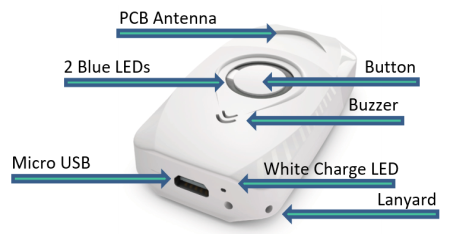
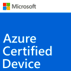

# Micro tracker
The Abeeway micro tracker is a multi-mode tracker combining **GPS**, **Low Power-GPS (LP-GPS)**, **Wi-Fi**, **LoRaWAN®** and **BLE** radios with embedded sensors to support accurate **outdoor** and **indoor** geolocation. This low-power location device tracks and **locates anything, anyone, anytime** at a **low cost** of ownership. 
Its **small size** and **long battery lifetime** make the micro tracker the **ideal product for numerous tracking applications**. It is simple to use, and a single button gives access to numerous functionalities that can be personalized for specific application needs. It can be used to keep track of assets and valuables, and to improve safety and security. 

::: warning WARNING
The **Micro USB charging/data cable** and lanyard are not included with the tracker and need to be purchased separately.
:::

## Key product features
Abeeway micro tracker provides you with the flexibility you need to adapt your tracker's behavior to your use case, selecting the right operating mode and geolocation technology.

### Multiple operating modes

* **Motion tracking** : Tracker reports real-time position only when motion is detected. This is the default configuration that you can discover in this guide.
* **Permanent tracking** : Tracker reports periodic real time positions.
* **Start/End motion tracking** : Tracker reports positions only at the start and end events of the motion.
* **Position on-demand** : Tracker sends its position only when requested from the end-user (very low power operating mode). The position request can be made from the geolocation backend platform or by using special button sequence on the micro-tracker.
* **Activity tracking** : Monitor activity rate with embedded sensors.
* **OFF** : Tracker is switched off.

### Geolocation technologies

* **GPS** : For **precise outdoor** positioning
* **Low Power-GPS (LP-GPS)** : For **power-efficient outdoor** and **daylight indoor** positioning
LP-GPS is an Abeeway proprietary technology based on GPS. Enabling Fast Time to First Fix, it results in **improved battery lifetime**.
* **Wi-Fi** : For **indoor** and **outdoor** location services in **urban areas**
It leverages the Wi-Fi access point scanning capabilities of the micro tracker.
* **BLE** : For **indoor** positioning, it leverages Bluetooth scanning capabilities of the micro tracker to send BLE beacons and their detected RSSIs to your application.

### Other features
* User interface: **Buzzer**, **LEDs**, **Multi-mode button**
* **Temperature** monitoring
* **LoRaWAN® Class A radio**
* Water-spray resistant enclosure ( **IP65** )
* Geofencing zone detection
* Edge computing for Proximity detection and exposure assessment
* Temperature monitoring
* BLE Communication link with a phone
* ATEX Zone 2 Certified for explosive atmosphere (see Datasheet, specific SKUs only)
* Firmware Upgrade via USB or Bluetooth
* 450mAh rechargeable battery
* BLE scan function for inventory of tools and accessories
* Indoor BLE/WiFi fingerprinting with HERE Tracking or Combain (requires subscription)
* Indoor BLE based geolocation with Quuppa Intelligent Location (requires Quuppa infrastructure)
* BLE based safe/hazard zone detection

### Standards and Certifications
* LoRa Alliance: EU868, US915, AS923, AU915
* Radio: EC, FCC, IC, TELEC
* ATEX Zone 2 (ordering option):
  - II 3 G Ex ic IIB T4 Gc (-20°C ≤ Tamb ≤ +40°C)
  - II 3 D Ex ic IIIB T135°C Dc (-20°C ≤ Tamb ≤ +40°C)

::: warning WARNING
 * The datasheet of the tracker can be downloaded from [here](/D-Reference/DocLibrary_R/AbeewayTrackers_R.html#data-sheets).
 * The latest information on certification can be found [here](/D-Reference/DocLibrary_R/AbeewayTrackers_R.md#certifications).
 * For more information on the battery lifetime of the tracker, visit [here](../../D-Reference/PowerConsumption_R)
* For more information on tracker documentation, visit [here](../../D-Reference/DocLibrary_R/AbeewayTrackers_R.md#reference-guides-and-tools).
 * The tracker must not be left with a low or completely discharged battery for more than a month. We recommend to periodically charge the tracker at least once a month. 
 * The tracker is resistant to water but must never be placed either fully/partially submerged in water or under the influence of high pressure water spray jets for significantly long periods of time. 
 * **The warranty of the tracker is avoid if used incorrectly.**
:::
