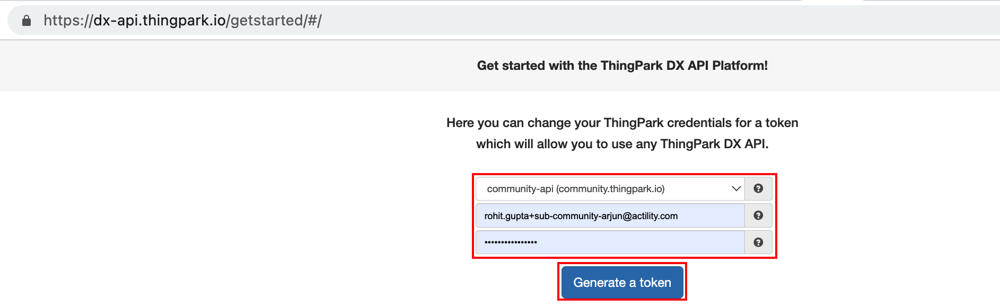

# Using ThingPark Location API
ThingPark Location provides developers with a comprehensive set of web-services based on the ThingPark DX framework.
The following API are to be considered when interfacing with ThingPark Location.

## Push locations to external application server

This section outlines the basic steps to configure ThingPark Location to send locations to external application server.

1. The first step is to authenticate with ThingPark Location using your credentials. If you are using community platform, see [here](https://dx-api.thingpark.io/getstarted/#/). For other platforms, see [here](/D-Reference/ThingParkLocationURLs/#how-to-create-a-free-account).

2. Once authenticated, you can access the ThingPark Location API documentation and swagger UI to interact with APIs.

2. Goto Connector module and configure the URL of the external application server.

You should see ThingPark Location making JSON posts to external application server for the future positions sent by the tracker.

## DX Admin API
DX Admin API provides a standard-based token management and administration features for the ThingPark DX API platform.
### Useful links

| DX Admin API | Resource | 
| ------------ | -------- | 
| **DX Admin Swagger UI** | [https://dx-api.thingpark.io/admin/latest/swagger-ui/index.html?shortUrl=tpdx-admin-api-contract.json](https://dx-api.thingpark.io/admin/latest/swagger-ui/index.html?shortUrl=tpdx-admin-api-contract.json) | 
| **DX Admin latest documentation** | [https://dx-api.thingpark.io/admin/latest/doc/index.html](https://dx-api.thingpark.io/admin/latest/doc/index.html) | 

## DX Location API
The purpose of this API is to provide the best experience for all developers who intend to interface their application with ThingPark Location features.
### Modules

<html>
<table>
    <tr>
        <th>
            Module
        </th>
        <th>
            Description
        </th>
    </tr>
    <tbody>
    <tr>
        <td>
            <strong>Binder module</strong>
        </td>
        <td>
            
API providing binder configuration and query capabilities on top of theThingPark Location solution.The Binder module has:

            <ul>
                <li>
                    Southbound interface ofThingPark Location , usually interfacing with LoRaWAN® network servers.
                </li>
                <li>
                    Feed API interface to integrate with third party LoRaWAN® network servers.
                </li>
            </ul>
        </td>
    </tr>
    <tr>
        <td>
            <strong>Tracker command module</strong>
        </td>
        <td>
            
Tracker command operations are used to send downlink commands to supported Abeeway trackers.

        </td>
    </tr>
    <tr>
        <td>
            <strong>Connector module</strong>
        </td>
        <td>
            
API providing connector configuration capabilities on top of the ThingPark Location solution.The Binder module has the northbound interface of ThingPark Location, usually interfacing with IoT application servers.

        </td>
    </tr>
    <tr>
        <td>
            <strong>Driver module</strong>
        </td>
        <td>
            
API providing ability to encode or decode Abeeway tracker payloads.

        </td>
    </tr>
    <tr>
        <td>
            <strong>Alarm configuration module</strong>
        </td>
        <td>
            
API providing operations to enable notifications on tracker parameters and configure geofences.

        </td>
    </tr>
    <tr>
        <td>
            <strong>Firmware Update module</strong>
        </td>
        <td>
            
API providing operations to retrieve the firmware binaries

        </td>
    </tr>
    <tr>
        <td>
            <strong>Key Management module</strong>
        </td>
        <td>
            
API providing operations to store the Keys for Operator interface configuration to integrate with LoRaWAN® Network servers

        </td>
    </tr>
    <tr>
        <td>
            <strong>Notification module</strong>
        </td>
        <td>
            
API providing operations to configure push notifications to be sent to the Abeeway Mobile APP

        </td>
    </tr>
    <tr>
        <td>
            <strong>Profile Management module</strong>
        </td>
        <td>
            
API providing operations to manage the profiles of Abeeway trackers

        </td>
    </tr>
    <tr>
        <td>
            <strong>Location Integration module</strong>
        </td>
        <td>
            
API providing operations to register/de-register the tracker to the Abeeway Mobile APP

        </td>
    </tr>
    </tbody>
</table>
</html>

### Useful links

| DX Location API | Resource | 
| --------------- | -------- | 
| **DX Location Swagger UI** | [https://dx-api.thingpark.io/location/latest/swagger-ui/index.html?shortUrl=tpdx-location-api-contract.json](https://dx-api.thingpark.io/location/latest/swagger-ui/index.html?shortUrl=tpdx-location-api-contract.json) | 
| **DX Location - Binder module documentation** | [https://dx-api.thingpark.io/location/latest/doc/index.html](https://dx-api.thingpark.io/location/latest/doc/index.html) | 
| **DX Location - Tracker Command module documentation** | [https://dx-api.thingpark.io/location-trackercommand/latest/doc/index.html](https://dx-api.thingpark.io/location-trackercommand/latest/doc/index.html) | 
| **DX Location - Connector module documentation** | [https://dx-api.thingpark.io/location-connector/latest/doc/index.html](https://dx-api.thingpark.io/location-connector/latest/doc/index.html) | 
| **DX Location - Driver Module documentation** | [https://dx-api.thingpark.io/location-driver/latest/doc/index.html](https://dx-api.thingpark.io/location-alarm-config/latest/doc/index.html) | 
| **DX Location - Alarm Config module documentation** | [https://dx-api.thingpark.io/location-alarm-config/latest/doc/index.html](https://dx-api.thingpark.io/location-alarm-config/latest/doc/index.html) | 
| **DX Location - Location Integration Module documentation** | [https://dx-api.thingpark.io/location-integration-module/latest/doc/index.html](https://dx-api.thingpark.io/location-integration-module/latest/doc/index.html) | 
| **DX Location - Key Management Module documentation** | [https://dx-api.thingpark.io/location-key-management/latest/doc/index.html](https://dx-api.thingpark.io/location-key-management/latest/doc/index.html) | 
| **DX Location - Notification Module documentation** | [https://dx-api.thingpark.io/location-notification/latest/doc/index.html](https://dx-api.thingpark.io/location-notification/latest/doc/index.html) | 
| **DX Location - Firmware Update Module documentation** | [https://dx-api.thingpark.io/abeeway-firmware-update/latest/doc/index.html](https://dx-api.thingpark.io/abeeway-firmware-update/latest/doc/index.html) | 
| **DX Location - Profile Management Module documentation** | [https://dx-api.thingpark.io/location-profile-management/latest/doc/index.html](https://dx-api.thingpark.io/location-profile-management/latest/doc/index.html) | 

You can find more information on using ThingPark Location API, [ThingPark Location Training](https://actilitysa.sharepoint.com/:f:/t/aby/EqVIEMaqJfVHoNAi90G068UB8K4HMfB1t2eyttWIGlIwbQ?e=aqnuDd).

If you are using some other ThingPark Location platform, see [ThingPark Location Platform URLs](/D-Reference/ThingParkLocationURLs/)

