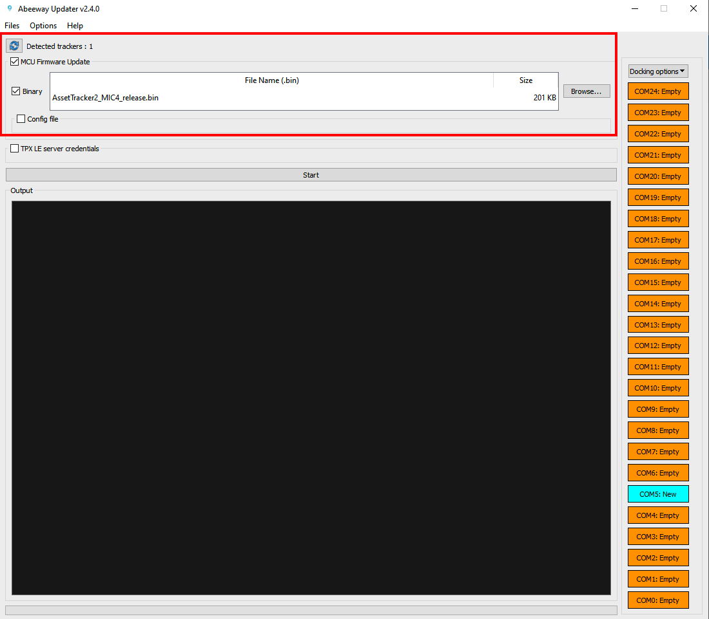

# Reset the tracker and re-join the LoRaWAN network

Your tracker is a LoRaWAN® OTAA device that needs to do a join request to attach the LoRaWAN® network and get a join accept from it. 

If necessary, you can force a new join request for a tracker that is already joined for example to attach it to a new network. You can also use this procedure to troubleshoot and reset the tracker.

## Resetting the tracker with LoRaWAN downlink

The above button sequences only reset the tracker to the configuration that was saved in the tracker. For more information on resetting the device with downlink, visit [Abeeway trackers Reference Guide](https://docs.thingpark.com/thingpark-location/D-Reference/DocLibrary_R/#reference-guides-and-tools), Section: Reset the device.

If you wish to reset the tracker with LoRaWAN downlink, there are three options:

1. **Reset the device (keeping the current configuration):** Send the downlink **ff010100** on LoRaWAN port=2 
2. **Reset the device (revert to the original config file that was flashed in the tracker):** Send the downlink **ff010101** on LoRaWAN port=2
3. **Reset the device (revert to the original config file that was flashed in the tracker and also remove Bluetooth bond):** Send the downlink **ff010102** on LoRaWAN port=2

## Resetting the tracker to factory default configuration

The above button sequences only reset the tracker to the configuration that was saved in the tracker. The factory default configuration can be found in the [Abeeway trackers Reference Guide](https://docs.thingpark.com/thingpark-location/D-Reference/DocLibrary_R/#reference-guides-and-tools), Chapter: Factory default Configuration.

<html>

<a href="../../D-Reference/AbeewayFirmwareUpdate_R/" style="color:teal">Abeeway Updater</a> can be used to reset the tracker to factory default if the MCU firmware update is carried out <b>without the config file</b>. The tracker is reset to factory default settings. 

</html>

