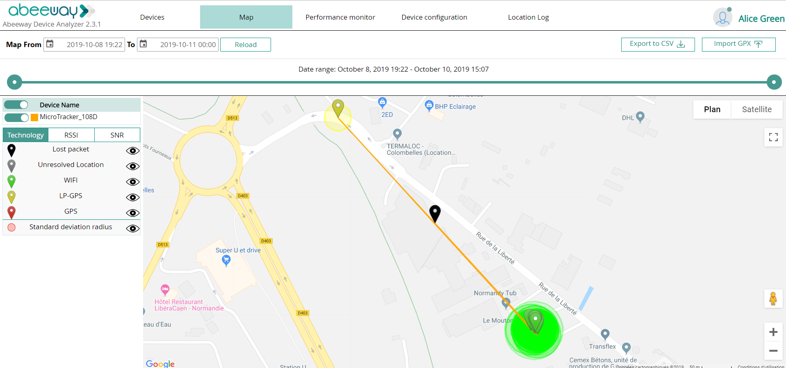

# Tracking your assets
You can track your assets locations on a map and assess your tracker performance.
::: warning Before you begin
 * We recommend you do a drive or walk test with your tracker to display and analyze a number of reported locations. You can also place the tracker in a moving asset you want to locate.
 * The tracker must be provisioned on a ThingPark platform. To create a free account, see [ThingPark platforms URLs](/D-Reference/ThingParkLocationURLs/).
:::

1. Log in to Abeeway Device Manager using the URL that applies to your environment.For example: 
    * Abeeway Device Manager on [ThingPark Community platform](https://community.thingpark.org/) : [here](https://community.thingpark.io/thingpark/abeewayDeviceAnalyzer/index.php?dxprofile=community-api) 

    * Abeeway Device Manager on IoT platform: [https://iot.thingpark.com/abeewayDeviceAnalyzer/?dxprofile=iot](https://iot.thingpark.com/portal/web/) 
If using another platform, see [ThingPark platforms URLs](/D-Reference/ThingParkLocationURLs/). 

2. In the **Select Devices** column of Abeeway Device Manager, select the tracker you want to see the location, and click **Select**. 
-> The tracker appears in the **Selected Devices** column.
::: tip Note
 You can select up to ten trackers to be shown and analyzed at the same time.
:::

3. In the **Device Analysis Dashboard** that opens, the tracker you have selected displays its status details and statistics. Click the arrow to expand the tracker information. The information relevant to notice is:
    * **MCU Firmware** : If need be, gives the tracker's MCU firmware version to refer to the relative [Asset Tracker Driver User Guide](/D-Reference/DocLibrary_R/#AssetTrackerDriver) to know the supported features.
    * **First Position** and **Last Position** of the tracker
    * **Last Mode** : Current mode of the tracker
    * **Battery** : Percentage of remaining battery
    
4. Click the **Map** tab to see the reported locations of your tracker.
    * Once you have located your tracker positions on the map, **zoom** in or out to get the best view of them.
    * Click all the **eyes** to close them, then click them again slowly one by one to display each packet separately and discriminate the information. When **Standard Deviation Marker** is selected, a green circle is displayed around the location representing the position accuracy.
    * Click a **marker** to display more information.
    * Use the **slider** slowly to monitor a period of time where you want to display locations on the map accordingly.
    
5. Click the **Performance monitor** tab to display statistics about your tracker.
    * When opening, only the **battery** chart is displayed.
    * Click the **eyes** to display more charts.
    * Pause the mouse over the charts to display the date and details of the packets.
    * Use the **slider** to change the monitoring period range. 
    ::: tip Note
    For a given tracker, all the sliders are synchronized between each other.
    :::
    
6. For more information about how to use Abeeway Device Manager, see [Abeeway Device Manager User Guide](/D-Reference/DocLibrary_R/#ADMUserGuide).
