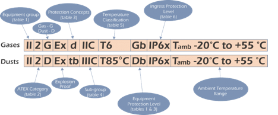
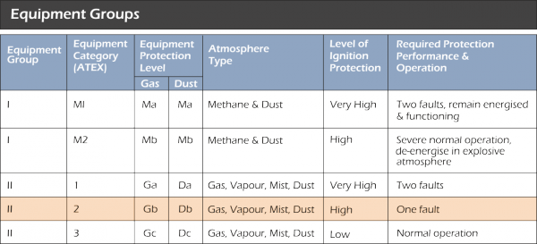
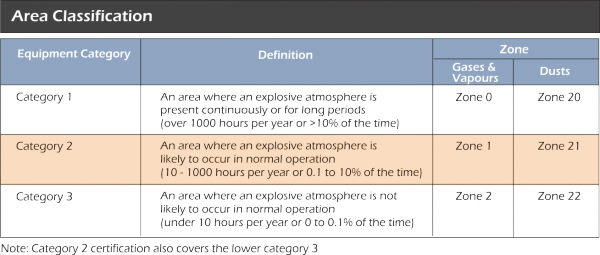
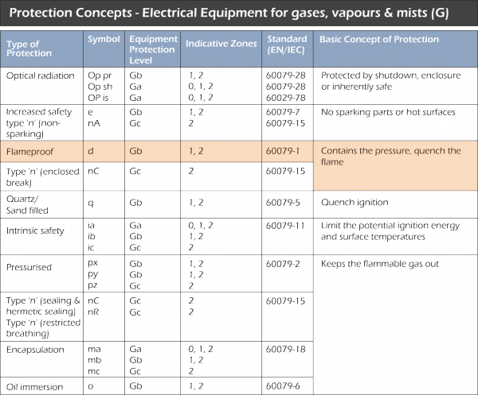
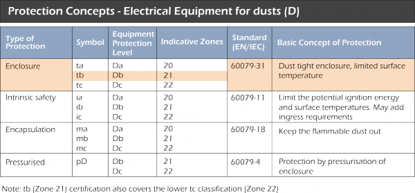
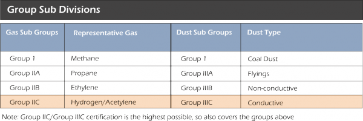
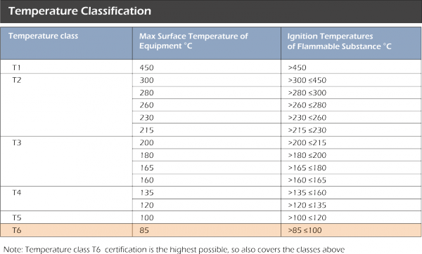
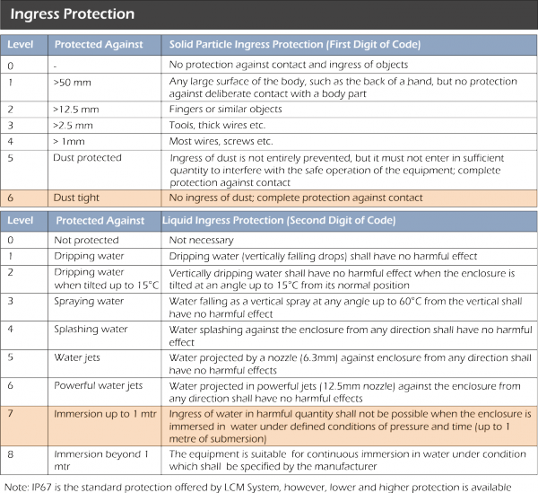

# Decoding the ATEX/IECEx Markings

## Introduction
This section describes the different elements of ATEX/IECEx markings and how to interpret them.

## Table 1 - Equipment Groups
There are two equipment groups - Group I, which concerns mines and is very restrictive due to the highly volatile methane gas and dusts present, and Group II, which relates to all other above ground industries.

## Table 2 - ATEX Categories
There are three area category types, with Category 1 requiring a very high level of protection and defined as an area having a permanant or prolonged risk of explosions (Zone 0), Category 2 which requires a high level of protection and has a frequent risk of an explosive mix being present in the air (Zone 1), and Category 3, specified as requiring a normal level of protection with a small chance of an explosive mix forming (Zone 2).

## Table 3 - Protection Concepts
Protection concepts refer to the means of ensuring a piece of equipment being used in a hazardous area does not cause an explosion. There are four basic methods utilised to avoid uncontrolled ignitions - exclusion of the flammable substance, prevention of component sparks or hot surfaces, explosion quenching and energy limitation. By applying individually or in combination, the protection concepts listed below are applied to a product in order to achieve this.

## Table 4 - Gas Sub-Groups
The ATEX standard also has a classification for explosive gases and dusts, with Group I referring to methane gases and coal dust (mining), while Group IIA to IIC gases and Group IIIA and IIIC dusts (above ground industries) have been categorised according to their different igniting power, with IIA/IIIA being the least dangerous and having the highest ignition temperature and IIC/IIIC the most dangerous with the lowest ignition temperature.

## Table 5 - Temperature Classification
Different substances may combust at different temperatures. The lower the combustion temperature is, the more dangerous the substance is. Therefore, each piece of equipment used in an explosive environment is classified according to the maximum surface temperature it generates. The maximum surface temperature of the equipment should always be well below the ignition temperature of the gases present.

## Table 6 - Ingress Protection Levels
This rating system (or IP code) is defined by the letters IP followed by two 'characteristic' numbers. The first number identifies the degree of protection against solid foreign objects and the second number refers to its protection against liquids.

