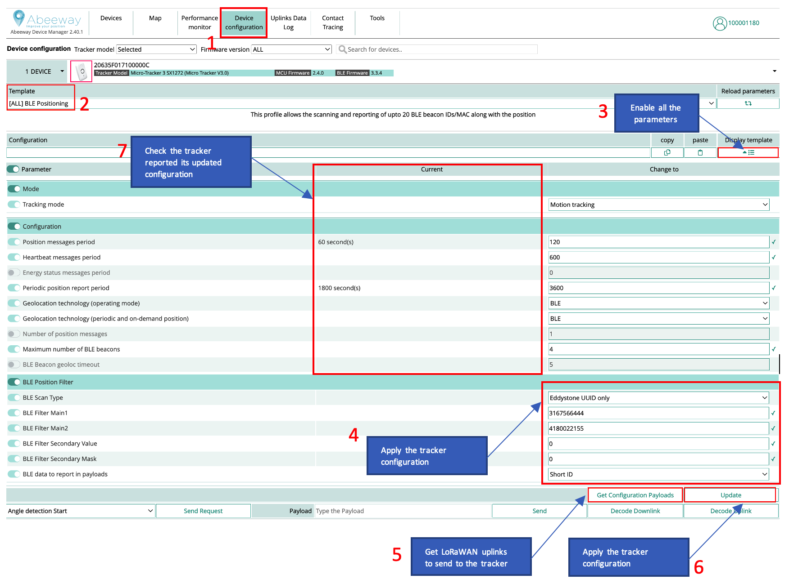
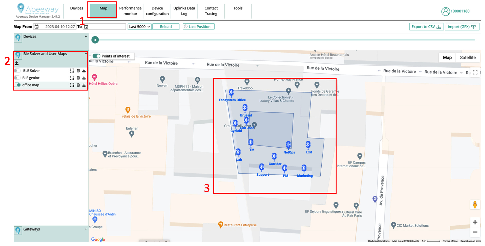

# Setting up indoor geolocation using Bluetooth beacons

This section describes the step by step procedure to use Bluetooth beacons with Abeeway trackers and ThingPark Location Engine.

We assume that the tracker is already connected to LoRaWAN network server and the LoRaWAN uplinks are routed to ThingPark Location (see [here](/C-Procedure-Topics/ProvisionTrackerOverview_T/) for more details).

## Tracker Placement
It is important that the tracker is placed without any obstructions (for ex. human body, metallic objects, etc) blocking the Bluetooth antenna. The tracker placement instructions are below:
1. [Micro Tracker](/B-Feature-Topics/MicroTrackerPlacement_C/)
2. [Smart Badge](/B-Feature-Topics/SmartBadgePlacement_C/)
3. [Industrial Tracker](/B-Feature-Topics/IndusTrackerPlacement_C/)
4. [Compact Tracker](/B-Feature-Topics/CompactTrackerPlacement_C/)
5. [Industrial Manageable ATEX Beacon](/B-Feature-Topics/IndustrialManageableATEXBeaconPlacement_C/)

## Tracker Firmware versions
We highly recommend to update the tracker to the latest [MCU and BLE Firmware version](/D-Reference/IdentifyTrackerModel/). The firmware update instructions are [here](/D-Reference/FirmwareUpdateOverview_R/).

## Configuring the tracker using Abeeway Device Manager (ADM)

The next step is to configure the tracker with the right parameters using Abeeway Device Manager (ADM). 



Here are the steps:

1. Goto Device Configuration tab.
2. Select the **BLE positioning** template.
3. Enable all the firmware parameters.
4. Apply the necessary BLE positioning filters. We recommend to apply these filters so the tracker will pick up only the beacons configured for your use case. For more information on applying the BLE positioning filters, see [BLE Position Filtering training](/D-Reference/DocLibrary_R/AbeewayTrackers_R.md#abeeway-firmware-trainings) and [AN-006_Position_BLE_filtering](/D-Reference/DocLibrary_R/AbeewayTrackers_R.md#application-notes)
5. Get the LoRaWAN configuration payloads that can be sent on LoRaWAN port = 2 with the network server. This step is not required when using Abeeway Device manager to send LoRaWAN downlinks.
6. Apply the tracker configuration which will result in multiple downlinks.
7. Ensure the tracker configuration is applied correctly. The tracker will send the uplinks to indicate its tracker configuration which will be visible in Abeeway Device Manager.

::: warning Note
Even if you plan to use your own location solver, we recommend to use ThingPark X Location Engine (TPX-LE) when preparing your tracker for first use for the following reasons:
- **Support for Low-Power GPS (LP-GPS) feature which allows faster GNSS fix with much lower power consumption on the tracker.**
- Support for averaging and filtering of positions with multiple geolocation technologies (GPS/LP-GPS/WiFi/Bluetooth) in the backend to remove outliers.
- Visualizations of positions in the map with various filtering options using [Abeeway Device Manager](/B-Feature-Topics/AbeewayDeviceManager_C/).
- Easily change the tracker's configuration with pre-configured templates using [Abeeway Device Manager](/C-Procedure-Topics/ChangeTrackerConfiguration_T/). 
- The tracker configuration can also be changed using [ThingPark Location APIs (Downlink tracker command)](https://dx-api.thingpark.io/location-trackercommand/latest/doc/index.html). Note: The URL is for ThingPark Location on Community platform. For other platforms, see [here](/D-Reference/ThingParkLocationURLs/).
:::

## Ensure tracker's LoRaWAN configuration for high capacity use cases
If you are setting *ul_period* to smaller values (for example 15 sec), then the tracker will generate uplink every 15 seconds. This will result in very high LoRaWAN throughput. It is important in this scenario to force the tracker configuration to LoRaWAN date rates that can accommodate high throughput or the tracker will reset itself after some time as firmware will have too many uplinks which will be buffered and cannot be sent due to duty cycle or regional restrictions. For more information on setting the specific LoRaWAN data rates, please refer to [AN-002_LoRa_Transmission_strategy](/D-Reference/DocLibrary_R/AbeewayTrackers_R.md#application-notes).
::: warning Warning
**It is important to dimension the LoRaWAN network for high capacity use cases to ensure the network can appropriately handle the traffic without loss.**
:::

## Beacon Configuration considerations

::: warning Warning
**Please review the section: Beacon settings & Calibration in [BLE Position Filtering training](/D-Reference/DocLibrary_R/AbeewayTrackers_R.md#abeeway-firmware-trainings) to ensure the trackers and beacons are correctly configured. Faulty beacon or tracker configuration will result in incorrect location resolution from Thingpark location.**
:::

### Beacon Advertising interval

The beacon advertising interval has direct impact on:

- Battery lifetime: a smaller value of advertising interval will consume the battery of beacon faster
- Latency of detection: Larger advertising duration results in larger latency for beacon detection, but also improves the battery lifetime of the beacon.  

In order to ensure that the beacon is correctly detected by the tracker when the tracker is sniffing the beacon, you must ensure</br> the following condition:

*Beacon_advertising_interval << ble_beacon_timeout*</br>
In general, you can set *beacon_advertising_interval = ble_beacon_timeout/10*

If different models of beacons are used, you must ensure the same Advertising Interval value is set on all of them

### Beacon transmit power

If different models of beacons are used, it is important to ensure all the beacons have the same output power. If the beacon is capable of advertising on several slots, we recommend to use only 1 advertising slot to save beacon battery.

## Upload the Geojson file in Abeeway Device Manager
Once the tracker configuration is applied correctly, you can upload the Geojson file which contains the coordinates of the BLE beacons inside the building. 



Here are the steps:

1. Goto the Map tab of Abeeway Device Manager
2. Upload the geojson file in ThingPark X Location Engine. The geojson file example can be retrieved from [ThingPark Location APIs (Alarm Config Module)](https://dx-api.thingpark.io/location-alarm-config/latest/swagger-ui/index.html?shortUrl=tpdx-location-alarm-config-api-contract.json#/Bluetooth%20map/post_bluetoothMap). Note: The URL is for ThingPark Location on Community platform. For other platforms, see [here](/D-Reference/ThingParkLocationURLs/). The geojson file can also be uploaded using this endpoint.


3. Once the file is uploaded, you should see it in the map tab of Abeeway Device manager.

## Visualization of tracker location
Once the tracker starts to send uplinks with Bluetooth beacon IDs, you can see the location of the tracker in the map view.

## Configure ThingPark Location to send uplinks to external application server
[ThingPark Location Connector module](https://dx-api.thingpark.io/location-connector/latest/doc/index.html) can be used to send the locations to the external application server.


The position from the Bluetooth solver is inside the JSON object [ResolvedPosition](https://dx-api.thingpark.io/location-connector/latest/doc/index.html#resolvedposition). You can find the example JSON object that is sent when ThingPark Location resolves Bluetooth position [here](/D-Reference/tpxle-sample-payloads-main_R/tpxle-output-position-ble.md).


```
{
  "deviceEUI" : "20635f028100003e",
  "time" : "2022-09-02T08:04:25.731Z",
  "customerId" : "100009247",
  "modelCfg" : "1:TPX_ba3df8fb-bc93-45ee-aa0d-b2f873b9bbc6",
  "dxProfileId" : "community-api",
  "coordinates" : [ 103.924992, 1.3143296, 0.0 ],
  "age" : 0,
  "validityState" : "NEW",
  "horizontalAccuracy" : 129,
  "incomingSubscriberId" : "100009247",

....

}
```


## Setting up Geofencing to receive alerts when the tracker enters/leaves the geofence zone

[ThingPark Location Alarm Config module](https://dx-api.thingpark.io/location-alarm-config/latest/swagger-ui/index.html?shortUrl=tpdx-location-alarm-config-api-contract.json) can be used to setup the Geofence for the tracker. Once the tracker enters/leaves or leaves the geofence, ThingPark Location will send [alarm object](https://dx-api.thingpark.io/location-connector/latest/doc/index.html#alert) to the external application server configured in the [connector module](https://dx-api.thingpark.io/location-connector/latest/doc/index.html)


The following is an example [GeofenceAlarm](https://dx-api.thingpark.io/location-connector/latest/doc/index.html#geofencealarm) JSON object that is sent by ThingPark Location to the application server when the tracker enters the geofence configured by the user.

``` 
{
  "deviceEUI": "20635f028100003e",
  "geofenceAlarm": {
    "geofence": {
      "circleRegion": {
        "centerCoordinates": [
          103.925065,
          1.31458
        ],
        "radius": 100
      },
      "deviceEUIList": "20635F028100003E",
      "icon": "http://abeeway.com",
      "name": "TestGeofenceYanik",
      "ref": "1cc7f58e-ee31-4550-993d-503bcbd2c698",
      "regionShape": "CIRCLE",
      "transition": {
        "notifyByEmail": true,
        "notifyOnInterface": true,
        "type": "ENTERING_LEAVING"
      }
    },
    "transition": "ENTERING"
  },
  "time": "2022-09-05T00:59:10.124Z",
  "typeAlarm": "GEOFENCE"
}
```
