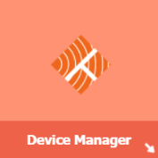

# Provisioning your trackers on ThingPark Wireless
This task consists of configuring your trackers on ThingPark Wireless Device Manager to forward all packets to and from the application server provided by Actility on its platform.
## Creating an AS routing profile
You need to create an AS routing profile and add the ready-to-use Actility's application server as a destination.
:::warning Before you begin
 In your delivery note, get your credentials to access a ThingPark Wireless platform and the name of the ThingPark Location application server.
:::
&nbsp;
1. Log in to ThingPark Wireless Device Manager using for example the IoT platform: [https://iot.thingpark.com/portal/web/](https://iot.thingpark.com/portal/web/) 
   If using another platform, see [ThingPark platforms URLs](/D-Reference/ThingParkLocationURLs/). 

2. If ThingPark User Portal opens, click the white arrow to access Device Manager.

3. In the navigation panel, click **AS routing profiles**.
4. In the **AS routing profiles** panel that opens, click **Create** in the **Add AS routing profiles** frame.

5. In the **New AS routing profile** dialog box that opens, enter or select the following information:

| &nbsp; | Information | 
| - | ----------- | 
| **Name** |  A name for the AS routing profile | 
| **Type** |  **LoRaWAN** | 

6. Click **Create**.

The AS routing profile opens in edit mode.

7. In the **Destinations** frame of the **AS routing profiles** panel, click **Add**.

8. In the **Add destination** dialog box, select the following information:

| &nbsp; | Information | 
| - | ----------- | 
| **Type** |  **Supplier application server** | 
| **Supplier** |  **Actility** | 
| **Destination** |  **ThingPark Location** | 

9. Click **Add**. 
The application server appears in the **Destinations** frame.

10. Click **Save** in the **AS routing profile** panel. 
The **Status** frame is updated. 
:::tip Note
 If not done when creating the tracker, the AS routing profile is ready to be allocated to the tracker.
:::

## Creating your tracker
To provision your tracker on your ThingPark Wireless platform, you need to create a device in Device Manager. Your tracker is a LoRaWAN® OTAA device. 
At the same time, you will associate it with the AS routing profile you have created, and that you have attached to the application server provided by Actility.
:::warning Before you begin
 Get the DevEUI, AppEUI, and AppKey of the tracker provided in your delivery note.
:::
1. In the navigation panel of Device Manager, click **Devices** to open the **Devices** panel. 

2. In the **Add devices** area, click **Create**.

The **New device dialog** box appears with LoRaWAN® OTAA configuration.

3. In the **Administrative data** frame, enter the following information:

| &nbsp; | Information | 
| - | ----------- | 
| **Device name** |  A name that helps you identify easily the tracker on your IoT network.&nbsp;For example, MicroTraker_108D, 108D being the last digits of the DevEUI on the sticker of the tracker | 
| **Administrative info** |  Any useful information related to the tracker | 
:::warning Tips
 * A tooltip appears when pausing your mouse over a field.
 * To help you entering your data, type slowly in a box until a blue frame appears. If the frame is red, your data is incorrect.
:::

4. In the **Device identification** frame, apply the configuration corresponding to your tracker as follows:

| &nbsp; | Information | 
| - | ----------- | 
| **Manufacturer** |  **Abeeway** | 
| **Model** |  Model of the tracker. It indicates the supported ISM bands | 
| **Device activation** |  **Over The Air Activation (OTAA)** must be selected | 
| **DevEUI** |  Globally unique identifier of the tracker. Provided within the tracker delivery note, it is composed of 16 hexadecimal digits (0 to 9, and A to F) | 
| **AppEUI** |  Global application identifier that uniquely identifies the application provider of the tracker. Provided within the tracker delivery note, it is composed of 16 hexadecimal digits (0 to 9, and A to F) | 
| **AppKey** |  The Application Key is an AES-128 key assigned by the application owner to the tracker to encrypt the join communication. It is provided within the tracker delivery note | 
5. In the **Network parameter** frame, select the following information:

| &nbsp; | Information | 
| - | ----------- | 
| **Connectivity plan** |  **Click and Go Connectivity Plan** | 
| **DevAddr** |  **Allocated by the network server** must be selected. | 
6. In the **Application layer handling** frame, select the following information:

| &nbsp; | Information | 
| - | ----------- | 
| **AS routing profile** |  To associate your tracker with ThingPark X Location Engine, select the routing profile you have created. It will route the tracker packets towards the Actility's application server. | 
| **DevAddr** |  **Allocated by the network server** must be selected. | 
7. Click **Create**. 
The device is displayed in the device list.
