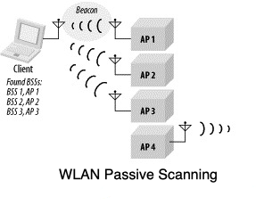

# Wi-Fi beaconing

There are two modes of scanning in which the Wi-Fi end user devices can operate.

## WLAN Passive Scanning

In Passive Wi-Fi scan, WLAN station moves to each channel as per channel list and waits for beacon frames. These frames are buffered and are used to decode and extract information about BSSs.

This passive scanning will save battery power as it does not need to transmit. As shown in the fig-1 WLAN client receives beacon frames from three access points and hence it will declare that it has found only three BSSs.
**By default, the tracker does passive Wi-Fi scan when doing Wi-Fi geolocation.**

## WLAN Active Scanning

WLAN active scanning
Station plan active role in Active Scanning. On each of the channels. probe request frames are used to obtain responses from the network of choice. In active scanning station finds out network rather than waiting for network to announce its availability to all the stations.

This can be used by third party solvers that reside in Wi-Fi access points to localize the tracker indoors. In order to activate Wi-Fi active scan when the tracker is performing Wi-Fi geolocation, we need to  set bit 23 in [config_flags](../../Parameters-default-configuration/firmware-parameters.md#miscellaneous-parameters) to true. This feature is disabled by default.

