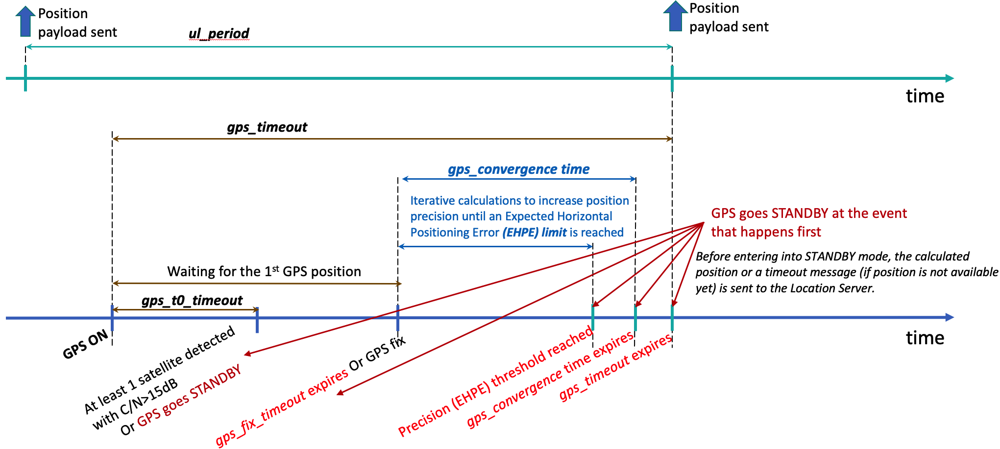
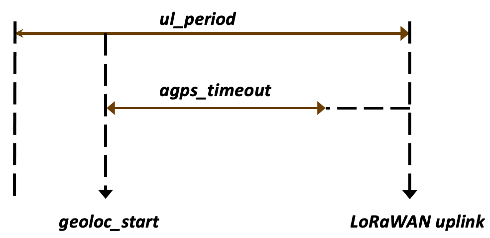
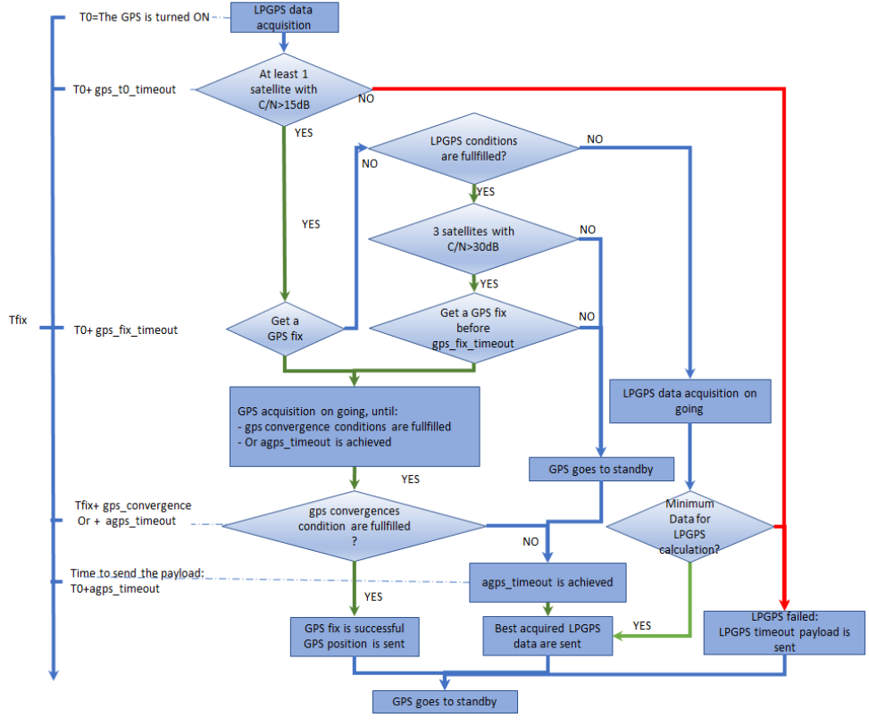

# Geolocation technology description

## Position message scheduling

 The position message reporting frequency is based on the *ul_period*
 parameter. However, the first message can be postponed due to the
 position acquisition delay.
 This delay depends on the geolocation strategy used.
 Nonetheless, the tracker triggers an uplink message each time a new
 geolocation cycle starts. This message depends on the operating mode
 used and the *config_flags* configuration.

**After the transmission of this initial message, a first position is transmitted when its calculation is done:**

-   GPS, WIFI-GPS or BLE-GPS: the max delay to send the position is the *gps_timeout* parameter value.
-   LPGPS, BLE-LPGPS or WIFI-LPGPS: the max delay to send the position is the *agps_timeout* parameter.
-   WIFI only: the max delay to send the position is 10 seconds.
-   BLE only: the max delay to send the position is given by the *ble_beacon_timeout* parameter increased by 2 seconds.

After the first position is obtained, the geolocation timing uplinks are scheduled using the *ul_period* parameter (or *sos_period* parameter in SOS).

:::tip Note

Depending on the *config_flags*, the **event** message can be:
-   A geoloc start event message
-   A motion start event message
-   A motion end event message

Refer to the section [Event message](../../uplink-messages/event/readme.md) for more details.
:::

## GPS

The tracker tries to acquire a position within *gps_timeout*. In the case of SOS, the timeout is reduced to *sos_period* if the *gps_timeout* is greater than the *sos_period* value. 

Find below the flowchart describing the working of the gps module:

For power consumption purpose, a predictive algorithm has been put in place: The GPS is stopped as soon as possible if it has no chance to make a fix (e.g. indoor location without a clear sky view). The following parameters are used to customize this algorithm:

-   *gps_t0_timeout*: When expired at least 1 satellite with C/N\>15dB must be detected to continue the GPS acquisition
-   *gps_fix_timeout*: when expired a GPS fix must be obtained detected to pursue the processing
-   *gps_timeout:* when expired the GPS acquisition is stopped

To complete a position, the GPS module expects one of the two following conditions to be achieved.

-   The *gps_convergence* timeout in seconds (time let to the GPS module to compute a more precise position) expires.
-   The *gps_ehpe* value is below the configured value. EHPE (Estimated Horizontal Position Error) is provided by the GPS component and is expressed in meters.

Once completed the position is reported via LoRaWAN&trade; and the GPS component switches to the standby state.

Once the *gps_standby_timeout* delay expires, the GPS component is powered off. This leads to a loss of all data and ephemeris.

In the case where the GPS module didn't succeed, a GPS timeout message is sent instead of a GPS position message. The timeout cause is given in the payload. (See [GPS timeout payload](../../uplink-messages/position/readme.md) for more details about this message)

## GPS state diagram

:::tip Note

In the case where the *gps_timeout* value is greater than the *ul_period*, the used *GPS timeout* will be *ul_period* for position sent for the main operating mode (permanent, motion or start end).
:::

## Low power GPS (LPGPS)

With this technology, the device sends the data given by the GPS module before the expiration of *agps_timeout* and the positions calculation are done by [ThingPark X Location Engine](../../../B-Feature-Topics/IntegrateAppwithTPLocation_C/).

In order to reduce power consumption on the tracker, a predictive algorithm has been put in place: The GPS is stopped as soon as possible if it has no chance to make a fix or to acquire enough data for LPGPS calculation (e.g. indoor location without a clear sky view).
The following parameters are used to customize this algorithm:
-   *gps_t0_timeout*: When expired at least 1 satellite with C/N\>15dB must be detected to continue the GPS acquisition
-   *gps_fix_timeout*: when expired if there is no GPS fix, the tracker switches back to LPGPS acquisition
-   *agps_timeout:* when expired the LPGPS or GPS acquisition is stopped

If the GPS component fails to provide enough data to the server, the tracker sends a LPGPS timeout uplink instead of a usual message.

If a GPS position is obtained before having sufficient data for LPGPS calculation, the GPS position is sent if one of the two following conditions is achieved before *agps_timeout* expired.
-   The *gps_convergence* timeout in seconds (time let to the GPS module to compute a more precise position) expires.
-   The *gps_ehpe* value is below the configured value. EHPE (Estimated Horizontal Position Error) is provided by the GPS component and is expressed in meters.

:::tip Note
In the case where the *agps_timeout* value is greater than the *ul_period*, the actual GPS timeout will be *ul_period* for position sent for the main operating mode (permanent, motion or start end).
:::

The figure below details the functioning of the LPGPS

:::tip Note
Refer to the dedicated application note [AN-016_GPS_LPGPS](https://actilitysa.sharepoint.com/:f:/t/aby/Evqx0qp6AQ1OqrI7-2DoIxsB1wKjLBjykfPh2p7Lo8mP7g?e=VrNdaS) for more details.
:::

## WiFi

Since a WIFI scan is always done within three seconds, there is no timeout parameter.
Once the scan is done, the BSSIDs along with associated RSSI are sent via LoRaWAN&trade; the position calculation is done by the ThingPark X Location Engine in the geolocation backend.

 The number of BSSID max that can be reported in a WIFI payload is:
-   4 If the bit 12 of the *config_flags* parameter is reset
-   12 If the bit 12 of the *config_flags* parameter is set

**In a multi technology geolocation**, WIFI scan results are only sent in the uplink if the number of BSSIDs are greater than or equals to 3. If there are less than 3 BSSIDs found, then this triggers a technology switch (move to GPS or LPGPS).

:::tip Note
A filtering system is applied when the WIFI finger printing is not used (bit 12 of the *config_flags* parameter reset). Multicast and locally administrated BSSID are removed.
A locally administered MAC address is an address generated by the WIFI access point. This MAC address is not guaranteed to be unique. Conversely, a public MAC address is a registered address against the IEEE and is unique around the world. Usually, a WIFI access point advertises both locally administered and public MAC addresses. A multicast address is usually used by the WIFI access point to send multicast IP packet (You can find more data about these BSSID [here](https://en.wikipedia.org/wiki/MAC_address))
:::

In the table below you can see the discarded BSSID:

|                      |  BSSID|Is BSSID discarded?(yes/no)|
|----------------------|-----------|-------------------------------|
|**Unicast (individual) / Universally  administered** |x**0**-xx-xx-xx-xx-xx|No|
||x**4**-xx-xx-xx-xx-xx|No|
||x**8**-xx-xx-xx-xx-xx|No|
||x**C**-xx-xx-xx-xx-xx|No|
|**Multicast (group) / Universally  administered** |x**1**-xx-xx-xx-xx-xx|Yes|
||x**5**-xx-xx-xx-xx-xx|Yes|
||x**9**-xx-xx-xx-xx-xx|Yes|
||x**D**-xx-xx-xx-xx-xx|Yes|
|**Unicast (individual) / Locally  administered** |x**2**-xx-xx-xx-xx-xx|Yes|
||x**6**-xx-xx-xx-xx-xx|Yes|
||x**A**-xx-xx-xx-xx-xx|Yes|
||x**E**-xx-xx-xx-xx-xx|Yes|
|**Multicast (group) / Locally  administered** |x**3**-xx-xx-xx-xx-xx|Yes|
||x**7**-xx-xx-xx-xx-xx|Yes|
||x**B**-xx-xx-xx-xx-xx|Yes|
||x**F**-xx-xx-xx-xx-xx|Yes|

## BLE beacon scan

 This technology scans the BLE beacons and reports them via
 LoRaWAN&trade;. The configuration is based on three parameters:
-   *ble_beacon_timeout*: BLE scan duration.
-   *ble_beacon_cnt*: Maximum number of beacons to be reported in the position message.
-   *ble_rssi_filter*: BLE RSSI condition to trigger a geolocation switch. Applicable only with BLE-GPS and BLE-LPGPS geolocation mode. The switch to the GPS technology occurs if there is no beacon with a RSSI greater than the configured value.

 In addition, some filtering can be added using the following parameters:
-   *position_ble_filter_type*: beacon type to be reported.
-   *position_ble_filter_main_1*: First part of the main BLE filter value (depends on the type chosen)
-   *position_ble_filter_main_2*: Second part of main BLE filter value (depends on the type chosen)
-   *position_ble_filter_sec_value*: Secondary BLE filter value (depends on the type chosen)
-   *position_ble_filter_sec_mask*: Secondary BLE filter mask (depends on the type chosen)
-   *position_ble_filter_report_type*:Type of data to be reported in the payloads.

:::tip Note
- Refer to the dedicated application note [AN-006_Position_BLE_filtering](https://actilitysa.sharepoint.com/:f:/t/aby/Evqx0qp6AQ1OqrI7-2DoIxsB1wKjLBjykfPh2p7Lo8mP7g?e=VrNdaS) for more details.
- We highly recommend to always use filtering to avoid detection of beacons by the tracker which are not part of IoT deployment
:::

 The figure below describes the timing of a scan.
 **Scan duration**=minimum (*ul_period, ble_beacon_timeout*)
 **Scan window**=120 milliseconds
 **Scan interval**=130 milliseconds

:::tip Notes
1.  **In a multi-technology geolocation**, the tracker switches to another geolocation technology if no beacons are detected or if there is no beacon with a RSSI greater than the *ble_rssi_filter* value.
2.  In the case where the technology used is **BLE only** and the BLE component fails to detect BLE beacons, the device reports a **BLE failure message**.
:::

**Configuration example**

*ble_beacon_cnt* = 0x04: The maximum number of beacons sent in  LoRaWAN&trade; position messages is 4

:::tip Notes
1.  BLE Beacons must be at least compliant with:
    -   iBeacon (Apple)
    -   Eddystone (Google)
    -   Altbeacon
2.  Once the scan is done, the BLE beacon data, along with associated RSSI are sent via LoRaWAN&trade; the position calculation is done by the ThingPark X Location Engine in the geolocation backend.
:::

## Multi-technologies

These technologies use two different components in the same geolocation cycle:

-   WIFI-GPS: Try a WIFI scan, then switch to the GPS in case of failure.
-   WIFI-LPGPS: Try a WIFI scan, then switch to the LPGPS in case of failure.
-   BLE-GPS: Try a BLE scan, then switch to the GPS in case of failure.
-   BLE-LPGPS: Try a BLE scan, then switch to the LPGPS in case of failure.

## WIFI-GPS and WIFI-LPGPS

A WIFI scan result is considered as successful if at least three BSSID are present in the scan. In this case a WIFI position message is sent via LoRaWAN&trade;. Otherwise, the tracker tries immediately the next geolocation technology (GPS or LPGPS), in the same geolocation cycle. 

The picture below shows the timing diagram.

The actual geolocation timeout can be determined using the formula: 
- Geoloc_timeout =*gps_timeout* or *agps_timeout* depending on the technology used.

If geoloc_timeout + WIFI_time (5 seconds) + switching techno time (3 seconds) is higher than *ul_period*, geoloc_timeout is adjusted and reduced to fit the *ul_period*.

## BLE- GPS and BLE-LPGPS

A BLE scan result is considered successful if at least one beacon is detected during the scan, with a measured RSSI value greater than *ble_rssi_filter* value. In this case BLE position message is sent via LoRaWAN&trade;. Otherwise, the tracker tries immediately the next geolocation technology (GPS or LPGPS), in the same geolocation cycle.

## Multi technology switching state diagrams

 The multi-technology state diagram is shown below:

