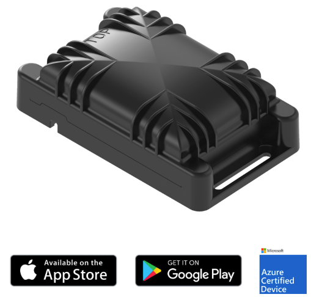

# Combo LPWAN Compact tracker

The Abeeway Combo Compact Tracker is a highly versatile
multi-mode Cellular (LTE-M, NB-IoT) and LoRaWAN tracker
with embedded sensors combining accelerometer, multi-constellation GNSS, [Low-power GPS](https://www.abeeway.com/technology/), Wi-Fi Sniffer, BLE and
LoRa® TDoA geolocation technologies, supporting accurate
indoor & outdoor geolocation.

The tracker has a robust form factor (IK08, IP68),
designed to resist harsh surroundings enabling you to
perform seamless asset tracking in any industrial environment
for heavy-duty assets or small equipment, taking advantage
of its long battery autonomy. 

# Applications

- On-Demand, real-time and motion triggered tracking of assets, vehicles or livestock, indoor and outdoor.
- Monitoring of equipment sets through BLE detection around the tracker.
- Activity monitoring based on motion or vibration for usage optimization.
- Optimization of supply chain and production, delivery and inventory tracking.
- Geofencing and antitheft applications.
- Optional external temperature probe 

The Abeeway compact tracker is a multi-mode tracker that uses 3 replaceable AA format batteries for long battery lifetime and easy replacement. It combines **GPS**, **Low Power-GPS (LP-GPS)** ([an ultra-low power assisted GPS patented by Abeeway](https://www.abeeway.com/technology/) that also optimizes Time-to-First Fix in difficult conditions), **Wi-Fi**, **LoRaWAN®** and **BLE** radios with embedded sensors to support accurate **outdoor** and **indoor** geolocation.
This tracker is equipped with a rugged waterproof casing which is designed to withstand harsh surroundings enabling seamless asset tracking and management in any industrial environment – whether it is for heavy duty assets, inventory or livestock.

## Key product features

### Multiple operating modes:
- **Motion Tracking:** Real-time position at a given cycle when motion is detected.
- **Permanent tracking:** Regular interval real time position.
- **Start/End motion tracking:** Receive position messages during motion start and end events.
- **Fix on demand:** Obtain tracker position when needed
- **Activity tracking:** Monitor activity rate with embedded sensors.
- **Geozone detection:** capability to detect specific zones that matter for your processes.

### Geolocation technologies:
- **GPS:** Precise outdoor position
- **Low power GPS:** Server assisted, fast Time To First Fix in low signal conditions

### Other features:
- Companion brandable Abeeway mobile app
- Firmware upgrade via BLE
- Configuration and mode change possible via Cellular, LoRaWAN or BLE
- BLE scan function for inventory of tools and accessories (set management)
- BLE zone detection (e.g. safe/hazard zone)
- Temperature monitoring
- Proximity detection
- Waterproof enclosure IP68; IK08
- Replaceable AA batteries
- Magnetic switch (optional)
- Pressure sensor (Optional)
- Indoor BLE/WiFi fingerprinting (requires subscription)
- Compatible with Quuppa Intelligent Location (requires Quuppa infrastructure) 

::: warning WARNING
*  The latest information on certification can be found [here](/D-Reference/DocLibrary_R/AbeewayTrackers_R.md#certifications).
* The tracker is resistant to water but must never be placed either fully/partially submerged in water or under the influence of high pressure water spray jets for significantly long periods of time. To avoid water entering in the casing, the tracker must not be placed upside down.
* In excessilvely hot weather, we recommend to put the tracker in the shade to avoid overheating.
* **The warranty of the tracker is avoid if used incorrectly**.
:::

### Datasheet
The datasheet of the tracker can be downloaded from [here](/D-Reference/DocLibrary_R/AbeewayTrackers_R.html#data-sheets).
