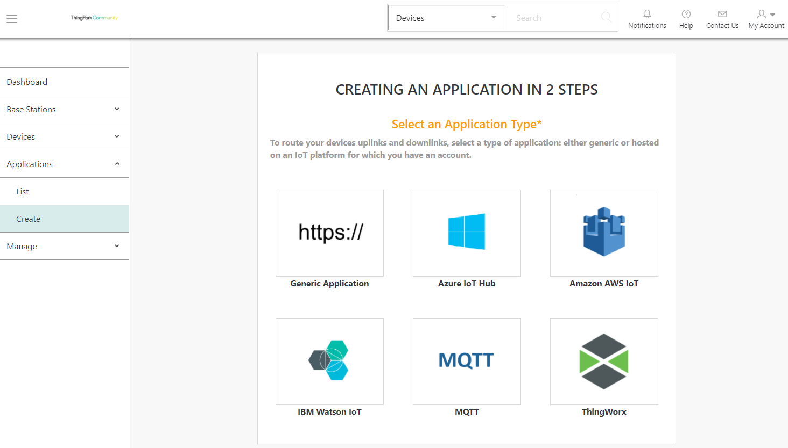
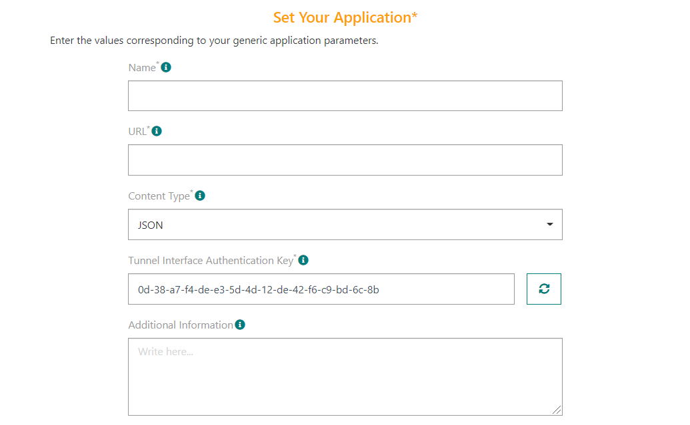
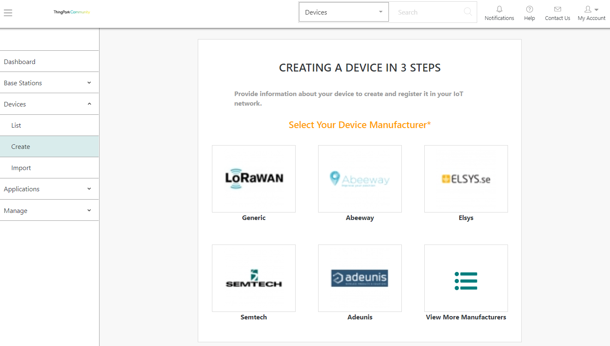
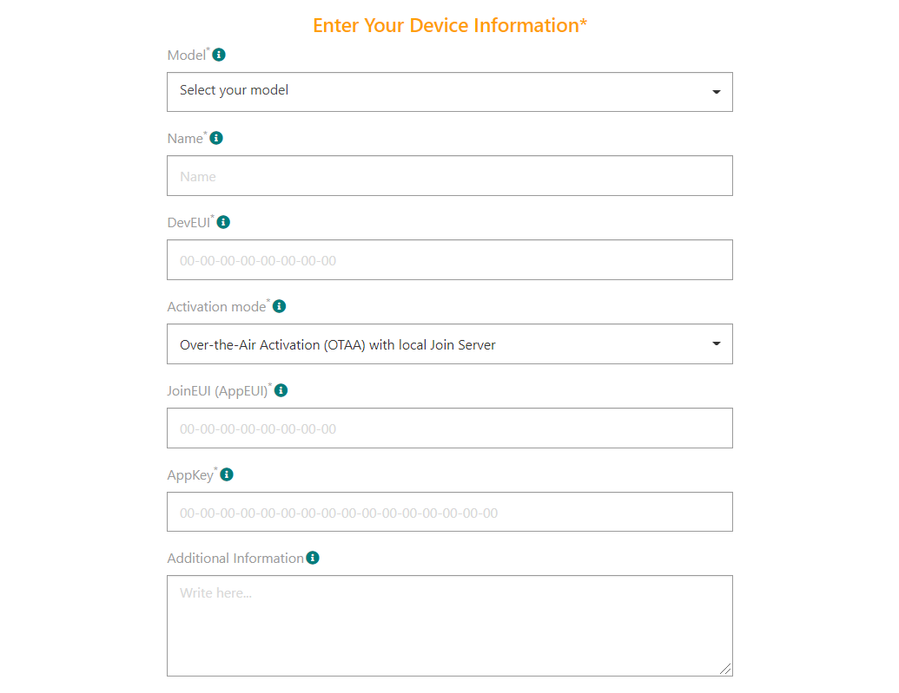

# Provisioning your trackers on ThingPark Enterprise
This task consists of configuring your trackers on ThingPark Enterprise to forward all packets to and from the ThingPark Location application server provided by Actility on its platform.
## Creating an application
You need to create a ThingPark Location application and associate it with your Abeeway devices.

1. Log in to ThingPark Community platform using [https://community.thingpark.org/](https://community.thingpark.org/) and click **Sign up** to create a free account. Then use this example URL to log in to your ThingPark Enterprise account: [https://community.thingpark.io/tpe/#/dashboard](https://community.thingpark.io/tpe/#/dashboard)
2. In ThingPark Enterprise, select **Applications** > **Create**, then click **Generic Applications**.

3. In **Set Your Application**, enter or select the following required information:

|   | Information | 
| - | ----------- | 
| **Name** |  ThingPark Location | 
| **URL** | [https://abeeway-eu-eco.thingpark.com:50540](https://abeeway-eu-eco.thingpark.com:50540) | 
| **Content Type** |  XML | 
| **Tunnel Interface Authentication Key** |  e8-95-9e-26-fd-9b-ce-52-70-06-05-a9-cf-e7-4d-53 | 

::: warning Warning
If you are using some other ThingPark Location platform, please refer to [ThingPark Location URLs](../../D-Reference/ThingParkLocationURLs)
:::

4. Click **Save**.

## Creating your tracker
To provision your tracker on the ThingPark Enterprise platform, you need to create a device. Your tracker is a LoRaWAN® OTAA device. 
At the same time, you will associate it with the ThingPark Location application you have created. 
::: warning Before you begin
 Get the DevEUI, AppEUI, and AppKey of the tracker provided in your delivery note.
:::

1. In ThingPark Enterprise, select **Devices** > **Create**, then click **Abeeway**. 
2. In **Enter Your Device Information**, apply the configuration corresponding to your tracker as follows:

|  | Information | 
| - | ----------- | 
| **Model** |  Model of the tracker. If any, select a tracker model compatible with your ISM band (EU/AS/US). | 
| **Name** |  A name that helps you identify easily the tracker on your IoT network and ThingPark Enterprise portal. | 
| **DevEUI** |  LoRaWAN® globally unique identifier of the tracker. Provided within the tracker delivery note, it is composed of 16 hexadecimal digits (0 to 9, and A to F). | 
| **Activation mode** |  **Over The Air Activation (OTAA) with local JOIN server** | 
| **JoinEUI (AppEUI)** |  Global application identifier that uniquely identifies the application provider of the tracker. Provided within the tracker delivery note, it is composed of 16 hexadecimal digits (0 to 9, and A to F). | 
3. In **Associate Your Device With Your Application**, select theThingPark Location application you have created to connect it to your tracker.

4. In **Set Your Device Location**, **Mode** must be set to **No location**.
5. Click **Save**.

    * The device is displayed in the devices list.
    * It is ready to communicate and has been associated with ThingPark Location.
