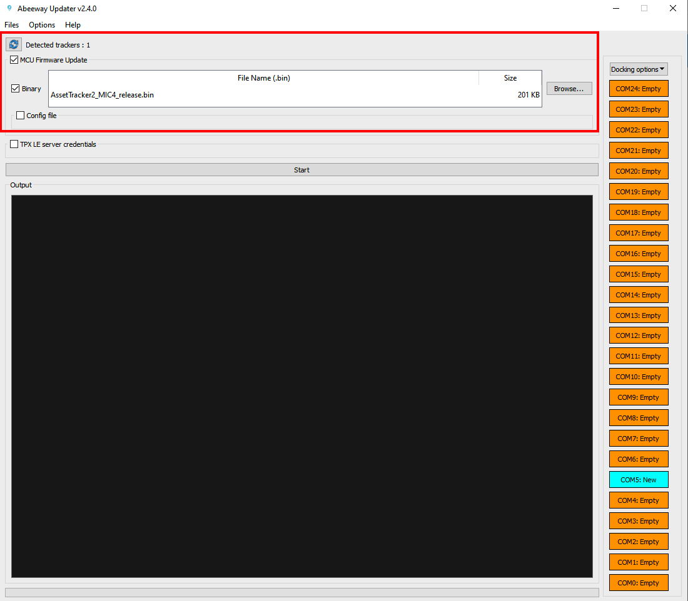

# Reset the tracker and re-join the LoRaWAN network
Your tracker is a LoRaWAN® OTAA device that needs to do a join request to attach the LoRaWAN® network and get a join accept from it. 

If necessary, you can force a new join request for a tracker that is already joined for example to attach it to a new network. You can also use this procedure to troubleshoot and reset the tracker. The tracker reset procedure differs from the MCU/Application firmware version.

## Find out the MCU Firmware version of the tracker

<html>

The button sequence to reset the tracker is quite different between Asset Tracker MCU Firmware 2.3 and the versions below. The first step is to find out the installed MCU firmware version of the tracker from <a href="../../D-Reference/IdentifyInstalledFirmware/" >here</a>

</html>

## Resetting the tracker with the button sequence for MCU  Firmware 2.3 and above
::: warning Important
 * **Click:** Pressing the button **less than one second**.
 * **Press:** Pressing the button **between 1 and 4 seconds**
 * **Long Press:** Pressing the button **between 5 and 7 seconds**.
 * **ESC Sequence:** Hold the button for **more than 14 sec** to trigger escape sequence (ESC).
 * This special sequence is applicable for all the tracker states: (SHIPPING, JOINING, JOINED) irrespective of the tracker being ON or OFF.
 * If the sequence that is entered is not recognizable by the firmware, the firmware will abort special sequence after 15 seconds.
 * You must wait at least 20 seconds between two special sequences, else the second special sequence will not be taken into account.
 * This sequence is not configurable with **button_mapping** parameter.
 * For more details on the User Interface (UI) of MCU FW 2.3+, please refer to [User Interface training](https://actilitysa.sharepoint.com/:f:/t/aby/EiWIqYpAehBKg3Py8I6X07oBFFxUWT3i2FVHYRX2MzXtow?e=ZFkhrM)

:::

<html><iframe type="text/html" frameborder="0" allowfullscreen="1" src="https://www.youtube.com/embed/xuSJ-1JDRdM?list=PLrtUhsI_mcGQ1B0AAgZ4Yvkad9AyoEPML" height="150px" width="300px"/></html>

The sequence to follow is the same for the micro tracker and the smart badge. 

Follow the sequence:
   1. Hold the button for more than 14 seconds (the tracker will beep every second during this time). If the ESC sequence is successful, the tracker will play a melody to indicate that the ESC sequence is successful.
   2. Click one time. **Wait for at least one second**
   3. Double-Click another time. **Wait for at least one second**
   4. Press the button (hold the button between 1 and 4 seconds),
   5. If the sequence is successful, the tracker will play [firmware reset melody](https://actilitysa.sharepoint.com/:u:/t/aby/EcctTThi8DFEgFY2Cy5i3o4BfZj-rO_dAuT-w9IwqJ7X2Q?e=ef9qay)
   6. If the sequence was unsuccessful, wait for about 15 sec before retrying for the ESC sequence to abort (The tracker will play abort sequence melody).

##  Resetting the tracker with the button sequence for MCU Firmware 2.2 and below
::: warning Important
 * **Click:** Pressing the button **less than one second**.
 * **Long Press:** Pressing the button for **more than five seconds**.
:::

<html><iframe type="text/html" frameborder="0" allowfullscreen="1" src="https://www.youtube.com/embed/etZ0FA_ssso?" height="150px" width="300px"/></html>

The sequence to follow is the same for the micro tracker and the smart badge:

1. **Make sure the tracker is switched off:** You can see it is switched off if it does not blink when you click the button. 
    * If the tracker is on, then do long press and the tracker will switch off with a beep.
    * Once you are sure the tracker is switched off, follow the steps below. 

2. Follow this sequence:
    1. **Click four times**.
    2. **Long press** **until** the tracker is turned on with **a small beep**
    3. **Click two times**.
    4. **Long Press** until the tracker plays [tracker reset melody](https://actilitysa.sharepoint.com/:u:/t/aby/EcctTThi8DFEgFY2Cy5i3o4BfZj-rO_dAuT-w9IwqJ7X2Q?e=ef9qay)

3. Wait for the tracker to **join the network**. The tracker will send a join request message and **blink shortly multiple times** to indicate that the join request is in progress.

4. The number of attempts is limited to 15 in EU region and 27 for other regions. The join process can be re-initiated again with long press on the button.

## Resetting the tracker with LoRaWAN downlink

The above button sequences only reset the tracker to the configuration that was saved in the tracker. For more information on resetting the device with downlink, visit [Abeeway trackers Reference Guide: Debug commands](/AbeewayRefGuide/downlink-messages/debug-commands/), Section: Resetting the device.

If you wish to reset the tracker with LoRaWAN downlink, there are three options:

1. **Reset the device (keeping the current configuration):** Send the downlink **ff010100** on LoRaWAN port=2 
2. **Reset the device (revert to the original config file that was flashed in the tracker):** Send the downlink **ff010101** on LoRaWAN port=2
3. **Reset the device (revert to the original config file that was flashed in the tracker and also remove Bluetooth bond):** Send the downlink **ff010102** on LoRaWAN port=2

## Resetting the tracker with Abeeway updater

The tracker can be reset to its factory default configuration using Abeeway updater. The factory default configuration can be found in the [Abeeway trackers Reference Guide](/D-Reference/DocLibrary_R/D-Reference/DocLibrary_R/AbeewayTrackers_R.md#reference-guides-and-tools), Chapter: Factory default Configuration.

[Abeeway Updater](../../D-Reference/AbeewayFirmwareUpdate_R/) can be used to reset the tracker to factory default if the MCU firmware update is carried out <b>without the config file</b>. The tracker is reset to factory default settings. 

## Resetting the tracker over CLI with tracker connected to USB port
The tracker can be reset over Command Line Interface (CLI) with the tracker connected to USB port.

::: warning Important
* The instructions below are for MCU FW 2.2 and above. For older firmware versions or to know more about CLI feature, please visit [CLI Usage](../../D-Reference/UsingCLI_R)
:::

Here are the steps:

1. Connect the tracker to the USB port and open [Tera Term](https://ttssh2.osdn.jp/index.html.en) to connect to the serial port on which the tracker is connected.
2. The tracker will prompt for the password. The default password is **123**.
3. If the password is successful, the CLI will show the traces and can be used to interact with the tracker.
4. Enter the command **system reset** on the CLI console to reset the tracker without changing its existing configuration saved in the flash. The tracker will re-join LoRaWAN network.
