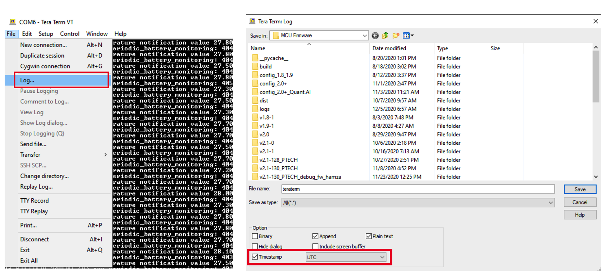
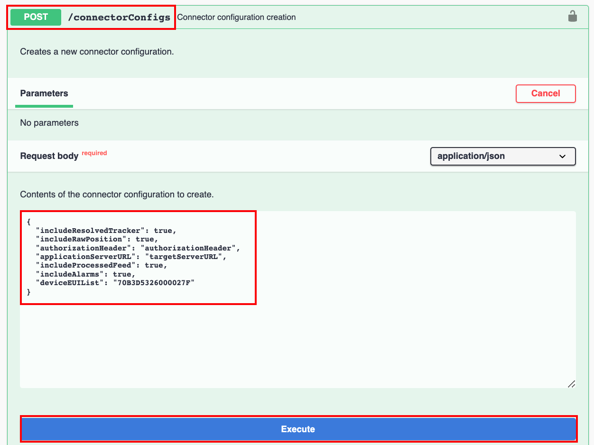
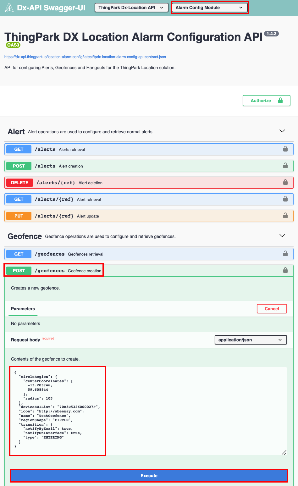

# Preparing your tracker for first use with GNSS

This section describes the step by step procedure to get a first GNSS fix on the tracker and update the Almanac information. It must be used after first unpacking a new tracker, each time a tracker has not performed a fix for over 3 months, or each time a tracker seems to be unable to obtain new GNSS fixes quickly.

::: warning Note
Even if you plan to use your own location solver, we recommend to use ThingPark X Location Engine (TPX-LE) when preparing your tracker for first use for the following reasons:
- **Support for Low-Power GPS (LP-GPS) feature which allows faster GNSS fix with much lower power consumption on the tracker.**
- Support for averaging and filtering of positions in the backend to remove outliers.
- Visualizations of positions in the map with various filtering options using [Abeeway Device Manager](/B-Feature-Topics/AbeewayDeviceManager_C/).
- Easily change the tracker's configuration with pre-configured templates using [Abeeway Device Manager](/C-Procedure-Topics/ChangeTrackerConfiguration_T/).
:::

We assume that the tracker is already connected to a LoRaWAN network (refer to the [out-of-box notice](/D-Reference/DocLibrary_R/AbeewayTrackers_R.html#out-of-box-user-guides) and [documentation related to Network servers](/C-Procedure-Topics/NetworkServerOverview/) if this is not the case).

## Tracker Placement
It is important that the tracker is placed in open sky without any obstructions (for ex. human body, metallic objects, etc) blocking the GNSS antenna. The tracker placement instructions are as follows:
1. [Micro Tracker](/B-Feature-Topics/MicroTrackerPlacement_C/)
2. [Smart Badge](/B-Feature-Topics/SmartBadgePlacement_C/)
3. [Industrial Tracker](/B-Feature-Topics/IndusTrackerPlacement_C/)
4. [Compact Tracker](/B-Feature-Topics/CompactTrackerPlacement_C/)
5. [Industrial Manageable ATEX Beacon](/B-Feature-Topics/IndustrialManageableATEXBeaconPlacement_C/)

## Ensure the tracker is running the correct MCU/BLE Firmware version
We recommend to run the [latest MCU and BLE firmware versions] as there have been numerous fixes to the GPS/LP-GPS feature. <br/>
You can find the MCU and BLE Firmware versions currently installed on your tracker by following this [procedure](/D-Reference/IdentifyInstalledFirmware/).<br/>
If the installed firmware is older than the firmware versions above, please upgrade the firmware by following [these instructions](/D-Reference/FirmwareUpdateOverview_R/).

## First satellite scan and refreshing the orbit information (Almanac)
When you use the tracker for the first time, it may have been stored for several months and therefore it is likely that the satellite orbit information (Almanac) will be stale. In such condition detection of satellite signal is much longer as the GNSS chip does not know which satellites to scan first (which satellites are visible from the current location), cannot correct for Doppler frequency shift, etc. In addition, unlike the Pseudo-range information used to evaluate the distance between the satellite and the tracker which can be detected below thermal noise (negative C/N), receiving the Almanac updates requires very good reception conditions (positive C/N).
Therefore **the first scan and refresh of Almanac must be made in open sky conditions, and can last over 15mns**. 

You can use pre-configured template: **"First use: Almanac refresh"** to retrieve the Almanac if using the tracker for the first time. The template can be applied from [Abeeway Device Manager (Device Configuration tab)](/B-Feature-Topics/AbeewayDeviceManager_C/).


The template **"First use: Almanac refresh"** has the following parameters and can also be applied by sending downlinks to the Abeeway tracker on LoRaWAN port=2. The downlink payloads can be generated using [Abeeway Device Manager (Device Configuration tab)](/C-Procedure-Topics/UseAbeewayDriver_T/#using-abeeway-device-manager) or using [Abeeway Driver](/C-Procedure-Topics/UseAbeewayDriver_T/#using-abeeway-driver). 

The template **"First use: Almanac refresh"** has the following parameters:
| Parameter Name | Compact / Industrial Tracker | Micro Tracker/Smart Badge  | 
| - | ----------- | -------- |
| [geoloc_sensor](/AbeewayRefGuide/Parameters-default-configuration/firmware-parameters.html#parameters-for-operational-modes) | 1 (GPS Only) | 1 (GPS Only) |
| [mode](/AbeewayRefGuide/Parameters-default-configuration/firmware-parameters.html#parameters-for-operational-modes) | 2 (Permanent tracking) | 2 (Permanent tracking) |
| [gps_standby_timeout (seconds)](/AbeewayRefGuide/Parameters-default-configuration/firmware-parameters.html#parameters-for-gps-and-low-power-gps-geolocation-modes) | 40000 | 0 |
| [ul_period (seconds)](/AbeewayRefGuide/Parameters-default-configuration/firmware-parameters.html#parameters-for-operational-modes) | 120 | 120   |

::: warning Note
- The template **"First use: Almanac refresh"** is not power efficient, so it must be disabled as soon as the Almanac is acquired by the tracker.
- **Even if you are not using ThingPark Location with the tracker, you can still use Abeeway Device Manager to generate the downlink configuration payloads for a given configuration (which must be sent on LoRaWAN Fport=2 to the device using your preferred LoRaWAN network server)**. 
- The tracker will acknowledge the configuration command with an uplink message.
- If no ack is received, the downlink, or the ack, may have been lost: the configuration downlink command need to be sent again to the tracker.
- The firmware parameters can also be set with the tracker connected to computer over USB port using CLI. For more information, see [here](/D-Reference/UsingCLI_R/).
:::

Once you start getting regular GNSS positions, keep the tracker in open sky conditions for at least 15mns (in the best possible conditions, a full Almanac refresh takes 12.5min). You can check the Almanac information status for the GPS constellation using CLI command.

```
gnss show gps
```

## Optimizing the GNSS/LP-GPS parameters
The optimization of GPS/LP-GPS parameters can be done by following the [AN-016_GPS_LPGPS](/D-Reference/DocLibrary_R/AbeewayTrackers_R.md#application-notes) application note. Please refer to the section on **Tuning the GNSS algorithm** or **Tuning the LP-GPS algorithm** depending whether you are using GNSS only mode or LP-GPS mode of the tracker.

We recommend to use **Balanced Configuration** for the first usage of the tracker as its a good compromise between power consumption, accuracy and time to get a GNSS fix.

## Troubleshooting the GNSS/LP-GPS positioning
If you think the tracker is already configured correctly with the steps above but you do not find the location results satisfactory, you can perform the following steps for troubleshooting:

1. Place the tracker in open sky conditions connected to a  **data USB cable (check that it is not a power-only cable)** to a computer using serial application like Tera Term. For more information on using Command Line Interface (CLI), see [here](/D-Reference/UsingCLI_R/).

During the acquisition of GNSS, the tracker will print information on CLI traces as shown in the example below:

```
00:07:55.832641 (GEO) GPS tracking - 2 sat.(25,28) (17,22)
```

In the example above, the trace indicates that the tracker sees two GPS satellites:<br/>
- Sat 1 has svid 25 and carrier to noise (C/N) ratio with a value 28dBm-Hz.<br/>
- Sat 2 has svid 17 and a C/N ratio of 22dBm-Hz.<br/>

Uploading Almanac and Ephemeris information requires a very good C/N > 27 dbm-Hz.
LP-GPS location (server assisted) works with a C/N as low as 15 dbm-Hz. Local GNSS location will also work with C/N > 15dbm but ONLY if the Almanac information and Ephemeris information for the visible satellites are available in memory and still valid: the Ephemeris information must have been updated at a maximum 30mn earlier, while the Almanac information can last about 3 months. For this reason LP-GPS is more robust than local GNSS location.

::: warning Warning
- If you do not see GNSS satellites in your traces after about 5mn, it means you are in poor GNSS coverage and need to find another location to make the test.
:::


2. Ensure that the tracker logs are captured in a trace file with the absolute timestamp of your PC or UTC. This is required to correlate the traces from the tracker to those of LoRaWAN uplinks. The timestamps from Tera term can be enabled as shown in the image below.


3.  You can run the following command on CLI at the end of your test to get the Almanac information from the tracker.

```
gnss read gps
gnss read beidou
```
The tracker will respond with a trace like the one below.

```
user> gnss show gps
GPS almanac validity. Last read: 00:01:04 (00:00:17 before now)
 Satellite      Week           Acquisition
 0              0              ---
 1              0              ---
 2              181            2022/09/25
 3              181            2022/09/25
 4              181            2022/09/25
 5              181            2022/09/25
 6              181            2022/09/25
 7              181            2022/09/25
 8              181            2022/09/25
 9              181            2022/09/25
 10             0              ---
 11             0              ---
 12             0              ---
 13             0              ---
 14             0              ---
 15             0              ---
 16             0              ---
 17             0              ---
 18             0              ---
 19             0              ---
 20             0              ---
 21             0              ---
 22             0              ---
 23             0              ---
 24             0              ---
 25             181            2022/09/25
 26             181            2022/09/25
 27             181            2022/09/25
 28             0              ---
 29             181            2022/09/25
 30             181            2022/09/25
 31             181            2022/09/25
OK
```
::: warning Note
- The Acquisition column indicates the date when the almanac was acquired and stored in GNSS chip. **The Almanac entry expires 3 months after this date**.
- The presence of valid Almanac in the tracker ensures faster GNSS fix as the GNSS will search the visible satellites first and not waste time with hidden constellation satellites.
:::

4. Please ensure to run the following additional commands before sending the tracker logs to us.

```
system info
ble info
config show
```
## Visualization of tracker location
Once the tracker starts to send uplinks with Bluetooth beacon IDs, you can see the location of the tracker in the map view.

## Configure ThingPark Location to send uplinks to external application server
[ThingPark Location Connector module](https://dx-api.thingpark.io/location-connector/latest/doc/index.html) can be used to send the locations to the external application server.



The position from the GPS solver is inside the JSON object [ResolvedPosition](https://dx-api.thingpark.io/location-connector/latest/doc/index.html#resolvedposition). You can find the example JSON object that is sent when ThingPark Location resolves GPS position [here](/D-Reference/tpxle-sample-payloads-main_R/tpxle-output-position-gps.md).


```
{
  "deviceEUI" : "20635f028100003e",
  "time" : "2022-09-02T08:04:25.731Z",
  "customerId" : "100009247",
  "modelCfg" : "1:TPX_ba3df8fb-bc93-45ee-aa0d-b2f873b9bbc6",
  "dxProfileId" : "community-api",
  "coordinates" : [ 103.924992, 1.3143296, 0.0 ],
  "age" : 0,
  "validityState" : "NEW",
  "horizontalAccuracy" : 129,
  "incomingSubscriberId" : "100009247",

....

}
```

## Setting up Geofencing to receive alerts when the tracker enters/leaves the geofence zone

[ThingPark Location Alarm Config module](https://dx-api.thingpark.io/location-alarm-config/latest/swagger-ui/index.html?shortUrl=tpdx-location-alarm-config-api-contract.json) can be used to setup the Geofence for the tracker. Once the tracker enters/leaves or leaves the geofence, ThingPark Location will send [alarm object](https://dx-api.thingpark.io/location-connector/latest/doc/index.html#alert) to the external application server configured in the [connector module](https://dx-api.thingpark.io/location-connector/latest/doc/index.html)



The following is an example [GeofenceAlarm](https://dx-api.thingpark.io/location-connector/latest/doc/index.html#geofencealarm) JSON object that is sent by ThingPark Location to the application server when the tracker enters the geofence configured by the user.

``` 
{
  "deviceEUI": "20635f028100003e",
  "geofenceAlarm": {
    "geofence": {
      "circleRegion": {
        "centerCoordinates": [
          103.925065,
          1.31458
        ],
        "radius": 100
      },
      "deviceEUIList": "20635F028100003E",
      "icon": "http://abeeway.com",
      "name": "TestGeofenceYanik",
      "ref": "1cc7f58e-ee31-4550-993d-503bcbd2c698",
      "regionShape": "CIRCLE",
      "transition": {
        "notifyByEmail": true,
        "notifyOnInterface": true,
        "type": "ENTERING_LEAVING"
      }
    },
    "transition": "ENTERING"
  },
  "time": "2022-09-05T00:59:10.124Z",
  "typeAlarm": "GEOFENCE"
}
```