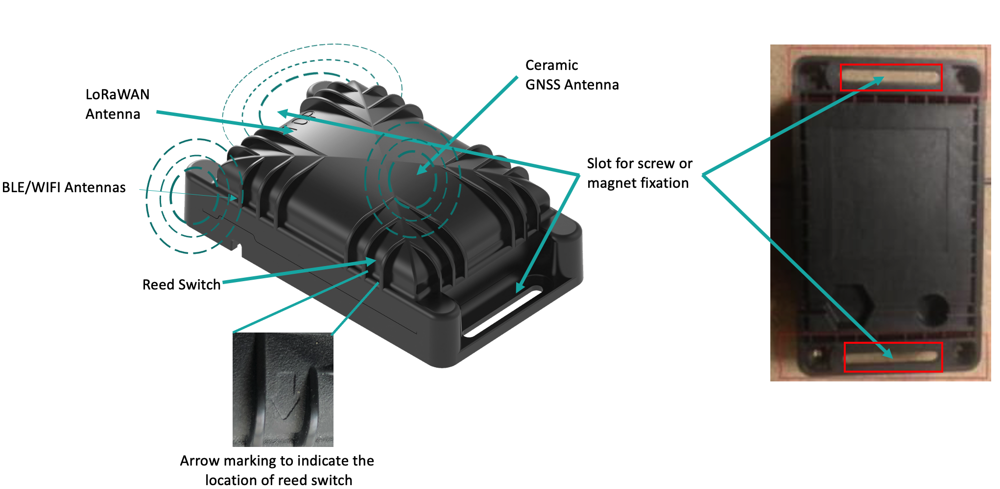
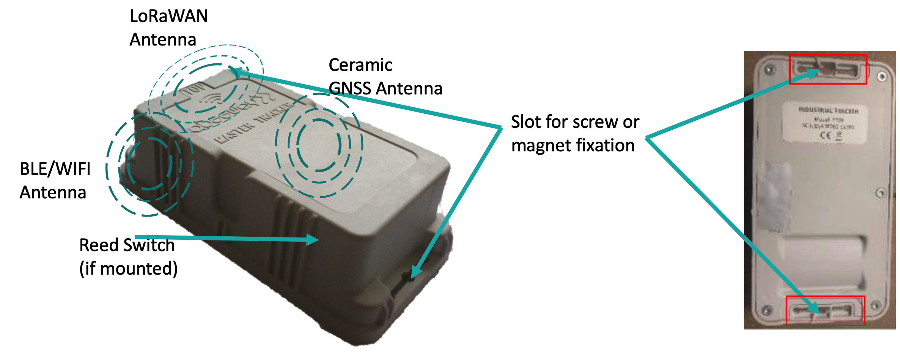

# Compact tracker and Industrial tracker device

## Compact Tracker

## Industrial Tracker

## Getting started

 The compact tracker is shipped to the customer in **shipping** state to preserve battery lifetime. It can be set into the **join** state by applying the following sequence:

-   A long activation of the reed switch (between 3 to 6 seconds)
-   A long time without activation of the reed switch (between 3 to 6 seconds)
-   A long activation of the reed switch (between 3 to 6 seconds)

 The magnet should be of sufficient strength and should be placed near the location where the arrow above points "*Reed switch*". Example magnet can be purchased from
 [here.](https://market.thingpark.com/abeeway-compact-tracker-magnets-reed-switch.html)
 The tracker will then start the **join** procedure which can be seen in LoRaWAN&trade; Network Server logs.

 The industrial tracker is sent directly in the **join** state.

 The compact tracker and the industrial tracker start immediately in the configured mode as soon as the join is done. Refer to the section [Startup process](../../functioning/startup-process/) for more details on the tracker startup.

## Tracker best placement

For optimum radio performance the tracker should be laid flat (as shown on the picture).

It can be fixed with a magnet, screws, or a double-sided tape. The mounting area on the tracker is marked in the figure above with RED.

:::tip Note
- The Industrial tracker by default does not have reed switch
- The latest compact trackers from the factory are activated by default in the join state. They need not be activated. However, if you do the above magnet sequence, it will restart the join procedure. You can also request [Abeeway support](../../../../troubleshooting-support/FAQ_R/) to find out if the tracker is activated or not before being shipped to the customer.
- For more details on compact tracker activation with a video, see [here](../../../../trackers-overview/CompactTracker_C/)
- The tracker should not be submerged in water or left in the presence of high-pressure water jets for prolonged duration as the water will get inside the casing eventually and damage the tracker. Incorrect placement of the tracker will void the guarantee.
- The close environment and orientation of the tracker can influence the radio performance. For optimum results keep the zone around the antenna area clear from any conducting material, magnetic fields or human skin.
:::
