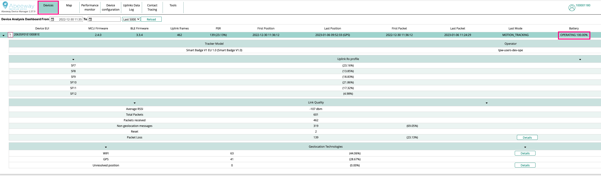
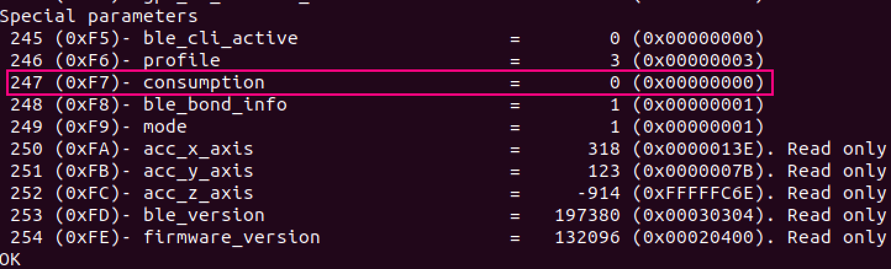

# Power consumption

The tracker maintains the [**consumption** (special Parameter ID: 0xF7)](../../../../abeeway-trackers-reference-guide/AbeewayRefGuide/parameters-default-configuration/firmware-parameters.md#miscellaneous-parameters) parameter which keeps tracker of the current power consumption of the tracker in mAh.

## Tracker behaviour for current firmware version (AT 2.4+)

### Rechargeable trackers (Micro Tracker/Smart Badge)
The **consumption** is never stored in flash, but rather in no-init RAM.
The write on parameter **consumption** is not useful, since the battery percentage is always calculated from the battery voltage.
The **consumption** parameter is reset each time the USB cable is
disconnected from the tracker. So, the estimated consumption indicates what we consumed since the last charge.


### Primary Battery trackers (Compact Tracker/Industrial Tracker)
**consumption** is stored in flash area of the tracker. This area of flash is preserved across tracker resets including in the case of brownout. The **consumption** parameter is updated in flash
only when the consumption difference (new value - stored value) exceeds a calculated threshold.
The threshold is 0.5 percent of the **battery_capacity**.

Examples:
- The threshold for a 19000 mAh battery is 19000*0.5/100 = 95 mAh
- The threshold for a 8000 mAh battery is 8000*0.5/100 = 40 mAh


## Tracker behaviour for earlier versions of firmware (AT 2.3 and below)
In earlier firmware versions, the total **consumption** was located
in a non-init RAM storage. This area is preserved across tracker resets except in the following cases:

- Brownout or battery replacement.
- MCU Firmware upgrade is done via Bluetooth using [Abeeway Mobile app](../../../../troubleshooting-support/firmware-update-overview/index.md). 
- Running a MFG or ACTT application could also erase the no-init RAM area and thus erase the **consumption** parameter.

However, it is preserved during the firmware upgrade via USB using [Abeeway Updater](../../../../troubleshooting-support/firmware-update-overview/index.md).

### Rechargeable trackers (Micro Tracker/Smart Badge)
The **consumption** is not stored in flash but rather in no-init RAM.
The write on parameter **consumption** is not useful, since the battery percentage is always calculated from the battery voltage.
The **consumption** is reset to 0 during firmware reset.

### Primary Battery trackers (Compact Tracker/Industrial Tracker)
The **consumption** is not stored in flash but rather in no-init RAM.
The write on parameter **consumption** is useful, when the battery is replaced.
The **consumption** is reset to 0 when replacing batteries or during firmware reset.


:::tip Note
The **consumption** parameter is regularly updated each hour or when the consumption is requested
via the CLI or via LoRa Downlink.
:::


## Reporting of remaining battery % in LoRaWAN uplinks
The tracker reports the remaining battery level (%) in [LoRaWAN common message header](../../../../abeeway-trackers-reference-guide/AbeewayRefGuide/uplink-messages/common-message-header/readme.md) (Supported since MCU Firmware V2.0). If your tracker is already integrated with [ThingPark X Location Engine](../../../../integrating-your-application-with-thingpark-location/integrate-app-with-tp-location.md), then you can see the remaining battery level(%) in [Abeeway device manager](../../../../trackers-overview/abeeway-device-manager/index.md)  as shown in the screenshot below.



Alternatively, you can use [Abeeway Driver](../../../../integrating-your-application-with-thingpark-location/encoding-decoding-lorawan-payloads/index.md#using-abeeway-driver) to decode LoRaWAN uplinks to retrieve the battery percentage.

## Steps to do when replacing batteries for Compact Tracker/Industrial Tracker
When replacing batteries in the tracker, you need to reset the **consumption** of the tracker as follows. There are following ways to do it.

### Reset the power consumption parameter in the tracker firmware

#### Method 1: Using ThingPark Location APIs
If you are using ThingPark Location APIs, you can use the APIs to reset the consumption of the tracker using Tracker Command API. The documentation URL for ThingPark Location on community Platform is [here](https://dx-api.thingpark.io/location-trackercommand/latest/doc/index.html#trackercommandtosendrequest). For other platforms, visit [here](../../../../troubleshooting-support/thingpark-location-urls.md). Here is the example API call to reset the consumption of the tracker.
```
------------------------------ Snippet begin ------------------------------
{
  "trackerCommandType": "TrackerCommandToSendAbeewayDownlinkPayload",
  "deviceEUI": "20635f01e100081e",
  "deviceProfileId": "ABEEWAY/MICRO",
  "abeewayDownlinkPayload": {
    "downMessageType": "SET_PARAM",
    "ackToken": 3,
    "setParameters": {
      "powerConsumption": 0
    }
  },
  "thing": {
    "application": {
      "producerId": "abeeway",
      "moduleId": "asset-tracker",
      "version": "2"
    }
  }
}
------------------------------ Snippet End ------------------------------
```
:::tip Note
The **deviceProfileId** parameter should always be "ABEEWAY/MICRO" irrespective of the tracker type.
:::

#### Method 2: Sending a downlink to the tracker
You can also send a downlink (0b0af700000000) on LoRaWAN port=2 to the tracker from the LoRaWAN network server to reset the consumption of the tracker. This downlink resets the value **consumption** parameter to 0.

The downlink can be constructed with [Abeeway driver](../../../../documentation-library/abeeway-trackers-documentation.md#reference-guides-and-tools) with the following example:

```
------------------------------ Snippet begin ------------------------------
curl -X 'POST' \
  'http://localhost:8095/iot-flow-driver/v1/decode ' \
  -H 'accept: application/json' \
  -H 'Content-Type: application/json' \
  -d '{
    "direction": "downlink",
    "meta": {},
    "thing": {
        "application": {
            "producerId": "abeeway",
            "moduleId": "asset-tracker",
            "version": "2"
        }
    },
    "message": {
        "downMessageType": "SET_PARAM",
        "ackToken": 10,
        "setParameters": {
            "powerConsumption": 0
        }
    }
}
------------------------------ Snippet End ------------------------------
```

The response is below where 0b0af700000000 should be sent on LoRaWAN downlink to the tracker on fPort=2.

```
------------------------------ Snippet begin ------------------------------
{
  "direction": "downlink",
  "sourceTime": "2023-01-10T10:42:05.512Z",
  "meta": {
    "lorawan": {
      "fPort": 2
    }
  },
  "raw": {
    "binary": "0b0af700000000"
  },
  "message": {
    "downMessageType": "SET_PARAM",
    "ackToken": 10,
    "setParameters": {
      "powerConsumption": 0
    }
  },
  "thing": {
    "application": {
      "producerId": "abeeway",
      "moduleId": "asset-tracker",
      "version": "2"
    }
  }
}
------------------------------ Snippet End ------------------------------
```

#### Method 3: Using CLI
You can connect the tracker to computer with the data USB cable and then use tera term or similar serial application to interact with the tracker. For more details on CLI, visit [here](../../../../troubleshooting-support/using-cli.md). Here are the steps once the tracker is connected to PC:

1. Once the tracker prompts login, enter password 123.
2. Reset the **consumption** parameter by entering the command: **config set 0xF7 0**.
3. Read all the parameters: **config show**. You should verify the new parameter value of **consumption** was reset to 0 (see screenshot below).



4. Save the new configuration in flash: **config save**.

### Resetting the tracker state in ThingPark Location
If you are using ThingPark location, then the tracker power consumption state must also be reset in the backend. 

:::tip Warning
The **consumption** parameter in the tracker must be reset to 0 before resetting the state of the backend.
:::

The application can then send the following [backend API command](https://dx-api.thingpark.io/location-trackercommand/latest/swagger-ui/index.html?shortUrl=tpdx-location-trackercommand-api-contract.json) to reset the state of the backend.

The API documentation of backend commands is [here](https://dx-api.thingpark.io/location-trackercommand/latest/doc/index.html). The URLs above are for ThingPark Location for community platform. For other platforms, see [here](../../../../troubleshooting-support/thingpark-location-urls.md).

```
------------------------------ Snippet begin ------------------------------
{
  "trackerCommandType": "TrackerCommandToSendRequest",
  "deviceEUI": "20635F0102001734",
  "deviceProfileId": "ABEEWAY/MICRO",
  "requestType": "RESET_BATTERY"
}
------------------------------ Snippet End ------------------------------
```
## Health status 
The application can request [Health Status Reports](../../uplink-messages/status/readme.md#health-status-message) by sending [status request](../../downlink-messages/status-request/readme.md) downlink to the tracker. It can be used to troubleshoot the power consumption of the tracker and its breakdown.

## Known Issues

### Tracker battery level goes to 100% after reset (even though the batteries were not replaced)
:::tip Warning
Note: This issue is only applicable for trackers that are not connected to ThingPark Location backend. If the tracker is connected to ThingPark Location, the backend takes into account the reset of the tracker and corrects the battery percentage in location engine updates.
:::

For MCU/Application **Firmware versions 2.3 and below**, the **consumption** parameter was in RAM and was not saved in flash. So, every time the tracker was reset, the **consumption** parameter was reset to 0. This obviously results the tracker reporting 100% remaining battery (after reset) in LoRaWAN uplinks even though the batteries were not replaced. If the tracker was just reset without replacing the batteries and you wish to report the correct battery level based on the remaining battery capacity, then the **consumption** parameter should be reset as follows:

1. Step 1: Take the remaining battery % from the **last uplink before the reset was done**. Lets call this parameter as **remaining_battery_percentage**.
2. Step 2: Compute the new value of **consumption** as follows:<br/>
   consumption = battery_capacity - (remaining_battery_percentage /100)*battery_capacity
3. Step 3: You can then use any of the [methods outlined above](../../../../abeeway-trackers-reference-guide/AbeewayRefGuide/functioning/power-consumption/readme.md#steps-to-do-when-replacing-batteries-for-compact-trackerindustrial-tracker) to reset the **consumption** in the tracker. 

:::tip Note
The **battery_capacity** is the following depending on the tracker model:

1. Micro Tracker V2/V3.x: 450 mAh
2. Smart Badge: 1300 mAh
3. Compact Tracker: 8000 mAh
3. Industrial Tracker V1/V2: 19000 mAh (EU), 14000 mAh (US) 
:::
