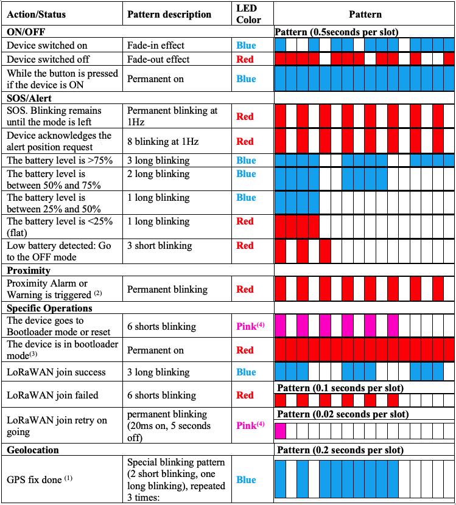

# User interfaces

 Depending on the trackers, some user interfaces can be unmounted.

The table below shows the default user interface components shipped with our trackers.

|  User interfaces |  Trackers             |
|----------------------|----------------------------|
|  **Button**          |  Micro tracker, Smart badge |
|  **LEDs**            |  Micro tracker, Smart badge |
|  **Buzzer**          |  Micro tracker, Smart badge |
|  **Reed switch**     |  Compact tracker           |

## Button management

 The interface between the user and the tracker is performed via a
 button. It is configurable using a new parameter called *button_mapping.*

 
**Non-configurable actions:**

|  Sequence      |  Action         |  User Interface behavior        |
|---------------------|---------------------|---------------------|
|One **press** when device OFF and good battery(3) |  Switch ON the tracker    |  [Buzzer melody](https://actilitysa.sharepoint.com/:u:/t/aby/EaBIKuw6iQxLmT2vwYpUxykBBrhZPhQdoNO3OQ1324BnYw?e=5wNbPV) + LED pattern (See next section)  |
|One **long press** when device ON(4)              |  Go to the OFF mode, except if mode disabled or if the tracker is in SOS   |  [Buzzer melody](https://actilitysa.sharepoint.com/:u:/t/aby/EViao4_dqSRJhByFCf6XEY0Bm4WhDEw1n8wIvD_ay3hFPg?e=w3Fnjq)      |
|While the button is pressed when the device is ON   |                      |  LED is Blue while the button is pressed        |
|Very Long Press or ESC Sequence(5) | Trigger the start of special sequence | LED is Blue and Red |

**Configurable actions ([Factory Default Configuration](../../Parameters-default-configuration/factory-default.md)):**

| Sequence | Action|User Interface Behavior  |
|-------------------------------------|---------------------|----------------------|
|Click(2)	| Battery level is shown with the LEDs |	LED pattern (See next section)|
|Triple click or more(7) |	Trigger a start/ end of the SOS |	LED pattern (see next section) |
|Not configured	| Trigger a position alert |	LED pattern (see next section) |
| Double click(6) |	Not configured|	None |
| Not configured |	Angle detection manual trigger(1) |	None |

Sequences for the above actions are the following:
-	Click(2)
-	Press(3)
-	Long press(4)
-	Double click(6)
-	Triple click or more(7)

The *press_duration* is also configurable via the *button_mapping* parameter. 

Special sequences that can be applied after the **ESC Sequence**(5) button action has been done.

|  Special Sequence     |  Action         |  User Interface behavior         |
|---------------------|---------------------|---------------------|
|1x click, Triple click or more, 1x Press (2)(3)(7) |Enter the BLE bootloader|Tracker will play 3 beeps|
|1x click, Double-click, 1x Press (2)(3)(6)    |Enter the MCU bootloader|Tracker will play 2 beeps followed by MCU bootloader reset melody|
|1x click, 1x click, 1x Press (2)(3)           |Remove the BLE bond information|     Tracker will play 1 beep followed by Bluetooth bond removal melody               |

The tracker exits the special-sequence mode if:
-   No button action is done within 10 seconds
-   a wrong sequence is performed

A beep is played while the tracker is in special sequence mode. The LED is also blinking Blue.

**Between 2 button sequences, a delay of 20 seconds must be respected**. If this delay is not respected the second sequence won't be taken into account.

:::tip Notes

(1) For more details, please refer to the application note [AN-010_Angle Detection](../../../../documentation-library/AbeewayTrackers_R.md#application-notes).

(2) **Click**: Press the button for less than 1 second.

(3) **Press**: Press the button between 1 and *press_duration* +3 seconds. The button must be released to generate the event.

(4) **Long Press**: Press the button between (*press_duration* +3) and (*press_duration* +7) seconds.

(5) **Very Long Press or ESC Sequence:** Press the button **more than 14 seconds**. The tracker will play a beep every second during this time.

(6) **Double-click:** Press the button 2 times (The duration **between** the clicks is **less than 1 second**).

(7) **Triple-click:** Press the button 3 times (The duration **between** the clicks is **less than 1 second**).

(8) The default value of *press_duration* is 1 second (configurable via *button_mapping* parameter).

:::

## LED interface

The end user can observe the behavior of tracker via the LED interface. Several patterns have been defined for different outputs.

LED blinking patterns

:::tip Notes

(1) If configured with bit 7 of [config_flags](../../Parameters-default-configuration/firmware-parameters.html#miscellaneous-parameters) parameter.

(2) Refer to the dedicated application note [AN-007_proximity feature](../../../../documentation-library/AbeewayTrackers_R.md#application-notes) for more details. **Only Applicable to MCU FW 2.3 and below**.

(3)  Only if bootloader is entered using the associated CLI command (Refer to the application note [AN-013_CLI_description](../../../../documentation-library/AbeewayTrackers_R.md#application-notes))

(4) In some trackers you can have blue + red colors instead of pink color.
:::

## Buzzer melodies

The second interface from the tracker to the user is done via a buzzer. The volume can be managed using *buzzer_volume* parameter. Different melodies have been defined:

| Feature       |Explanation|  Melody         |
|---------------------|----|---------------------|
|**Tracker Operation**|Device is resetting/ going to bootloader|  Device reset|
| |Device is starting|  Switch on (Major rising scale)   |
||Device is going to OFF mode |Switch off (Major falling scale)|
||Low battery detected | Low battery     |
|   |Tracker in SoS|  SOS                |
|     |Tracker is exiting SoS |  SOS stop           |
|  |LoRaWAN join success|Join success melody(1)|
|**BLE communication**|  The tracker is not bound and waits for a bond|  BLE advertising    |
|                     |  Bond process unsuccessful or bond deleted       |  BLE bond failure or deleted  |
|                     |  Bond process successful      |  BLE bond success   |
|                     |  Alert activated from connected device using BLE or BLE link loss    |  BLE Link Loss/alert (2)|
|  **BLE geozoning**  |  Entering a hazardous area        |  BLE geozoning alert   |

:::tip Notes
(1) It is only played for micro tracker, Smart badges for their **first** join.

(2)  BLE Link Loss/alert melody has been modified in applicative firmware 2.3
:::

The different melodies can be found [here](https://actilitysa.sharepoint.com/:f:/t/aby/Er982mOeCYxLniE8OjVErKwBopXN9-mKCC7VPn5HsJkigA?e=N3Rd8f).

## Reed switch interface

A reed switch is a physical switch operated by an applied magnetic field. The reed switch is only present inside the compact tracker. It is used when no button is mounted on the tracker. It can be configured with the [*reed_switch_configuration* parameter](../../Parameters-default-configuration/firmware-parameters.md#miscellaneous-parameters) (2):

-   **Act as a button**, the reed switch behaves as described in the Button management section above. A short magnetic field input is recognized as a short press, and a long input, as a long press.
-   **Specific behavior**, the reed switch sequence(1) generates a device reset:
-   **BLE connectivity**: The reed switch sequence(1) turns on the BLE advertisement (regardless the setting of the advertised bit in the *config_flags* parameter)

:::tip Notes

(1) In the configuration other than \"**Act as a button**\", the reed switch sequence is the following:
  - A long activation of the reed switch (between 3 to 6 seconds)  
  - A long time without activation of the reed switch (between 3 to 6 seconds) 
  - A long activation of the reed switch (between 3 to 6 seconds) 

(2)  In **Startup** mode, only one action is available and doesn't follow the configuration. The sequence described above is used to exit the **shipping** mode and will also enable Bluetooth advertising:
  - If the tracker is not bonded to smart phone, the Bluetooth advertising will stop after _ble_cnx_adv_duration_ seconds.
  - If the tracker is bonded, the Bluetooth advertising will continue indefinitely.
:::
