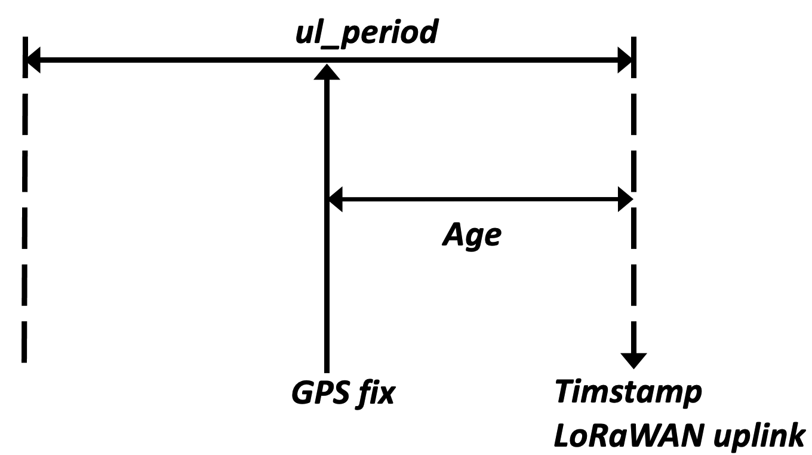

# Position messages

 These positions messages are sent if the bit 18 of *config_flags*
 parameter is reset

|  Common header   | Common header |Common header  |   Position information data           |
|----------------------|-------------------|-------------------|-------------------------------    |
|  Byte 0     |  Byte 1-3   |  Byte 4  | (1)   |    
| **Type**=0x03 | **Status/Batt/Temp.** |  **ACK / Opt**| **Position Information**         |

:::tip Note
(1) The size of data part depends on the type of position message.
:::

**Opt**: type of position message

- 0: GPS fix
- 1: GPS timeout
- 2: Encrypted WIFI BSSIDs (No more used but still supported).
- 3: WIFI timeout
- 4: WIFI failure
- 5, 6: LPGPS data (encrypted, not described in this document)
- 7: BLE beacon scan with MAC address
- 8: BLE beacon failure
- 9: WIFI BSSIDs
- 10: BLE beacon scan with short identifier
- 11: BLE beacon scan with long identifier

## GPS fix payload

 Common header with **Type**=0x03 and **Opt**=0x0
 **Position information data**
| Byte 5      |  Byte 6-8  |  Byte 9-11 |  Byte 12  |  Byte 13-15     |
|-------------|------------|------------|-----------|---------------- |
| **Age**     |**Latitude**|**Longitude**|**EHPE**  |**Encrypted**    |

**Age**: Time difference between the fix and the LoRaWAN transmission. [Encoded form](../encoded-form/readme.md) using **lo**= 0, **hi**=2040, **nbits**= 8, **resv**= 0. Expressed in seconds. The step is 8 seconds.

**Latitude**: Latitude of the position (expressed in degrees) is calculated as follows: 

Latitude = Latitude \&lt;\&lt; 8

If Latitude \&gt; 0x7FFFFFFF then Latitude = Latitude - 0x100000000

Latitude = Latitude / 107

**Longitude**: Longitude of the position (expressed in degrees) is calculated as follow: 

Longitude = Longitude \&lt;\&lt; 8

If Longitude \&gt; 0x7FFFFFFF then Longitude = Longitude - 0x100000000

Longitude = Longitude / 107

**EHPE**: Estimated Horizontal Position Error, expressed in meters. [Encoded form](/AbeewayRefGuide/uplink-messages/encoded-form/readme.md) using **lo**= 0, **hi**= 1000, **nbits**= 8, **nresv**= 0. The step is 3.9 meters.

## GPS timeout payload

 Common header with **Type**=0x03 and **Opt**=0x1
 **Position information data**
| Byte 5      |  Byte 6  |  Byte 7 |  Byte 8  |  Byte 9     |
|-------------|------------|------------|-----------|---------------- |
| **Cause**     |**C/N 0**|**C/N 1**|**C/N 2**  |**C/N 3**    |

 **Cause**: Timeout cause
-   0: Default timeout cause (when it is not due to **Cause** 1 or 2)
-   1: Timeout caused by the parameter *gps_t0_timeout* (if the tracker is static) or *gps_t0_timeout_motion* (if the tracker is moving) 
-   2: Timeout caused by the parameter *gps_fix_timeout*

 **C/N 0**: Carrier over noise (dBm) for the first satellite seen.
 **C/N 1**: Carrier over noise (dBm) for the second satellite seen.
 **C/N 2**: Carrier over noise (dBm) for the third satellite seen.
 **C/N 3**: Carrier over noise (dBm) for the fourth satellite seen.

:::tip Notes
1.  The satellites are ordered based on their **C/N**. The best is sent in **C/N 0**.
2.  **C/N** encoding uses: **lo**= 0, **hi**=50, **nbits**=8, **nresv**= 0. It is expressed in dBm with a step of 0,2 dBm 
3.  Encoded form is detailed in the [Encoded form](/AbeewayRefGuide/uplink-messages/encoded-form/readme.md) section.
:::

## WIFI timeout payload

 Common header with **Type**=0x03 and **Opt**=0x3
 **Position information data**
| Byte 5      |  Byte 6  |  Byte 7 |  Byte 8  |  Byte 9     |  Byte 10|
|-------------|------------|------------|-----------|---------------- |---------------- |
| **v_bat1**  |**v_bat2**|**v_bat3**|**v_bat4**  |**v_bat5**  |**v_bat6**|   

- **V_bat1**: Encoded voltage at the start time (T0) of the WIFI scan.
- **V_bat2**: Encoded voltage at T0 + 0.5 second. 
- **V_bat3**: Encoded voltage at T0 + 1 second. 
- **V_bat4**: Encoded voltage at T0 + 1.5 seconds. 
- **V_bat5**: Encoded voltage at T0 + 2 seconds. 
- **V_bat6**: Encoded voltage at T0 + 2.5 seconds.

:::tip Notes
1.  Most of time a WIFI timeout occurs due to low battery.
2.  **V_bat** encoding uses: **lo**= 2.8, **hi**=4.2, **nbits**=8, **nresv**= 2. It is expressed in volt with a step of 5.5mV
3.  Encoded form is detailed in the [Encoded form](/AbeewayRefGuide/uplink-messages/encoded-form/readme.md) section.
:::

## WIFI failure payload

 Common header with **Type**=0x03 and **Opt**=0x4
 **Position information data**
| Byte 5      |  Byte 6    |  Byte 7    |  Byte 8   | Byte 9    |  Byte 10 | Byte 11 |
|-------------|------------|------------|-----------|-----------|----------|---------|
| **v_bat1**  |**v_bat2**  |**v_bat3**  |**v_bat4** |**v_bat5** |**v_bat6**|**Error**|

- **V_bat1**: Encoded voltage at the start time (T0) of the WIFI scan.
- **V_bat2**: Encoded voltage at T0 + 0.5 second. 
- **V_bat3**: Encoded voltage at T0 + 1 second. 
- **V_bat4**: Encoded voltage at T0 + 1.5 second. 
- **V_bat5**: Encoded voltage at T0 + 2 seconds. 
- **V_bat6**: Encoded voltage at T0 + 2.5 seconds.

**Error:**

-   0: WIFI connection failure (no communication between WiFi and MCU)
-   1: Scan failure (scan of WiFi BSSID failed)
-   2: Antenna unavailable
-   3: WIFI not supported on this device

:::tip Notes
1.  Most of time a WIFI timeout occurs due to a low battery condition.
2.  **V_bat** encoding uses: **lo**= 2.8, **hi**=4.2, **nbits**=8, **nresv**= 2. It is expressed in volt with a step of 5.5mV
3.  Encoded form is detailed in the [Encoded form](/AbeewayRefGuide/uplink-messages/encoded-form/readme.md) section.
:::

## WIFI BSSID payload

 Common header with **Type**=0x03 and **Opt**=0x9
 **Position information data**
| Byte5      |  Bytes 6-11    |  Byte2    |  Bytes 13-18   | Byte19    |  Bytes 20-25 | Byte26 | Bytes 27-32| Byte33 |
|-------------|------------|------------|-----------|-----------|----------|---------|---------|---------|
| **Age**  |**BSSID0**  |**RSSI0**  |**BSSID1** |**RSSI1** |**BSSID2**|**RSSI2**|**BSSID3**|**RSSI3**|

 **Age**: [Encoded form](/AbeewayRefGuide/uplink-messages/encoded-form/readme.md) of scan age with **lo**=0, **hi**=2040, **nbits**=8, **nres**=0. Expressed in seconds. The step is 8 seconds.

 **BSSIDx**: BSSID of the WIFI station x.

 **RSSIx**: Receive Signal Strength Indication of the WIFI station x. Non encoded form (negative value, refer to the section [Two's complement Encoding](/AbeewayRefGuide/downlink-messages/two-complement-encoding/readme.md) for information for the encoding). It is expressed in dBm.

 When long WIFI payload is activated in *config_flags* parameter and transmit strategy is not well chosen, too long payload could not be transmitted. In this case, after 5 discarded uplinks, the tracker sends an **uplink length error** message which is described [here](/AbeewayRefGuide/uplink-messages/debug-payloads/readme.md)

:::tip Notes
1.  The payload contains the listened WIFI stations (up to 12 if bit 12 of *config_flags* parameter is set, up to 4 if it is reset).
2.  If less than 4 stations are listened, the payload will be reduced.
3.  BSSID address is provided in big endian format. So, the byte 6 of the payload contains the MSB of the BSSID0, while the byte 11 contains its LSB.
4.  The data rate and the transmit strategy must be adapted to the payload size, or the payload will be rejected by the LoRaWAN™ MAC, and won't be sent. Refer to the application note [AN- 002_LoRa_Transmission_strategy](../../../../documentation-library/AbeewayTrackers_R.md#application-notes) for more data.
:::

## BLE beacon scan payload (MAC address)

 Common header with **Type**=0x03 and **Opt**=0x7
 **Position information data**
| Byte5      |  Bytes 6-11    |  Byte2    |  Bytes 13-18   | Byte19    |  Bytes 20-25 | Byte26 | Bytes 27-32| Byte33 |
|-------------|------------|------------|-----------|-----------|----------|---------|---------|---------|
| **Age**  |**MACADR0**  |**RSSI0**  |**MACADR1** |**RSSI1** |**MACADR2**|**RSSI2**|**MACADR3**|**RSSI3**|

 **Age**: [Encoded form](/AbeewayRefGuide/uplink-messages/encoded-form/readme.md) of scan age with **lo**=0, **hi**=2040, **nbits**=8, **nres**=0. Expressed in seconds.

 **MAC ADRx**: MAC Address of the BLE beacon x.

 **RSSIx**: Receive Signal Strength Indication of the BLE beacon x. Non-encoded form (**negative value**, refer to the section [Two's complement Encoding](/AbeewayRefGuide/downlink-messages/two-complement-encoding/readme.md) for information for the encoding).and expressed in dBm.

**Notes**

1.  The payload contains the listened BLE beacons (up to 4, it is configurable using *ble_beacon_cnt* parameter), during *ble_beacon_timeout* delay.
2.  If less than 4 BLE beacons are listened, the payload will be reduced.
3.  Refer to the application not [AN-006_Position_BLE_filtering](../../../../documentation-library/AbeewayTrackers_R.md#application-notes) for more details

## BLE beacon scan payload (short identifier)

 Common header with **Type**=0x03 and **Opt**=0xA
 **Position information data**
| Byte5      |  Bytes 6-11    |  Byte2    |  Bytes 13-18   | Byte19    |  Bytes 20-25 | Byte26 | Bytes 27-32| Byte33 |
|-------------|------------|------------|-----------|-----------|----------|---------|---------|---------|
| **Age**  |**short BID0**  |**RSSI0**  |**short BID1** |**RSSI1** |**short BID2**|**RSSI2**|**short BID3**|**RSSI3**|

 **Age**: [Encoded form](/AbeewayRefGuide/uplink-messages/encoded-form/readme.md) of scan age with lo=0, hi=2040, nbits=8, nres=0. Expressed in seconds.

 **Short BIDx**: 
Eddystone UID beacon: 6 last bytes of the Instance ID field 
Altbeacon UID beacon: 6 last bytes of the beacon UID 
Ibeacon UID beacon:
 If *position_ble_report_type*= 1: 6 last bytes of the Ibeacon UUID
 If *position_ble_report_type*= 3: 2 last bytes of the UUID field, the
 Major number and the Minor

 **RSSIx**: Receive Signal Strength Indication of the BLE beacon x. Non-encoded form (negative value, refer to the section [Two's complement Encoding](/AbeewayRefGuide/downlink-messages/two-complement-encoding/readme.md) for information for the encoding) and expressed in dBm.

:::tip Notes
1.  The payload contains the listened BLE beacons (up to 4, it is configurable using *ble_beacon_cnt* parameter), during *ble_beacon_timeout* delay.
2.  If less than 4 BLE beacons are listened, the payload is reduced. 
3.  Short ID is not supported for eddystone url beacons.
4.  Refer to the application not [AN-006_Position_BLE_filtering](../../../../documentation-library/AbeewayTrackers_R.md#application-notes) for more details.
:::

## BLE beacon scan payload (long ID)

 Common header with **Type**=0x03 and **Opt**=0xB
 **Position information data**

|  Byte 5                        |  Byte 6-21     |  Byte 22   |
|--------------------------------|----------------|------------|
|  **Age**                       |  **long BID0** |  **RSSI0** |

 **Age**: [Encoded form](/AbeewayRefGuide/uplink-messages/encoded-form/readme.md) of scan age with **lo**=0, **hi**=2040, **nbits**=8, **nres**=0. Expressed in seconds.

 **Long BIDx**: 
 Eddystone UID beacon: Name space + instance ID (16 bytes) 
 IBeacon UID beacon: 16 last bytes of the Ibeacon UUID 
 Altbeacon UID beacon: 16 last bytes of the beacon UID

 **RSSIx**: Receive Signal Strength Indication of the BLE beacon x. Non-encoded form (negative value, refer to the section [Two's complement Encoding](/AbeewayRefGuide/downlink-messages/two-complement-encoding/readme.md) for information for the encoding).and expressed in dBm.

:::tip Notes
1. The payload contains the long ID of only one beacon. 
2. Long ID is not supported for Eddystone URL frame type.
3. Refer to the application not[AN-006_Position_BLE_filtering](../../../../documentation-library/AbeewayTrackers_R.md#application-notes) for more details.
:::

## BLE failure payload

 Common header with **Type**=0x03 and **Opt**=0x8
 **Position information data**

|  Byte 5                       |
|-------------------------------|
|  **Error**                    |

**Error:**

-   0x00: BLE is not responding
-   0x01: Internal error
-   0x02: Shared antenna not available
-   0x03: Scan already on going
-   0x04: BLE busy (should not occur)
-   0x05: No beacon detected
-   0x06: Hardware incompatibility
-   0xFF: Unknown/wrong BLE firmware version
