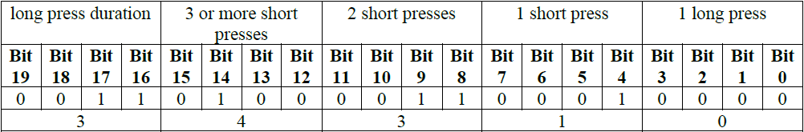

# Parameters configuration

 Any parameter can be remotely modified with a downlink LoRaWAN message. Such messages are built according to the following format:

|  Byte 0 |  Byte 1  |  Byte2            |  Byte 3-6                |
|---------|----------|-------------------|--------------------------|
|  0x0B   |  **ACK** |  **Parameter ID** |  **New value** \[31-00\] |

 It is possible to modify up to 5 parameters in the same message by using the following format:

|   |    |  Parameter 1  |  Parameter 1   |  Parameter 2 |  Parameter 2   |
|---------|----------|--------|---------|---------|---------|
|  Byte 0  |   Byte 1     |  Byte 2   |  Byte 3-6 |  Byte 7  |  Byte 8-11 |
|    0x0B  |  **ACK** | **Parameter ID 1** | **New value 1** [31-00]  | **Parameter ID 1** |  **New value 1** [31-00]  |

 **ACK**: Acknowledge token. Refer to the section [Acknowledge token](../ack-token/readme.md) **Max value is 0x0F**.

 The table below sum up all parameters and their identifiers (ID). The parameters described as "reserved" are not used for this tracker.

|Parameter|ID|Parameter|ID|Parameter|ID|
|-------------|------|-------------|------|-------------|------|
|ul_period	  |0x00	|reed_switch_configuration	|0x29	|position_ble_report_type	|0x52|
|lora_period	  |0x01	|gnss_constellation	|0x2A	|buzzer_volume	|0x53|
|pw_stat_period	|0x02	|prox_scan_pwr_min	|0x2B	|angle_detect_mode	|0x54|
|periodic_pos_period	|0x03	|prox_distance_coef	|0x2C	|angle_ref_acq	|0x55|
|**Reserved, do not use**|0x04	|prox_scan_frequency	|0x2D	|angle_ref_acc_x	|0x56|
|geoloc_sensor	|0x05	|prox_backtrace_max_age	|0x2E	|angle_ref_acc_y	|0x57|
|geoloc_method	|0x06	|prox_distance_sliding_window	|0x2F	|angle_ref_acc_z	|0x58|
|Reserved, do not use	|0x07	|prox_exposure_50	|0x30	|angle_critical	|0x59|
|motion_nb_pos	|0x08	|prox_exposure_100	|0x31	|angle_critical_hyst	|0x5A|
|gps_timeout	|0x09	|prox_exposure_150	|0x32	|angle_report_mode	|0x5B|
|agps_timeout	|0x0A	|prox_exposure_200	|0x33	|angle_report_period	|0x5C|
|gps_ehpe	|0x0B	|prox_exposure_250	|0x34	|angle_report_repeat	|0x5D|
|gps_convergence	|0x0C	|prox_exposure_300	|0x35	|angle_rising_time	|0x5E|
|**config_flags**	|0x0D	|prox_exposure_400	|0x36	|angle_falling_time	|0x5F|
|**transmit_strat**	|0x0E	|prox_alarm_dist_immediate	|0x37	|angle_learning_time	|0x60|
|ble_beacon_cnt	|0x0F	|prox_alarm_exposure	|0x38	|angle_acc_accuracy	|0x61|
|ble_beacon_timeout	|0x10	|prox_warn_dist_immediate	|0x39	|angle_deviation_delta	|0x62|
|gps_standby_timeout	|0x11	|prox_warn_exposure	|0x3A	|angle_deviation_min_interval	|0x63|
|confirmed_ul_bitmap	|0x12	|prox_record_dist_immediate	|0x3B	|angle_deviation_max_interval	|0x64|
|confirmed_ul_retry	|0x13	|prox_record_exposure	|0x3C	|default_profile	|0x65|
|**motion_sensitivity**	|0x14	|prox_alarm_buz_duration	|0x3D	|password	|0x66|
|**shock_detection**	|0x15	|prox_warn_buz_duration	|0x3E	|gps_t0_timeout	|0x67|
|periodic_activity_period	|0x16	|prox_contact_policy	|0x3F	|gps_fix_timeout	|0x68|
|motion_duration	|0x17	|prox_scan_duration	|0x40	|geofencing_scan_duration	|0x69|
|geofencing_scan_period	|0x18	|prox_scan_window	|0x41	|beaconing_type	|0x6A|
|geofencing_collect_period	|0x19	|prox_scan_interval	|0x42	|beaconing_tx_power	|0x6B|
|ble_rssi_filter	|0x1A	|prox_alarm_remanence	|0x43	|beaconing_static_interval	|0x6C|
|temperature_high	|0x1B	|prox_warn_remanence	|0x44	|beaconing_motion_interval	|0x6D|
|temperature_low	|0x1C	|prox_bcn_repeat	|0x45	|beaconing_motion_duration	|0x6E|
|temperature_action	|0x1D	|prox_bcn_tx_power	|0x46	|ble_cnx_adv_duration	|0x6F|
|transmit_strat_custom	|0x1E	|prox_reminder_period	|0x47	|**beacon_id_0**	|0x70|
|network_timeout_check	|0x1F	|prox_reminder_distance	|0x48	|**beacon_id_1**	|0x71|
|network_timeout_reset	|0x20   |prox_warn_disable_dist	|0x49	|**beacon_id_2**	|0x72|
|collection_scan_type	|0x21	|prox_alarm_disable_dist	|0x4A	|**beacon_id_3**	|0x73|
|collection_nb_entry	|0x22	|prox_max_speed_filter	|0x4B	|**beacon_id_4**	|0x74|
|collection_ble_filter_type	|0x23	|prox_max_update	|0x4C	|**sos_period**	|0x75|
|collection_ble_filter_main_1	|0x24	|position_ble_filter_type	|0x4D	|**motion_debounce**	|0x76|
|collection_ble_filter_main_2	|0x25	|position_ble_filter_main_1	|0x4E	|**button mapping**	|0x77|
|collection_ble_filter_sec_value	|0x26	|position_ble_filter_main_2	|0x4F	|**default_datarate**	|0x78|
|collection_ble_filter_sec_mask	|0x27	|position_ble_filter_sec_value	|0x50|	dynamic profile|0xF6| 	
|battery_capacity	|0x28	|position_ble_filter_sec_mask	|0x51|		power consumption|0xF7| 
||	|||		delete BLE bond|0xF8| 
|||	||		mode|0xF9| 

:::tip Notes
1.  the parameters in bold are new or modified in this firmware version
2.  The Application should avoid sending parameter values with invalid values.
    The firmware accommodates an invalid value as follow:
	-  Value above the maximum is set to the maximum
	-  Value below the minimum is set to the minimum
	-  If the downlink contains out of range Parameter ID, then the downlink is silently discarded.
:::

 **Example**: If the application sends a downlink to change the *lora_period* to 120 seconds, the tracker will set the value to 300 since this is the minimum acceptable (range \[300-86400\]). If configured for (the bit3 of *config_flags* parameter is set) the tracker will send a device configuration uplink with the corrected value. The application should check the reported value of the device configuration which it is trying to set and send another downlink if the device configuration is not reported in the uplink.

 The parameters identifiers and the values are given in the following tables.

## Parameters for operational modes

|Parameter|ID|Unit|Range|Description|
|-------------|------|----------|------------|-------------|
|  mode       |  0xF9|  none    |  0 - 5    |Operational mode of the tracker:|
|              |          |            |             | 0. Standby             |
|              |          |            |             | 1.  Motion tracking    |
|              |          |            |             | 2.   Permanent tracking |
|              |          |            |             | 3.  Motion start/end tracking  |
|              |          |            |             | 4. Activity tracking    |
|              |          |            |             | 5. Off mode     |
|default_profile|  0x65   |  none      |  0 - 3      |Profile applicable to configure several parameters at once, used when application starts, after a reset or when the tracker is turned on:    |
|              |          |            |             | 0.  None     |
|              |          |            |             | 1.  Sleep    |
|              |          |            |             | 2.  Economic |
|              |          |            |             | 3.  Intensive
|profile| 0xF6 |  none      |  0 - 3     |Set the dynamic profile of the tracker|
|              |          |            |             | 0.  None     |
|              |          |            |             | 1.  Sleep    |
|              |          |            |             | 2.  Economic |
|              |          |            |             | 3.  Intensive|
|ul_period     |  0x00    |  second    |15(1) - 86400|Period of position or activity messages in motion, start/end, activity or permanent operating mode| 
|lora_period   |  0x01    |  second    |300 - 86400  |Period of LoRa heartbeat messages|
|geoloc_sensor |  0x05    |  none      |  0 - 12    |Geolocation sensor profile used in main operating mode and SOS:|
|           |          |           |           | 0.  WIFI only | 
|           |          |           |           | 1.  GPS only  |    
|           |          |           |           | 2.  LPGPS (AGPS/GPS) |    
|           |          |           |           | 3.  Reserved (do not use)|     
|           |          |           |           | 4.  Reserved (do not use)|
|           |          |           |           | 5.  Reserved (do not use)|   
|           |          |           |           | 6.  WIFI-GPS only (WIFI then GPS if WIFI fails in one geolocation cycle)|   
|           |          |           |           | 7.  WIFI-LPGPS only (WIFI then LPGPS if WIFIfails in one geolocation cycle)|   
|           |          |           |           | 8   Reserved (do not use)   |
|           |          |           |           | 9.  WIFI-LPGPS first, then WIFI-GPS until timeout, then back to WIFI-LPGPS| 
|           |          |           |           | 10. BLE scan only   |
|           |          |           |           | 11. BLE-GPS only (BLE then GPS if BLE fails in one geolocation cycle)|
|           |          |           |           | 12. BLE-LPGPS only (BLE then LPGPS if BLE fails in one geolocation cycle)      |
|**motion_nb_pos**|0x08|  none     |  0 - 20   |This parameter has been updated in FW2.3. In motion tracking mode: additional positions are done when the device goes to static (after motion_duration period). If set to 0, no positions are added In motion start/end mode: Number of positions to report during motion events    |
|motion_duration|  0x17| second  |60 - 3600    |Period of time required to detect the end of a motion |
|**sos_period**|  0x75   |  second  |  15 - 300  |SOS uplink period in seconds  |

:::tip Note
(1) If a small *ul_period* value is set the following issue can be encountered: 

*   Uplink timing not respected (due to the duty cycle)
*   If it is a geolocation mode using GPS or LPGPS, It can be difficult for the device to acquire a position
:::

**Example**:

 To modify the heartbeat period to 1 hour, the command 0x0B020100000E10 should be sent. Description:
-   (0x0B): set the parameter
-   (0x02): with an ack token of 2
-   (0x01): heartbeat message period
-   (0x 00 00 0E 10): to a value of 3600s = 1 hour

## Parameters for side operation modes

 These parameters are used for the following side operating modes:
-   Periodic position
-   Position on demand
-   Alert mode
-   Periodic activity report

The parameters for others side operation are described in dedicated sections.

|Parameter|ID|Unit|Range|Description|
|-------------|------|----------|------------|-------------| 
|periodic_pos_period |  0x03    |  second    |0, 900 - 604800  |Period of the periodic position report. When set to 0, the reporting is disabled.|
|geoloc_method |0x06 |  none    |  0 - 7    |Geolocation policy used for the side operating modes:|
|           |          |           |           | 0.  WIFI  | 
|           |          |           |           | 1.  GPS   |    
|           |          |           |           | 2.  LPGPS (AGPS/GPS) |    
|           |          |           |           | 3.  WIFI-GPS only (WIFI then GPS if WIFI fails in one geolocation cycle)|     
|           |          |           |           | 4.  WIFI-LPGPS only (WIFI then LPGPS if WIFI fails in one geolocation cycle)|
|           |          |           |           | 5.  BLE scan only|   
|           |          |           |           | 6.  BLE-GPS only (BLE then GPS if BLE fails in one geolocation cycle)|   
|           |          |           |           | 7.  BLE-LPGPS only (BLE then LPGPS if BLE fails in one geolocation cycle)| 
|periodic_activity_period|0x16    |  second    |0, 1800 - 86400|Period of the periodic activity report. The value must be a multiple of 6(1). When set to 0, the reporting is disabled|

:::tip Note
(1) If a wrong value is set, it is automatically updated with an upper value that is a multiple of 6.
:::

**Example**:

 To modify the periodic position period to 12 hours, the command 0x0B01030000A8C0 should be sent. Description:
-   (0x0B): set the parameter
-   (0x01): with an ack token of 1
-   (0x03): periodic position message period
-   (0x 00 00 A8 C0): to a value of 43200s = 12 hours

## Parameters for collections

|Parameter|ID|Unit|Range|Description|
|-------------|------|----------|------------|-------------|
|collection_scan_type|  0x21|  none    |  0 - 2    |Collection scan type used: |
|              |          |            |             | 0. No collection scan             |
|              |          |            |             | 1.  BLE collection scan    |
|              |          |            |             | 2.  WIFI collection scan |
|collection_nb_entry| 0x22|  none      |  1 - 20     |Maximum number of elements to report in collection payloads after a scan.  |
|collection_ble_filter_type|0x23|  none|  0 - 6    |Beacon type to scan and report when Collection Scan Type is BLE:|
|           |          |           |           | 0.  No filter  | 
|           |          |           |           | 1.  Eddystone UID only   |    
|           |          |           |           | 2.  Eddystone URL only |    
|           |          |           |           | 3.  All Eddystone|     
|           |          |           |           | 4.  iBeacon UID only|
|           |          |           |           | 5.  altBeacon only|   
|           |          |           |           | 6.  Reserved, internal use only|
|collection_ble_filter_main_1|0x24|none|0x0 –0xFFFFFFFF|First part of the main BLE filter.|
|collection_ble_filter_main_2|0x25|none|0x0 –0xFFFFFFFF|Second part of the main BLE filter.|
|collection_ble_filter_sec_value|0x26|none|0x0 –0xFFFFFFFF|BLE secondary value|
|collection_ble_filter_sec_mask|0x27|none|0x0 –0xFFFFFFFF|BLE secondary mask|

:::tip Note
Refer to the application note [AN-003_Scan Collection](https://actilitysa.sharepoint.com/:f:/t/aby/Evqx0qp6AQ1OqrI7-2DoIxsB1wKjLBjykfPh2p7Lo8mP7g?e=VrNdaS) for more details about these parameters.
:::

## Parameters for GPS and low power GPS geolocation modes

|Parameter|ID|Unit|Range|Description|
|-------------|------|----------|------------|-------------|
|gnss_constellation|0x2A|none   |  0 - 6    |Configure the GNSS constellations used by the GPS chip to compute a position(1): |
|              |          |            |             | 0. GPS only             |
|              |          |            |             | 1.  GLONASS only    |
|              |          |            |             | 2.  GPS and GLONASS |
|              |          |            |             | 3.  GPS and Galileo |
|              |          |            |             | 4.  GPS, GLONASS and Galileo |
|              |          |            |             | 5.  Beidou only |
|              |          |            |             | 6.  GPS and Beidou |
|collection_nb_entry| 0x22|  none      |  1 - 20     |Maximum number of elements to report in collection payloads after a scan.  |
|gps_timeout|0x09|second|30 - 300|Timeout used for GPS geolocation mode before sending a message. (GPS position or timeout)|
|gps_ehpe|0x0B|meter|0 - 100|Acceptable GPS horizontal error for GPS geolocation|
|gps_convergence|0x0C|second|0 - 300|Time let to the GPS module to refine the calculated GPS position|
|gps_standby_timeout|0x11|second|0, 1 - 43200|Duration of the GPS standby mode before going OFF. When 0, no standby timeout is applied|
|gps_t0_timeout|0x67|seconds|0, 1 - 300|Time in seconds to abort the GPS or LPGPS geolocation when not enough satellites are in view. The condition is at least one satellite with a C/N greater than 15 at the end of the configured period. When 0, the timeout doesn’t apply|
|gps_fix_timeout|0x68|seconds|0, 1 - 300|**GPS**: Abort the current GPS geolocation if there is no GPS fix at the end of this duration. **LPGPS**: get back to LPGPS geolocation if there is no GPS fix at the end of this duration. When 0, the timeout doesn’t apply|
|agps_timeout|0x0A|second|15 - 250|Timeout used for LPGPS geolocation mode before sending the geolocation message|

:::tip Note
(1) If a value is set out of the range, configuration 4 is used
:::

**Example**:

 To modify the *gps_convergence* time to 5 minutes, the command 0x0B040C0000012C should be sent. Description:
-   (0x0B): set the parameter
-   (0x04): with an ack token of 4
-   (0x0C): *gps_convergence* time
-   (0x 00 00 01 2C): to a value of 300s = 5 minutes

## LoRa parameters

|Parameter|ID|Unit|Range|Description|
|-------------|------|----------|------------|-------------|
|transmit_strat(1)(2)|0x0E|none|0 - 5|Transmit strategy in motion: |
|              |          |            |             | 0. Single fixed. Single TX. Using the data rate configured in default_datarate parameter             |
|              |          |            |             | 1. Single random: Single TX. Using a random data rate within [DR0-DR5].    |
|              |          |            |             | 2. Dual random: First TX using a random data rate within [DR4-DR5], next TX using a random data rate within [DR0-DR3]. |
|              |          |            |             | 3. Dual fixed: First TX using a random data rate within [DR4-DR5]. Next TX Using the data rate configured in default_datarate parameter. (not recommended) |
|              |          |            |             | 4. Reserved, internal use only. |
|              |          |            |             | 5. Activate the strategy defined with the *custom_transmit_strat* parameter|
|transmit_strat_custom(3)(2)|0x1E|none|0 –0xFFFFFF|bit 0: ADR activation in static (0: enabled)  |
|              |          |            |             |bit 1: Transmission type: 0: single transmission 1: double transmission|
|              |          |            |             |bit 2-4: First transmission, data rate distribution: 0: Random  1: Bell Curve 2: Ring|
|              |          |            |             |bit 5-7: Second transmission, data rate distribution: 0: Random 1: Bell Curve 2: Ring|
|              |          |            |             |bit 8-15: Bitmap representing each data rate to select for the first transmission (from DR0 to DR7)(4) bit 8 is DR0, then Bit 9, DR1 and so on.|
|              |          |            |             |bit 16-23: Bitmap representing each data rate to select for the second transmission (from DR0 to DR7)(4). bit 16 is DR0, then Bit 17, DR1 and so on.|
|default_datarate|0x78|none|-1, 0 - 7|-1: use the provisioned data rate.(6)  0-7: set the corresponding data rate.  If the configured data rate is not supported by the Lora MAC. The min data rate supported is used instead|
|confirmed_ul_bitmap(5)|0x12|none|0 –0xFFFF|Bitmap enabling the LoRaWAN confirmation of specific type of uplink message|
|confirmed_ul_retry(5)|0x13|none|0 – 8|The number of retries for each confirmed uplink when the confirmation is not received|
|network_timeout_check|0x1F|seconds|0, 86400 – 5184000|Time without received downlink, before asking a link check request. 0: No timeout check is done|
|network_timeout_reset|0x20|seconds|0, 21600 – 2592000|Time after network_timeout_check without received downlink before the tracker resets. 0: feature deactivated|

:::tip Notes

(1) Refer to the section [LoRaWAN&trade; uplink transmission](../../uplink-messages/lorawan-ul-transmission/readme.md) for more details.

(2) For trackers configured in US region: 
    -   DR5 is not used, and it is replaced by DR4. 
    -   If the selected data rate (DR) is not valid due to the payload length, the payload is sent using DR+1

(3) Refer to the application note  [AN-002_LoRa_Transmission_strategy](https://actilitysa.sharepoint.com/:f:/t/aby/Evqx0qp6AQ1OqrI7-2DoIxsB1wKjLBjykfPh2p7Lo8mP7g?e=VrNdaS) for more data.

(4) If no data rate is selected, the default will be the minimum available for the current band.

(5) Refer to the section [Confirmed uplink](../../uplink-messages/lorawan-ul-transmission/readme.md) for more details

(6) Value provisioned in the device during the manufacturing process
:::

**Examples**:

 To modify the transmit strategy to 2, the command 0x0B050E00000002 should be sent. Description:
-   (0x0B): set the parameter
-   (0x05): with an ack token of 5
-   (0x0E): *transmit_strat* parameter
-   (0x 00 00 00 01): to a value of 1 (single random)

 To use custom strategy, with the following settings:
-   double transmission enabled
-   ADR enabled in static
-   DR1 and DR2 used for the first transmission with random distribution
-   DR3 and DR4 used for the second transmission with random distribution
 the commands 0x0B050E00000005 (enable custom strategy) and
 0x0B061E00180602 (to set the custom strategy) should be sent. (see the
 table below to see the bitmap)

 *transmit_strat_custom* parameter:

 The value in the table above is 0001 1000 0000 0110 0000 0010 =0x180602

## BLE scan and communication parameters

### BLE position scan parameters

|Parameter|ID|Unit|Range|Description|
|-------------|------|----------|------------|-------------|
|ble_beacon_cnt|0x0F|none|1 - 4|This parameter provides the maximum number of BLE beacons to provide in payload (1)|
|ble_beacon_timeout|0x10|second|1 - 5|BLE scan duration|
|ble_rssi_filter|0x1A|dBm|-100 - -40|RSSI value to filter BLE beacons with BLE-GPS geolocation mode. (negative value, refer to the section Two’s complement Encoding for information for the encoding).|
|position_ble_filter_type|0x23|  none|  0 - 6    |Beacon type to scan and report when position Scan Type is BLE:|
|           |          |           |           | 0.  No filter  | 
|           |          |           |           | 1.  Eddystone UID only   |    
|           |          |           |           | 2.  Eddystone URL only |    
|           |          |           |           | 3.  All Eddystone|     
|           |          |           |           | 4.  iBeacon UID only|
|           |          |           |           | 5.  AltBeacon only|   
|           |          |           |           | 6.  Reserved, internal use only|
|position_ble_filter_main_1|0x4E|none|0x0 –0xFFFFFFFF|First part of the main BLE filter.|
|position_ble_filter_main_2|0x4F|none|0x0 –0xFFFFFFFF|Second part of the main BLE filter.|
|position_ble_filter_sec_value|0x50|none|0x0 –0xFFFFFFFF|BLE secondary value|
|position_ble_filter_sec_mask|0x51|none|0x0 –0xFFFFFFFF|BLE secondary mask|
|position_ble_report_type|0x52|none|  0 - 3    |Configure the BLE data to report in payloads.(2)|
|           |          |           |           | 0.  MAC address  | 
|           |          |           |           | 1.  Short ID   |    
|           |          |           |           | 2.  Long ID |    
|           |          |           |           | 3.  Short beacon ID including the Major and Minor field (iBeacon only) (4)|

### BLE communication parameters

|Parameter|ID|Unit|Range|Description|
|-------------|------|----------|------------|-------------|
|ble_cnx_adv_duration|0x6F|seconds|30 – 18000(5)|Time in seconds for BLE advertisement duration.(3)|
|delete_ble_bond|0xF8|second|0|Delete BLE bond|

:::tip Notes

(1) This parameter has no effect with long ID BLE payloads: only one beacon is sent.

(2) Depends on the value of *position_ble_filter_type* parameter. Refer to the dedicated application note [AN-006_Position_BLE_filtering](https://actilitysa.sharepoint.com/:f:/t/aby/Evqx0qp6AQ1OqrI7-2DoIxsB1wKjLBjykfPh2p7Lo8mP7g?e=VrNdaS) for more details.

(3) refer to the section [BLE communication interface](../../ble-communication-interface/readme.md) for more details.

(4) In the case where the parameter *position_ble_filter_type* is not iBeacon and the *position_ble_report_type* is set to the new value 3), the tracker will behave as if the *position_report_type* = 1 (short beacon ID).

(5) The max value is 18000 seconds with BLE firmware version 3.3.1 or above, 600 seconds for BLE firmware version 3.3.0.
:::

**Example**:

 To modify the *ble_beacon_cnt* parameter to three BLE beacons max reported, the command 0x0B060F00000003 should be sent.

 Description:
-   (0x0B): set the parameter
-   (0x06): with an ack token of 6
-   (0x0F): *ble_beacon_cnt* parameter
-   (0x 00 00 00 03): to a value of 03 (max numbers of BLE beacon reported in payload)

## Miscellaneous parameters

|Parameter|ID|Unit|Range|Description|
|-------------|------|----------|------------|-------------|
|config_flags|0x0D|none|0 –0x1FFFFF|Configuration flags:|
|           |          |           |           |bit0:	 Frame pending mechanism| 
|           |          |           |           |bit1:	Activate very long button press to switch to off mode |    
|           |          |           |           |bit2:	Deprecated, to not used|    
|           |          |           |           |bit3:	Send a configuration uplink message in response to a configuration modification downlink.|     
|           |          |           |           |bit4: WIFI payload with Cypher (0) or without Cypher(1) |
|           |          |           |           |bit5: Activate BLE connectivity interface at the start time(2) |   
|           |          |           |           |bit6: First WIFI scan when geolocation starts. If disabled (0), WIFI position is replaced by a geoloc start message|
|           |          |           |           |bit7: LED blinks when a GPS fix is received. Set to enable the feature, reset to disable|
|           |          |           |           |bit8: Set to enable the sending of a motion start message |
|           |          |           |           |bit9:	Set to enable the sending of a motion end message|
|           |          |           |           |bit10: Set to enable a new OTA join when leaving the mode OFF(3) |
|           |          |           |           |bit11: Asymmetric BLE pairing: 0 accepted, 1 rejected(4)(5)|
|           |          |           |           |bit12: Set to enable Long WIFI payload with up to 12 BSSID(6) |
|           |          |           |           |bit13: Set to enable Collection Long Report|
|           |          |           |           |bit14: Set to enable the autostart of the tracker when leaving shipping state(7) |
|           |          |           |           |bit15: Set to forbid the mode OFF(8)|
|           |          |           |           |bit16: Set to enable a melody during SOS|
|           |          |           |           |bit17: Set to enable the automatic data rate selection in case of too long payloads(9)(10)|
|           |          |           |           |**bit18**: Set to enable extended position payload, (type=0x0E), reset to use classic payload (type=0x03)|
|           |          |           |           |bit19: Reserved, do not used|
|           |          |           |           |bit 20: Enable the CLI over BLE|
|battery_capacity(11)|0x28|mAh|-1, 0, 1 - 65535|Battery setting:|
|           |          |           |           |-1: Used provisioned value. |
|           |          |           |           |0: Rechargeable battery.|
|           |          |           |           |1-65535: Capacity of the primary battery|

:::tip Notes

(1)  Before V1.7 MCU application firmware version, WIFI position payloads were all encrypted, this parameter is for backward compatibility only and only non-cyphered payload should be use in new application

(2)  If the bit is set, the advertising is activated when the tracker is turned on, with a debug downlink or in case of Compact Tracker when the special Reed switch sequence is detected.

(3)  Force a new join to the LoRaWAN&trade; network when the tracker is turned on after it was in OFF mode due to a downlink or a user action.

(4)  It is only useful when the tracker is used BLE bonded with a mobile  or a tablet

(5)  When this bit is modified, the buzzer plays a melody according to  the BLE bonding state:
    -   Tracker bonded: BLE bond success melody.
    -   Tracker not bonded: BLE bond on going melody.

(6)  Refer to the application note [AN-002_LoRa_Transmission_strategy](https://actilitysa.sharepoint.com/:f:/t/aby/Evqx0qp6AQ1OqrI7-2DoIxsB1wKjLBjykfPh2p7Lo8mP7g?e=VrNdaS) to know how to set DR working with long payloads.

(7)  This bit is automatically set for compact and industrial tracker and can't be disabled

(8)  The tracker switches to standby mode if the user sends downlink to change to OFF mode, or if a very long button press is done.

(9)  If the bit 17 is set to 1, and t*ransmit_strat* =1,2,4 or 5 then the tracker adapts the LoRaWAN&trade; data rate for long payloads (so it is possible that the transmit strategy is not respected)

(10) If bit 17 is set to 0, then the tracker does not adapt the LoRaWAN data rate for long payloads. In this case if the selected data rate does not support the payload size, then it is discarded

(11) This parameter should not be modified to have the right battery percentage in the uplinks. Provisioned value is always used
:::

|Parameter|ID|Unit|Range|Description|
|-------------|------|----------|------------|-------------|
|reed_switch_configuration|0x29|none|0 – 3|Reed switch action:|
|           |          |           |           |0.	Disable the reed switch.| 
|           |          |           |           |1.	A special sequence causes a device reset(12) |    
|           |          |           |           |2.	Behave as the button.|    
|           |          |           |           |3.	Start BLE advertising using the special sequence(12) |
|**button_mapping**|0x77|none|0 – 0x00086666|Configure the button action|     
|           |          |           |           |Bit0-3:	Button **long press** action |
|           |          |           |           |Bit4-7:	Button **short press** action|   
|           |          |           |           |Bit8-11: **2 short button presses** action|
|           |          |           |           |Bit12-15: **3 or more short button presses** action|
|           |          |           |           |Bit16-19: Button **long press** duration in seconds, range is [1:8](13)|
|           |          |           |           |**Possible actions are listed below, coded on 4 bits:**|
|           |          |           |           |0.	No action| 
|           |          |           |           |1.	Battery level is shown with the LEDs. |    
|           |          |           |           |2.	Start/Stop SOS.|    
|           |          |           |           |3.	Alert.|
|           |          |           |           |4.	Whitelist a badge with proximity.|  
|           |          |           |           |5.	Angle detection manual trigger.|  
|           |          |           |           |6.	Special sequence activation.|
|buzzer_volume|0x53|%|0 – 100|Configure of the buzzer volume| 
|password|0x66|none|100 – 999999|password used to access user command| 
|power consumption|0xF7|mAh|0, 1 –0xFFFFFFFF|0: the current consumption of the tracker is resetted. Set the current consumption of the tracker|
|pw_stat_period|0x02|second|0, 300 - 604800|No more used| 

:::tip Notes
12  Special sequence is described in [Reed switch interface](../../functioning/user-interfaces/#reed-switch-interface) section.

13  If set to 0, the long press duration is 1 second, if set to a value above 8, the long press duration is 8 seconds
:::

**Example 1**:

 To modify the *config_flags* parameter to 0x1F, the command 0x0B030D0000001F should be sent. Description:
-   (0x0B): set the parameter
-   (0x03): with an ack token of 3
-   (0x0D): *config_flags* parameter
-   (0x 00 00 00 1F): to a value of 0x1F:

|Bit 11 |Bit 10|Bit 9|Bit 8 |Bit 7 |Bit 6|Bit 5|Bit 4 |Bit 3|Bit 2 |Bit 1 |Bit 0|
| ----- | -----|----- | -----|----- | -----|----- | -----|----- | -----|----- |----- |
|0 |0|0|0 |0|0|0|1|1|1|1|1|

**Example 2**:

 To set the *button mapping* parameter with the following setting
-   Button long press action: No action
-   Button short press action: Battery level is shown with the LEDs
-   2 short button presses action: Start Alert
-   3 or more short button presses action: Whitelist a badge with proximity
-   Button long press duration: 3 seconds

 0x0B027700034310 should be sent. Description:
-   (0x0B): set the parameter
-   (0x02): with an ack token of 2
-   (0x77): *button mapping* parameter
-   (0x 00 03 43 10): to a value of 0x34310:

## Accelerometer parameters

 The *motion_sensitivity* parameter is used to set the minimum
 acceleration to be measured to validate a motion of the tracker.
 The *shock_detection* parameter is used to set the shock level to
 trigger a shock detection message
 The functioning of these 2 parameters has been modified in the
 applicative FW 2.3 and is no backward compatible

|Parameter|ID|Unit|Range|Description|
|-------------|------|----------|------------|-------------|
|**motion_sensitivity**|0x14|none|1 – 200|Accelerometer configuration. Functioning has been modified in FW 2.3|
|           |          |           |           |1-30: The threshold is coded as follow: motion_sensitivity * 0.063g| 
|           |          |           |           |31-99:	Same mode than above with the value 30. The threshold is capped to 30 * 0.063 = 1,89g|    
|           |          |           |           |100:	Default mode (was 0 in firmware version 2.2-x and below). |    
|           |          |           |           |101-200: Default mode (sensitivity ranging from 1% to 100% as in firmware version 2.2-x and below).|
|**shock_detection**|0x15|none|0, 1 – 111|This parameter provides the configuration of the sensitivity of the shock detection. A value of 0 disables shock detection. *shock_detection* value = (shock intensity (in g) - 1)/0.063. **Note**: When enabled *shock_detection* sensitivity should be strictly less than *motion_sensitivity parameter sensitivity*|
|**motion_debounce**|0x76|none|0 – 4|Minimum duration of a movement to be detected if *motion_sensitivity* parameter is set between 1 and 30. 0 triggers motion detection as soon as a single accelerometer sample is above the value set in *motion_sensitivity*. The duration of the period is given by the formula: *motion_debounce* \* 20 milli seconds|

## Temperature monitoring parameters

 These parameters are used to configure temperature monitoring

|Parameter|ID|Unit|Range|Description|
|-------------|------|----------|------------|-------------|
|temperature_high|0x1B|°C|-44 – 85, 255|Configure the high threshold temperature 255 = disabled|
|temperature_low|0x1C|°C|-44 – 85, 255|Configure the low threshold temperature 255 = disabled|
|temperature_action|0x1D|none|0 – 3|Configure the action to be done when entering a critical state:|
|           |          |           |           |0. No action| 
|           |          |           |           |1. Geolocation disabled if *temperature_high* is reached |    
|           |          |           |           |2. Geolocation disabled if *temperature_low* is reached |    
|           |          |           |           |3. Geolocation disabled if *temperature_low* or *temperature_high* is reached|

:::tip Notes
1.  If parameter *temperature_high* or *temperature_low* is modified during the life of the tracker, you may need to reset the tracker to clear the temperature monitoring counters.
2.  Critical state is entered if an over or under temperature is detected.
:::

## Proximity feature parameters

These parameters are used to configure the proximity feature.

|Parameter|ID|Unit|Range|Description|
|-------------|------|----------|------------|-------------|
|prox_scan_pwr_min|0x2B|dBm|-90 – 10|Minimum RSSI power for a proximity scan entry to be considered.|
|prox_distance_coef|0x2C|none|1 – 256|Proximity distance coefficient.|
|prox_scan_frequency|0x2D|scan/hour|2 – 3600|Number of proximity scans in an hour.|
|prox_backtrace_max_age|0x2E|seconds|1 – 256|Delay after which a proximity entry is removed from short term buffer.|
|prox_distance_sliding_window|0x2F|seconds|1 – 256|Duration of a sliding window over which distance average will be evaluated.|
|prox_exposure_50|0x30|none|0, 1 – 256|Marginal exposure index for (0-50) cm range during 1 second. 0 means it is not considered.|
|prox_exposure_100|0x31|none|0, 1 – 256|Marginal exposure index for (50-100) cm range during 1 second. 0 means it is not considered.|
|prox_exposure_150|0x32|none|0, 1 – 256|Marginal exposure index for (100-150) cm range during 1 second. 0 means it is not considered.|
|prox_exposure_200|0x33|none|0, 1 – 256|Marginal exposure index for (150-200) cm range during 1 second. 0 means it is not considered.|
|prox_exposure_250|0x34|none|0, 1 – 256|Marginal exposure index for (200-250) cm range during 1 second. 0 means it is not considered.|
|prox_exposure_300|0x35|none|0, 1 – 256|Marginal exposure index for (250-300) cm range during 1 second. 0 means it is not considered.|
|prox_exposure_400|0x36|none|0, 1 – 256|Marginal exposure index for (300-400) cm range during 1 second. 0 means it is not considered.|
|prox_alarm_dist_immediate|0x37|0.1meters|0 – 100|Detection threshold to trigger an alarm.|
|prox_alarm_exposure|0x38|none|0 – 65535|Total Exposure threshold to trigger an alarm.|
|prox_warn_dist_immediate|0x39|0.1meters|0 – 100|Detection threshold to trigger a warning.|
|prox_warn_exposure|0x3A|none|0 – 65535|Total Exposure threshold to trigger a warning.|
|prox_record_dist_immediate|0x3B|0.1meters|0 – 100|Detection threshold to record a contact.|
|prox_record_exposure|0x3C|none|1 – 65535|Total Exposure threshold to record a contact.|
|prox_alarm_buz_duration|0x3D|seconds|0 – 256|Alarm buzzer duration.|
|prox_warn_buz_duration|0x3E|seconds|0 – 256|Warning buzzer duration.|
|prox_contact_policy|0x3F|none|0 – 0x07|Contact policy bitmap: bit 0: enable proximity feature // bit 1: store data in memory // bit 2: send data with Lora uplinks. If bit 0 is 0, the feature is disabled.|
|prox_scan_duration|0x40|0.1seconds|1 – 600|Duration of proximity scan.|
|prox_scan_window|0x41|milli seconds|10 – 10240|Duration of a scan window.|
|prox_scan_interval|0x42|milli seconds|15 – 10245|Duration of a scan interval.|
|prox_alarm_remanence|0x43|seconds|0 – 256|Time in seconds to keep an item in Alarm list when not detected anymore.|
|prox_warn_remanence|0x44|seconds|0 – 256|Time in seconds to keep an item in Warning list when not detected anymore.|
|prox_bcn_repeat|0x45|milli seconds|0 – 65535|Proximity beacon advertising interval.|
|prox_bcn_tx_power|0x46|dBm|-60 – -20|Advertising calibrated TX power at 1m.|
|prox_reminder_period|0x47|seconds|0 – 256|Interval to repeat Alarm or Warning buzzer reminder. 0 disables the reminder.|
|prox_reminder_distance|0x48|0.1meters|0 – 256|Distance to ignore reminder for Alarm or Warning devices.|
|prox_warn_disable_dist|0x49|0.1meters|1 – 256|Distance to ignore Warning devices.|
|prox_alarm_disable_dist|0x4A|0.1meters|1 – 256|Distance to ignore Alarm devices.|
|prox_max_speed_filter|0x4B|0.1meter/second|0 – 40|Maximum speed in tenth of meter to filter outliers.|
|prox_max_update|0x4C|seconds|300 – 43200|Time before sending a record|

:::tip Note
Refer to the application note [AN-007_proximity feature](https://actilitysa.sharepoint.com/:f:/t/aby/EgbhcfgQ-bZPrkYbQ7isqYYBPZkOHvKjhwmED46IDtiimA?e=m0AYsd) for more details about these parameters.
:::
## Angle feature parameters

 These parameters are used to configure the angle detection feature.

|Parameter|ID|Unit|Range|Description|
|-------------|------|----------|------------|-------------|
|angle_detect_mode|0x54|none|0 – 3|Angle Detection method. |
|           |          |           |           |0. Disabled| 
|           |          |           |           |1. Critical angle detection only |    
|           |          |           |           |2. Critical angle detection + Angle deviation detection |    
|           |          |           |           |3. Critical angle detection triggered on shock detection|
|angle_ref_acq|0x55|none|0 – 3|Reference acquisition mode for Angle detection feature.|
|           |          |           |           |0. Manual(2)| 
|           |          |           |           |1. Configured |    
|           |          |           |           |2. Automatic |    
|           |          |           |           |3. Assisted|
|angle_ref_acc_x|0x56|mG|-1000 – 1000, 0xFFFF|X axis for reference orientation vector. 0xFFFF means this axis is ignored.|
|angle_ref_acc_y|0x57|mG|-1000 – 1000, 0xFFFF|Y axis for reference orientation vector. 0xFFFF means this axis is ignored.|
|angle_ref_acc_z|0x58|mG|-1000 – 1000, 0xFFFF|Z axis for reference orientation vector. 0xFFFF means this axis is ignored.|
|angle_critical|0x59|degrees|5 -175|Critical angle|
|angle_critical_hyst|0x5A|degrees|0 – 180|Critical angle hysteresis.|
|angle_report_mode|0x5B|none|0 – 0x1F|Angle Detection events to report in LoRaWAN messages:|
|           |          |           |           |Bit 0: normal → critical.| 
|           |          |           |           |Bit 1: critical → normal.|    
|           |          |           |           |Bit 2: learning → normal.|    
|           |          |           |           |Bit 3: normal → learning.|
|           |          |           |           |Bit 4: critical → learning.|
|angle_report_period|0x5C|seconds|0, 60 – 36000|Reporting period between repeated event messages. 0 means reports and repetitions will be transmitted after positions.|
|angle_report_repeat|0x5D|none|0 – 7|number of event message repetitions. 0 indicates only one event message is sent (no repetition).|
|angle_rising_time|0x5E|seconds|0 – 3600|Rising time phase duration, in seconds.|
|angle_falling_time|0x5F|seconds|0 – 3600|Falling time phase duration, in seconds.|
|angle_learning_time|0x60|seconds|0 – 3600|Learning time phase duration, in seconds. In automatic reference acquisition this is also the period between 2 learning steps|
|angle_acc_accuracy|0x61|mg|0 – 1000|Accuracy of the measured acceleration.|
|angle_deviation_delta|0x62|degrees|0 – 175|A deviation of *angle_deviation_delta* from the previous reported orientation triggers an event message. Applicable only with angle deviation methods(1)|
|angle_deviation_min_interval|0x63|seconds|0 – 1800|No event message is sent before the delay *angle_deviation_min_interval* from previous angle deviation event is elapsed. Any deviation before this delay is ignored. Applicable only with angle deviation methods.|
|angle_deviation_max_interval|0x64|seconds|0 – 86400|No event message is sent after this duration from first event message is elapsed. Applicable only with angle deviation methods.|

:::tip Notes
(1)  Depending on the setting of *angle_report_mode* parameter. Refer to the application note [AN-010_Angle_Detection](https://actilitysa.sharepoint.com/:f:/t/aby/Evqx0qp6AQ1OqrI7-2DoIxsB1wKjLBjykfPh2p7Lo8mP7g?e=VrNdaS) for more details about these parameters.

(2)  If selected *button mapping* parameter should be set to have a button action with angle reference acquisition activated
:::

## BLE geozoning parameters

|Parameter|ID|Unit|Range|Description|
|-------------|------|----------|------------|-------------|
|geofencing_scan_period|0x18|seconds|0, 1 – 300|scan period (in seconds). 0 means the BLE geozoning scan is disabled|
|geofencing_collect_period|0x19|seconds|0, 15 – 3600|Period in second at which the last beacon seen is inserted in the collection. 0, means there is no geozoning collection reported|
|geofencing_scan_duration|0x69|milli second|370 – 3000|BLE geozoning scan duration expressed in milliseconds|

:::tip Note
Refer to the application note [AN-011_BLE_geozoning](https://actilitysa.sharepoint.com/:f:/t/aby/Evqx0qp6AQ1OqrI7-2DoIxsB1wKjLBjykfPh2p7Lo8mP7g?e=VrNdaS) for more details about these parameters.
:::

## BLE beaconing parameters

|Parameter|ID|Unit|Range|Description|
|-------------|------|----------|------------|-------------|
|beaconing_type|0x6A|none|0 – 5|Beaconing advertisement type. |
|           |          |           |           |0. Disabled| 
|           |          |           |           |1. Proximity |    
|           |          |           |           |2. Quuppa |   
|           |          |           |           |3. Eddystone UID|   
|           |          |           |           |4. Ibeacon|   
|           |          |           |           |5. Altbeacon|
|beaconing_tx_power|0x6B|none|0 – 8|Beaconing TX power:|
|           |          |           |           |0. +4 dBm| 
|           |          |           |           |1. +3 dBm|    
|           |          |           |           |2. +0 dBm|    
|           |          |           |           |3. -4 dBm|   
|           |          |           |           |4. -8 dBm|   
|           |          |           |           |5. -12 dBm|   
|           |          |           |           |6. -16 dBm|   
|           |          |           |           |7. -20 dBm|   
|           |          |           |           |8. -40 dBm|
|beaconing_static_interval|0x6C|millisecond|0, 100 – 10000|when the beaconing feature is active, time in milliseconds for beacon advertising period when the tracker is static. 0 disables beaconing when static|
|beaconing_motion_interval|0x6D|millisecond|0, 100 – 10000|when the beaconing feature is active, time in milliseconds for beacon advertising period when the tracker is moving. 0 disables beaconing when in motion|
|beaconing_motion_duration|0x6E|seconds|4 – 255|when the beaconing feature is active, time in seconds to be considered in motion when receiving a motion event|
|beaconing_id_0|0x70|none|0 – 0xFFFFFFFF|Beacon ID advertised in the BLE Beacon advertisement payload, part 0|
|beaconing_id_1|0x71|none|0 – 0xFFFFFFFF|Beacon ID advertised in the BLE Beacon advertisement payload, part 1|
|beaconing_id_2|0x72|none|0 – 0xFFFFFFFF|Beacon ID advertised in the BLE Beacon advertisement payload, part 2|
|beaconing_id_3|0x73|none|0 – 0xFFFFFFFF|Beacon ID advertised in the BLE Beacon advertisement payload, part 3|
|beaconing_id_4|0x74|none|0 – 0xFFFFFFFF|Beacon ID advertised in the BLE Beacon advertisement payload, part 4| 

:::tip Note
Refer to the application note [AN-012_Quuppa_beaconing](https://actilitysa.sharepoint.com/:f:/t/aby/Evqx0qp6AQ1OqrI7-2DoIxsB1wKjLBjykfPh2p7Lo8mP7g?e=VrNdaS) for more details about these parameters.
:::
