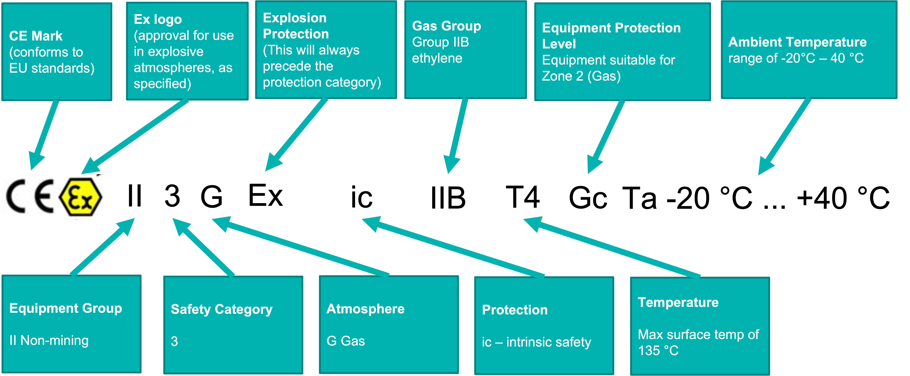
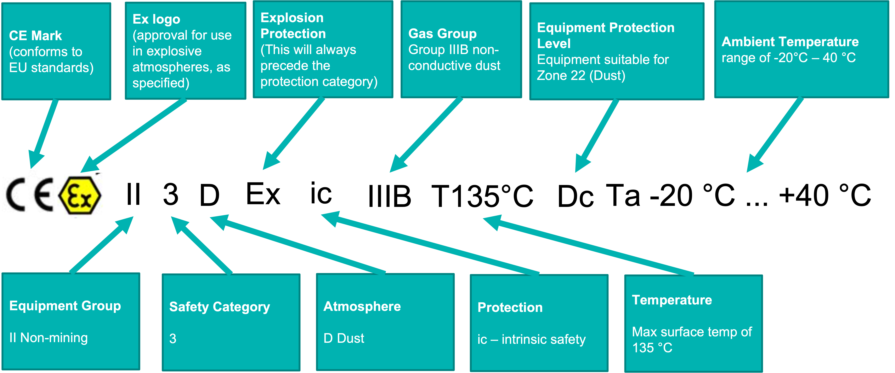
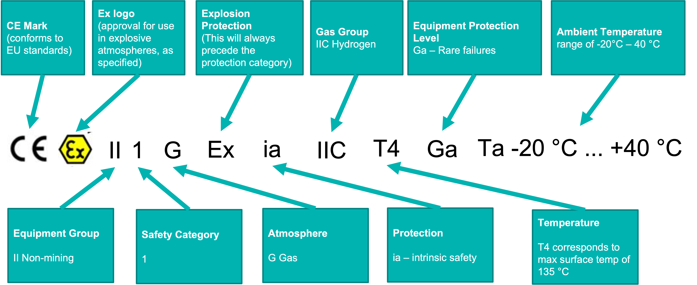
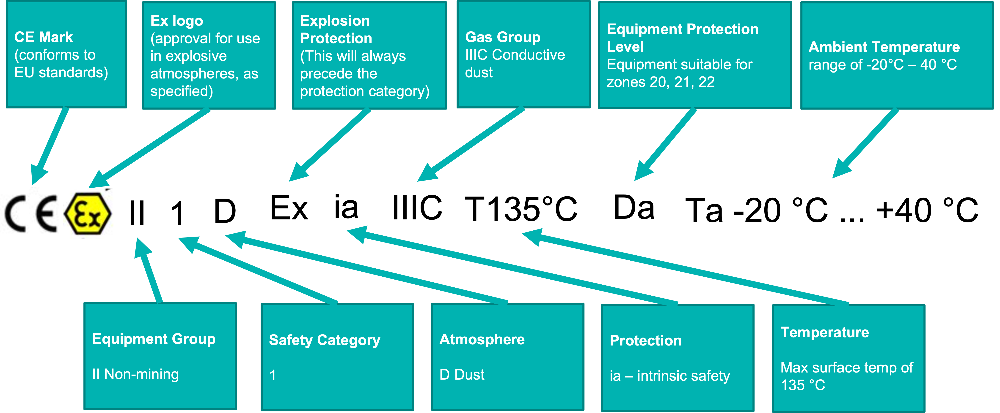
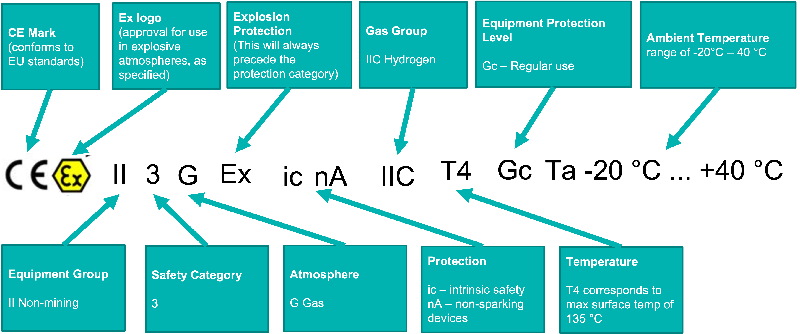
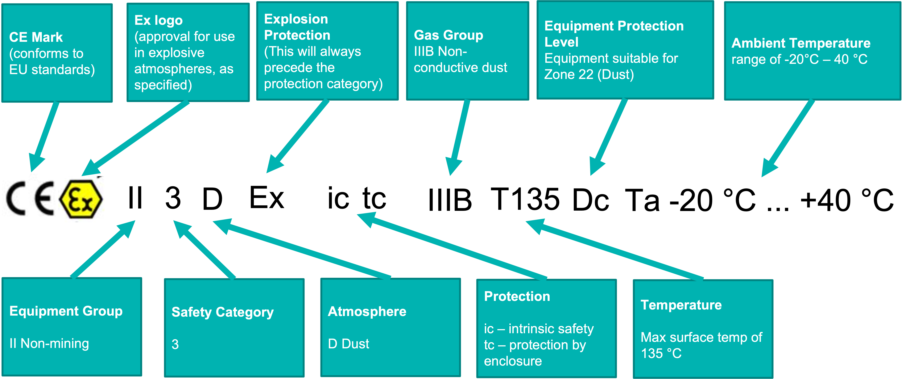
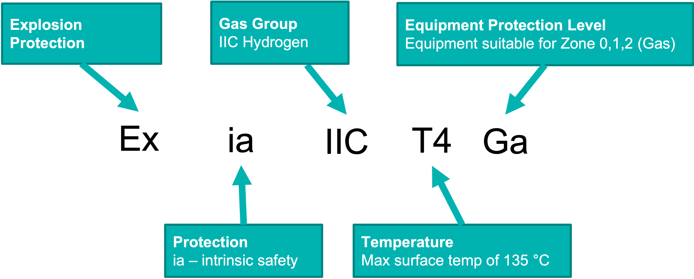
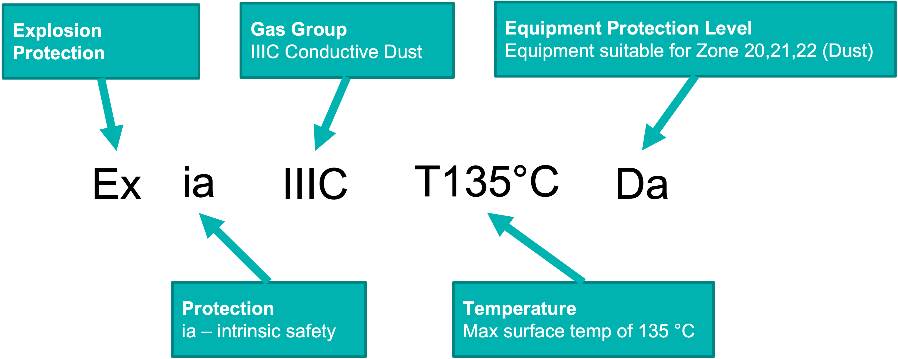

# Abeeway ATEX/IECEx products

## Introduction
The table below summarizes the ATEX/IECEx certifications of Abeeway trackers:

| | Supported Tracker Models |
| - | -------- |
| **ATEX Zone 0-20**  **IECEx Zone 0**| Compact tracker, Industrial Manageable ATEX Beacon |  
| **ATEX Zone 2-22**|Micro Tracker V2, Smart Badge, Compact tracker, Industrial Manageable ATEX Beacon|

## Smart Badge

Abeeway Smart Badge is certified as ATEX Zone 2-22 with the following ATEX Markings: 
 **Ex II 3 G Ex ic IIB T4 Gc (-20 °C ≤ Tamb ≤ +40 °C)**  
 **Ex II 3 D Ex ic IIIB T135 °C Dc (-20 °C ≤ Tamb ≤ +40 °C)**  

The markings are explained in the following figures below :

  

:::warning Note
- The certification documents are available [here](/D-Reference/DocLibrary_R/AbeewayTrackers_R.md#certifications).
- The data sheet is available [here](/D-Reference/DocLibrary_R/AbeewayTrackers_R.md#data-sheets).
- The OOB document is available [here](/D-Reference/DocLibrary_R/AbeewayTrackers_R.md#out-of-box-user-guides).
:::

## Micro Tracker V2

Abeeway Micro Tracker V2 is certified as ATEX Zone 2-22 with the following ATEX Markings: 
 **Ex II 3 G Ex ic IIB T4 Gc (-20 °C ≤ Tamb ≤ +40 °C)**  
 **Ex II 3 D Ex ic IIIB T135 °C Dc (-20 °C ≤ Tamb ≤ +40 °C)**  

The markings are explained in the following figures below :

  

:::warning Note
- The certification documents are available [here](/D-Reference/DocLibrary_R/AbeewayTrackers_R.md#certifications).
- The data sheet is available [here](/D-Reference/DocLibrary_R/AbeewayTrackers_R.md#data-sheets).
:::

## Compact Tracker

### ATEX Zone 0-20
Abeeway compact tracker is certified as ATEX Zone 0-20 with the following marking: 
 **Ex II 1G Ex ia IIC T4 Ga Ta -20 °C ... +40 °C**  
 **Ex II 1D Ex ia IIIC T135°C Da Ta -20 °C ... +40 °C**  

The markings are explained in the following figures below :

  

### ATEX Zone 2-22
Abeeway compact tracker is certified as ATEX Zone 2-22 with the following marking: 
 **Ex II 3G Ex ic nA IIC T4 Gc Ta -20 °C ... +40 °C**  
 **Ex II 3D Ex ic tc IIIB T135°C Dc Ta -20 °C ... +40 °C**  

The markings are explained in the following figures below :

  

### IECEx Zone 0
Abeeway compact tracker is certified as IECEx Zone 0 with the following marking: 
 **Ex ia IIC T4 Ga**  
 **Ex ia IIIC T135°C Da**  

The markings are explained in the following figures below :

  

