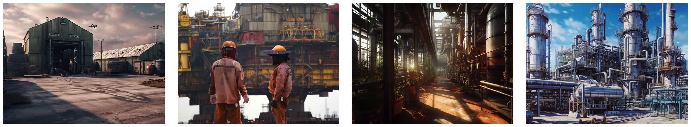

# What is ATEX/IECEx/HAZLOC

ATEX, IECEx, and HAZLOC are globally recognized certifications that ensure the safe operation of equipment in hazardous environments. These certifications are particularly vital for industries dealing with flammable materials, such as the cosmetic, pharmaceutical, oil &amp; gas, chemical, and military sectors.

- **ATEX** (short for “Atmosphères Explosives) refers to European directive 2014/34/EU which defines the conditions for a device to be allowed to have the specific marking of explosion protection that guarantees that the equipment can be used safely in explosive atmospheres (which are further defined in the marking).
- **IECEx** (International Electrotechnical Commission System for Certification to Standards Relating to Equipment for Use in Explosive Atmospheres) is an international standard that certifies equipment for use in potentially explosive environments. It is almost identical to ATEX with slightly different requirements for quality certification. 
- **HAZLOC** (Hazardous Locations) is a North American safety standard defined by the National Fire Protection Association (NPFA), the American Petroleum Institute (API), and the Canadian Standards Association (CSA) which outline minimum equipment requirements in the National Electric Code (NEC) and Canadian Electric Code (CEC).  
