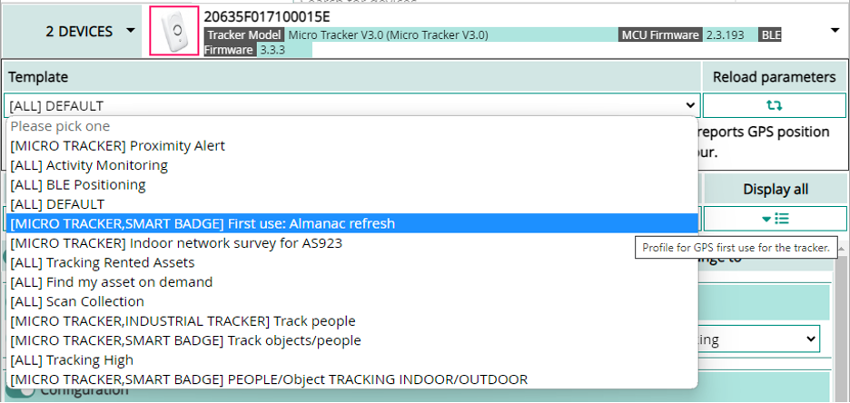

# Preparing the trackers for first use with GNSS
When a GNSS chip starts scanning for satellites, the search space is potentially huge: 
*	with no prior knowledge of satellites in sight all of them need to be searched
*	with no prior knowledge of the motion of satellites:
    - the impact of Doppler effect on expected signal frequency is also unknown and that increases the search space
    - even after capturing the pseudo range (signal flight time) for a given satellite, the position cannot be computed if the position of the satellite is not known. However it may be computed in the cloud using AGPS (Assisted-GPS) or LP-GPS (Low-Power GPS) technologies.

This initial blind search is called **Cold Start**, and typically requires up to a minute to acquire pseudo range and ephemeris (short term trajectory) of 4 satellites, which allows to compute the first fix. It will require an additional 12-15 minutes (potentially more depending on receive conditions) to acquire the Almanac (longer term trajectory information for the whole constellation), after which the GNSS will be “Warm” and able to perform subsequent fixes with a much shorter Time To First Fix (TTFF).

For this reason, when first using a tracker, it is important to not limit the resolution time to less than about a minute (parameter ***[gps_timeout](/AbeewayRefGuide/Parameters-default-configuration/firmware-parameters.md#parameters-for-gps-and-low-power-gps-geolocation-modes)***) and to allow some reasonable time to find the first satellite (parameter ***[gps_t0_timeout](/AbeewayRefGuide/Parameters-default-configuration/firmware-parameters.md#parameters-for-gps-and-low-power-gps-geolocation-modes)*** and ***[gps_t0_timeout_motion](/AbeewayRefGuide/Parameters-default-configuration/firmware-parameters.md#parameters-for-gps-and-low-power-gps-geolocation-modes)*** set to 30 seconds). In order to make sure the Almanac is captured rapidly, it is also recommended to maximize the activity time of the GNSS when preparing them for first operational use, by setting a high target resolution (parameters ***[gps_ehpe](/AbeewayRefGuide/Parameters-default-configuration/firmware-parameters.md#parameters-for-gps-and-low-power-gps-geolocation-modes)*** and ***[gps_ehpe_motion](/AbeewayRefGuide/Parameters-default-configuration/firmware-parameters.md#parameters-for-gps-and-low-power-gps-geolocation-modes)*** set to 10m or less,  ***[gps_convergence](/AbeewayRefGuide/Parameters-default-configuration/firmware-parameters.md#parameters-for-gps-and-low-power-gps-geolocation-modes)*** set to 40s or more).

After about an hour in clear sky conditions with such settings, the GNSS chip should be completely updated with the latest long term Almanac information, and in such “Warm” conditions it will be able to be set to more aggressive settings, with lower convergence time and lower power consumption).
A set of parameters that are optimized for first use acquisition of Almanac are available as a template in Abeeway Device Manager.

You can also verify the current status of Almanac that is stored in the tracker by entering the following command **gnss show `<gps|beidou`>** on [CLI](/troubleshooting-support/using-cli.md/) with the tracker connected to the computer using USB port or via [Abeeway mobile app](/C-Procedure-Topics/GetStartedMobileApp_T/) (over bluetooth). For more information refer to [AN_016_GPS_LPGPS_usage](/documentation-library/abeeway-trackers-documentation.md#application-notes) and [here](/D-Reference/UseCaseGPSPositioning_R/readme.md#preparing-your-tracker-for-first-use-with-gnss).
