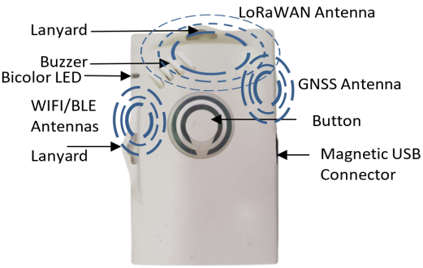
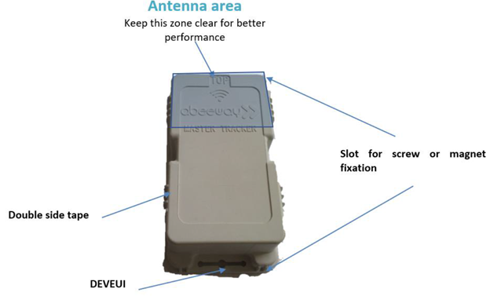

# Deploying your trackers

## Turning on your trackers

### Switching on/off your micro tracker or smart badge

<html>

</html>

If your tracker's button does not blink when pressed, either the tracker is switched off or its battery is out-of-charge. When not in testing, switch off the tracker to save battery.

:::warning WARNING
 The micro tracker and smart badge must not be left with a low or completely discharged battery for more than a month. We recommend to periodically charge the tracker at least once a month. The warranty is void if the battery of the tracker has not been charged for a prolonged period.
:::

1. If necessary, plug in the USB charging cable. 

2. On the tracker's button:
    * Press **once lengthily** (more than five seconds) **until you heard a melody**. The tracker starts in **motion tracking** mode that is the default configuration. <html><iframe type="text/html" frameborder="0" allowfullscreen="1" src="https://www.youtube.com/embed/T9dfVbptpsM?" height="150px" width="300px"/></html>

3. **When you have finished testing**, switch off the tracker like this:
    * Press **once lengthily** (more than five seconds) **until you heard a melody**. <html><iframe type="text/html" frameborder="0" allowfullscreen="1" src="https://www.youtube.com/embed/gNtn3KRglrU?" height="150px" width="300px"/></html>

### Changing your compact tracker's state
Unlike the industrial tracker which is shipped from the warehouse in **JOIN** state, the compact tracker is sent in **shipping** state to avoid draining the battery. 
You must change the state of your compact tracker before and after using it.
1. Bring a magnet close to the compact tracker for at least five seconds for the tracker to move to **JOIN** state. <html><iframe type="text/html" frameborder="0" allowfullscreen="1" src="https://www.youtube.com/embed/KoNssJapk2s?" height="150px" width="300px"/></html>

2. If the compact tracker does not **JOIN** the network, repeat the previous step again.

### Changing your industrial or compact tracker's mode
You must change the mode of your industrial or compact tracker before and after using it:
* Once the industrial or compact tracker has joined the network, it is in **standby** mode to avoid unnecessary battery drain. In this mode, the tracker is only sending LoRaWAN® heartbeat messages periodically. 

* Before starting the tracking, the testing or the integration with the industrial or compact tracker, you must change the mode to **motion tracking**, and change it back to **standby mode** when finished.
 

1. Log in to Abeeway Device Manager using the URL that applies to your environment. 
    * Abeeway Device Manager on [ThingPark Community platform](https://community.thingpark.org/) : [here](https://community.thingpark.io/thingpark/abeewayDeviceAnalyzer/index.php?dxprofile=community-api) 

    * Abeeway Device Manager on IoT platform: [https://iot.thingpark.com/abeewayDeviceAnalyzer/?dxprofile=iot](https://iot.thingpark.com/portal/web/) 
If using another platform, see [ThingPark platforms URLs](/troubleshooting-support/thingpark-location-urls.md). 

2. In the **Select Devices** column of Abeeway Device Manager, select the tracker you want to change the mode, and click **Select**.
:::tip Note
 You can select up to ten trackers to be shown at the same time.
:::

3. In the **Device Analysis Dashboard** that opens, the tracker you have selected displays its status details and statistics. Click the arrow to expand the tracker information. The information relevant to notice is:
    * **MCU Firmware** :  It gives the tracker MCU firmware version. Please refer to the [Asset Tracker Firmware Reference Guide](/abeeway-trackers-reference-guide/AbeewayRefGuide/introduction/index.md) to know the supported features. **Please ensure to follow only the reference guide version matching the firmware version running on the tracker**.
    * **First Position** and **Last Position** : When in standby mode, the tracker sends LoRaWAN® heartbeat messages periodically which can be used to get battery information, mode, firmware version...
    * **Last Mode** : Current mode of the tracker.
    * **Battery** : Percentage of battery left.

4. Click the **Device configuration** tab:
    * Select the tracker for which you want to change the profile. 

    * Select the **DEFAULT** profile, and click **Apply** at the bottom of the page.
    :::tip Note
    Depending on the connectivity with the LoRaWAN® network and the periodic LoRaWAN® hearbeat messages, it can take some time for the mode to be changed. The mode change can take at least the periodicity of the LoRaWAN® heartbeat messages defined by the LoRa_Live parameter. However it will take more time if there are network connectivity issues.
    :::
    * After few minutes, refresh the **Device configuration** tab to check the mode has changed to **Motion tracking**.
    :::warning Important
    Do not proceed further until the new mode is displayed.
    :::
    

## Trackers best placement
:::warning WARNING
 The trackers are resistant to water but must never be placed either fully/partially submerged in water or under the influence of high pressure water spray jets for significantly long periods of time. The warranty of the tracker is avoid if used incorrectly.
:::
### Micro tracker best placement
To get optimum radio performance and accuracy of your micro tracker, apply these rules when using it:
* Orient the LoRa/GPS antenna to the sky to be in reach of LoRaWAN® base stations and GPS satellites. 

* Avoid contact of fewer than five centimeters with skin, magnetic and metallic objects. 

* Avoid strong radio interferences with a cellular phone, unless using BLE where a cellular phone must be in reach.

### Smart badge best placement
To get optimum radio performance and accuracy of your smart badge, apply these rules when using it:
* Orient the LoRa/GPS antenna to the sky to be in reach of LoRaWAN® base stations and GPS satellites.  

* Avoid contact of fewer than five centimeters with skin, magnetic and metallic objects.
* Avoid strong radio interferences with a cellular phone, unless using BLE where a cellular phone must be in reach.

### Compact tracker best placement
To get optimum radio performance and accuracy of your compact tracker, apply these rules when using it:
* Always lay the compact tracker flat as shown bellow:  

* You can fix your compact tracker on an asset with a magnet, screws or a double-sided tape.
* Avoid contact of fewer than five centimeters with skin, magnetic and metallic objects.
* Avoid strong radio interferences with a cellular phone, unless using BLE where a cellular phone must be in reach.
* To avoid water entering in the casing, the tracker must not be placed upside down.

### Industrial tracker best placement
To get optimum radio performance and accuracy of your industrial tracker, apply these rules when using it:
* Always lay the industrial tracker flat as shown bellow: 

* 
* You can fix your industrial tracker on an asset with a magnet, screws or a double-sided tape. 

* Avoid contact of fewer than five centimeters with skin, magnetic and metallic objects.
* Avoid strong radio interferences with a cellular phone, unless using BLE where a cellular phone must be in reach.
* To avoid water entering in the casing, the tracker must not be placed upside down.

## Trackers default configuration
At this stage of the process, your trackers are ready to report position and help you track your assets. 
By default, we have configured your trackers to optimize your experience during your first steps with ThingPark Location favoring continuous indoor/outdoor positioning, tracker responsiveness, and positioning accuracy.
### Trackers mode
Your trackers are currently in **Motion Tracking** mode:
* They will report position when a movement is detected by the trackers' accelerometer. 

* The reporting period on motion detection is limited to one position per two minutes.

### Geolocation strategy
Your trackers are configured to report positions based on GPS or WiFi technology, ensuring continuous indoor/outdoor positioning. 
WiFi is prioritized over GPS to optimize power consumption.
### Periodic position reporting
In case your trackers do not move, they will report position periodically every four hours.
### LoRaWAN® uplink period
On top of position reports, yours tracker will send periodically LoRaWAN® uplinks. These uplinks are used to report other types of information such as battery level. Most importantly, uplinks are also used to open downlink communication slots with the trackers such as configuration change and on-demand position request.  
To maximize responsiveness of the tracker, this LoRaWAN® uplink period is set to five minutes.
### Adjusting tracker's configuration to your needs
As mentioned previously, default tracker's configuration is made to optimize your experience while discovering our solution. 
Although you will enjoy this at the beginning, you might need to adapt trackers behavior to better suit your use case requirements, or optimize power consumption. 
Abeeway trackers support a wide variety of modes and configuration parameters to help you with that. Please refer to [Abeeway Device Manager User Guide](//trackers-overview/abeeway-device-manager/index.md) to learn how to change tracker configuration.

