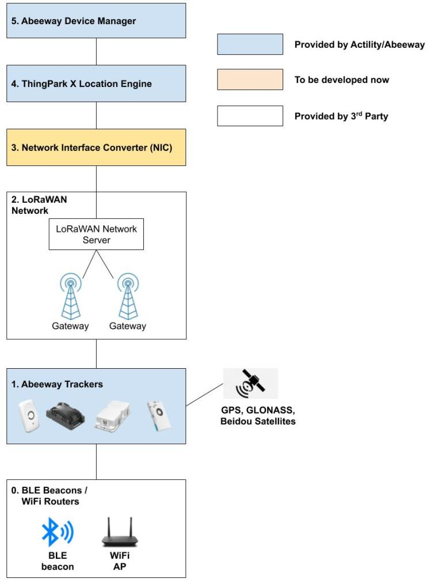

# Integrating a third-party network server
As a system integrator, a distributor, or a operation engineer, you can integrate ThingPark Location with non-Actility third-party network servers to test the unique features of Abeeway trackers. 

There are two ways to integrate with third-party network servers:
1. Use pre-deployed [Actility Network Interface Translator](/B-Feature-Topics/Integrate3PNS_1_C/) (This only works with TTN/Helium Network Server)
2. Deploy your own [Node-RED Network Interface Translator](/B-Feature-Topics/Integrate3PNS_2_C/) (This supports third party Network servers such as Helium, TTN, Loriot, Kerlink and many more)

## Setup environment
The setup environment requires the following components:
* **BLE beacons / WiFi routers** : These components are required only in case you want to test the BLE/WiFi scan feature of the trackers. 

* **Abeeway trackers** : Micro trackers, smart badges, industrial trackers, compact trackers.
* **A LoRaWAN® network** : A network is built from LoRaWAN® gateways and a LoRaWAN® network server. In this tutorial, we assume that the network is already present and offers reliable connectivity at the test area.
* **An interface converter application** : It is a proxy application that translates messages between the LoRaWAN® network server and the location solver. We will explain how you can develop your own interface proxy utilizing our Node-RED examples. 
:::tip Note
 The Node-RED component is not needed if you are using Actility’s ThingPark Wireless or ThingPark Enterprise in the cloud.
:::
* **ThingPark X Location Engine (TPXLE)** : TPXLE is a SaaS geolocation service solution.
* **Application servers** : The application servers will visualize the location data reported by the trackers. In our demo environment, we will use Abeeway Device Manager.

These components are presented below with a color code showing their origin and availability. Components from Actility/Abeeway are represented in blue, components that we plan to develop ourselves are in orange, components from third-parties are in white.

## References
[https://github.com/Actility/thingpark-integrations](https://github.com/Actility/thingpark-integrations)

