## ThingPark X Location Engine Network Interface Translator setup guide

The ThingPark X Location Engine Network Interface Translator (TPXLE-NIT) can be used to interface Abeeway trackers connected through 3rd party network servers (e.g. Helium or TTN) to ThingPark X Location Engine and the [Abeeway Device Manager][3].
An instance of this interface translator is already hosted in the ThingPark cloud, but you can setup your own (contact us).

The following steps explain how to use the hosted TPXLE-NIT.

### 1. Sign up for a new ThingPark Community account.

Sign up for a new ThingPark Community account [here][1]. This is free of charge.

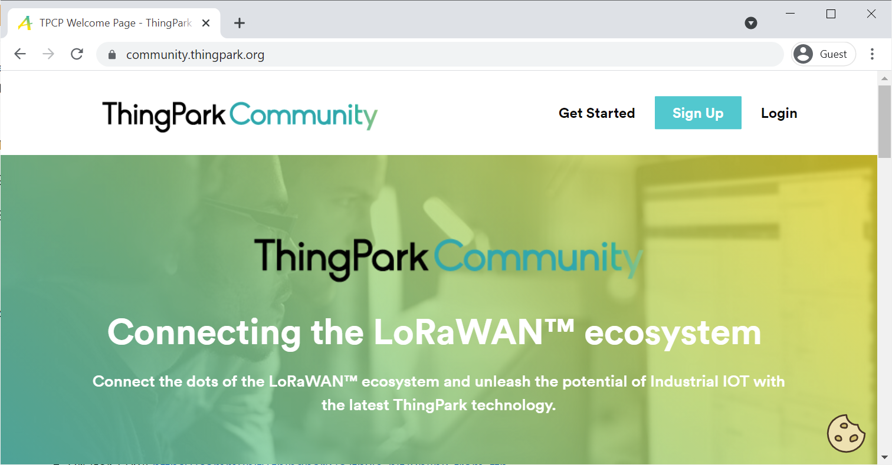

Log in with your new account to the ThingPark Community Console [here][2]

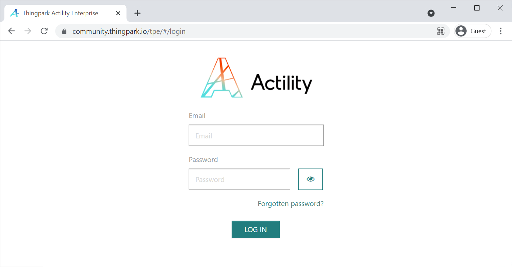

If you were able to log in, you can look around and get acquainted with the UI of ThingPark Enterprise. However, you don't need to use the console for anything now, since your goal is to use the ThingPark X Location Engine Network Interface Translator to connect to a 3rd party network server. This login was just required to verify if your ThingPark Community account is active. You can now logout and leave this site without changing anything.

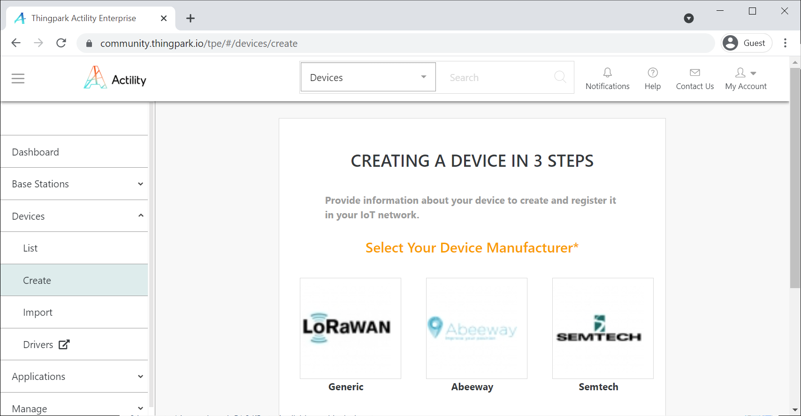

<!--

### Create a dummy application (as prerequisite to add devices)

Before adding your devices to the platform you need to create an Application. This application won't be used for anything in the context of this interconnection with a 3rd party application server, but it is a pre-requisite to create a device on the Community portal.

1. Click on **_Applications>Create_** on the side bar menu and select **_https:// Generic Application_**

  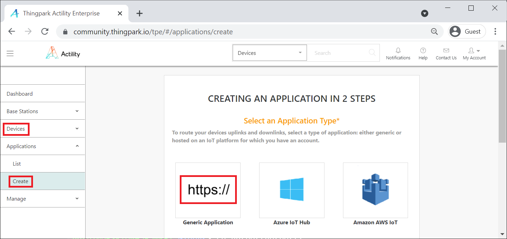

2. Fill in the form according to the following screenshot:

  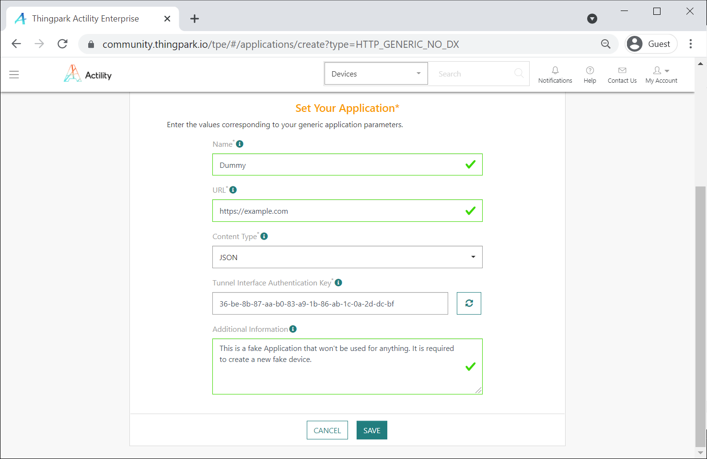

3. Save the new application

### Provision your Abeeway Trackers on the ThingPark Community Console.

Since you are planning to use a 3rd party network server, you dont have to provision your devices with the correct AppSKey and AppEUI. We recommend you using "00000000000000000000000000000000" as ApppSKey and 0000000000000000 as JounEUI. The only important data you need to be accurate with is the DevEUI so that our platform can assign your device to your account. This step ensures that your devices are declared on the ThingPark platform, so later on you can refer to them in context of the ThingPark X Location Engine.

1. Click on **_Devices>Create_** on the side bar menu and select **_Abeeway_**

  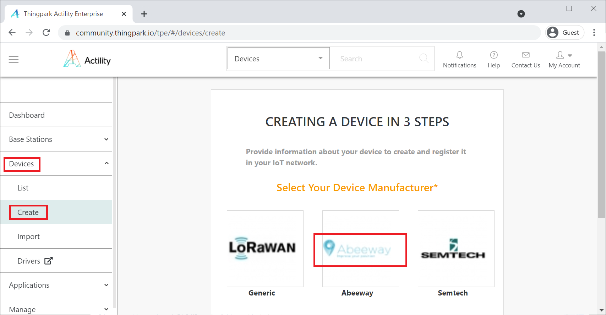

2. Fill in the form according to the following screenshots. (Please replace the DevEUI with your Device's real DevEUI.)

  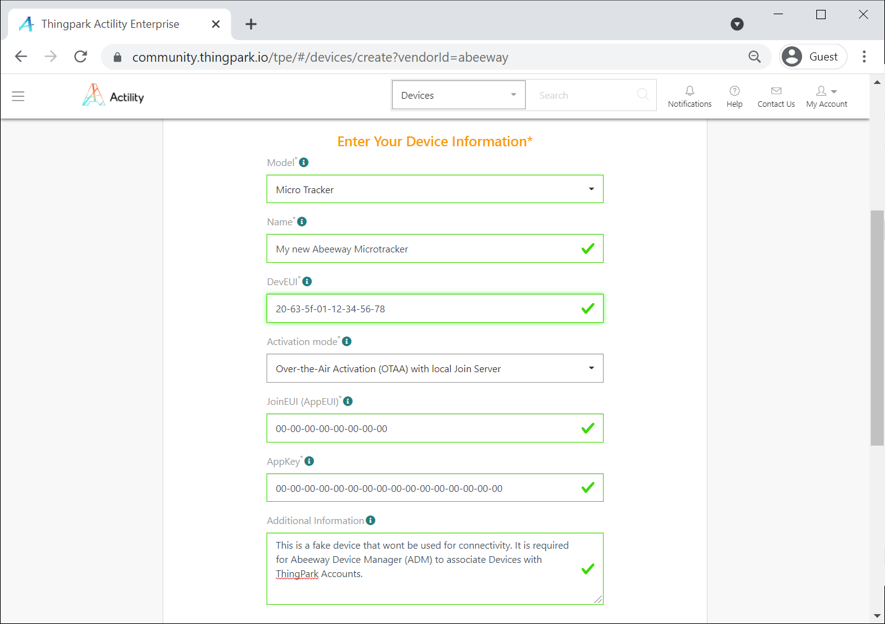

  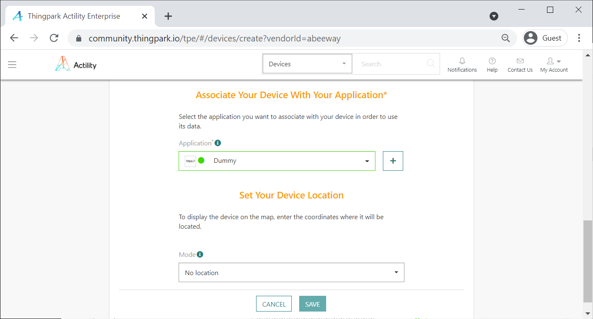

-->

### 2. Set up the uplink message flow on the 3rd party LoRaWAN Network Server

Create a new HTTP (webhook) integration on the 3rd party network server console with the parameters described below.

#### Helium console:   
Login to Helium Console [here][4]   
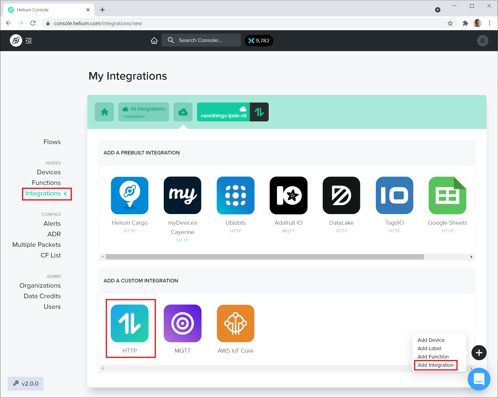

In case you use your tracker with Abeeway Device Managger or with your own application server interfaced to ThingPark X Location Engine  
create a new HTTP (webhook) integration with the following parameters:
  - Url (for Helium): `https://community.thingpark.io/tpxle-nit/uplink_from_helium`
  - Header: `x-client-id: community-api/<your_thingpark_community_user_id>`
  - Header: `x-client-secret: <your_thingpark_community_password>`  

In case you use your tracker with the Abeeway Mobile Application and you selected the *"Abeeway - Preview"* distributor after login 
create a new HTTP (webhook) integration with the following parameters (the mobile app uses a specific realm):
  - Url (for Helium): `https://community.thingpark.io/tpxle-nit/uplink_from_helium`
  - Header: `x-client-id: <your_mobile_app_user_id>`
  - Header: `x-client-secret: <your_mobile_app_password>`  
  - Header: `x-realm: le-lab`  
  *Please note that the screenshots below are not presenting the exact headers that need to be used for the Mobile App. Please add and set the headers that are described here.*

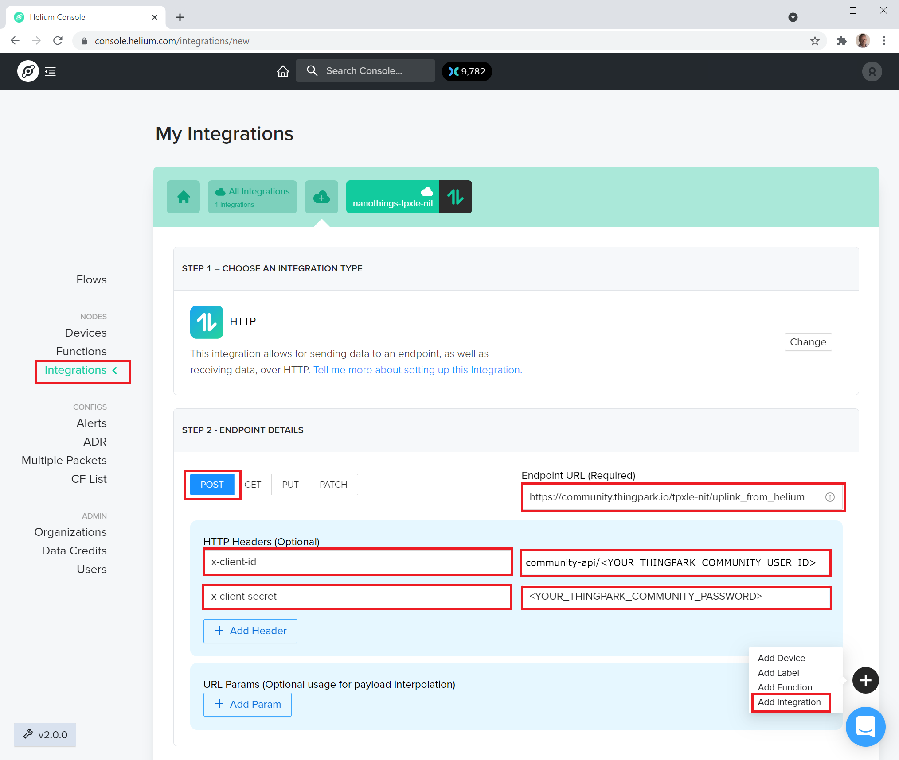

After your integration is created, don't forget to create a new flow to associate your Abeeway device to push data to your newly created integration 


#### TTN Console:   
Login to the TTN Console [here][5]

Create a new API key: 
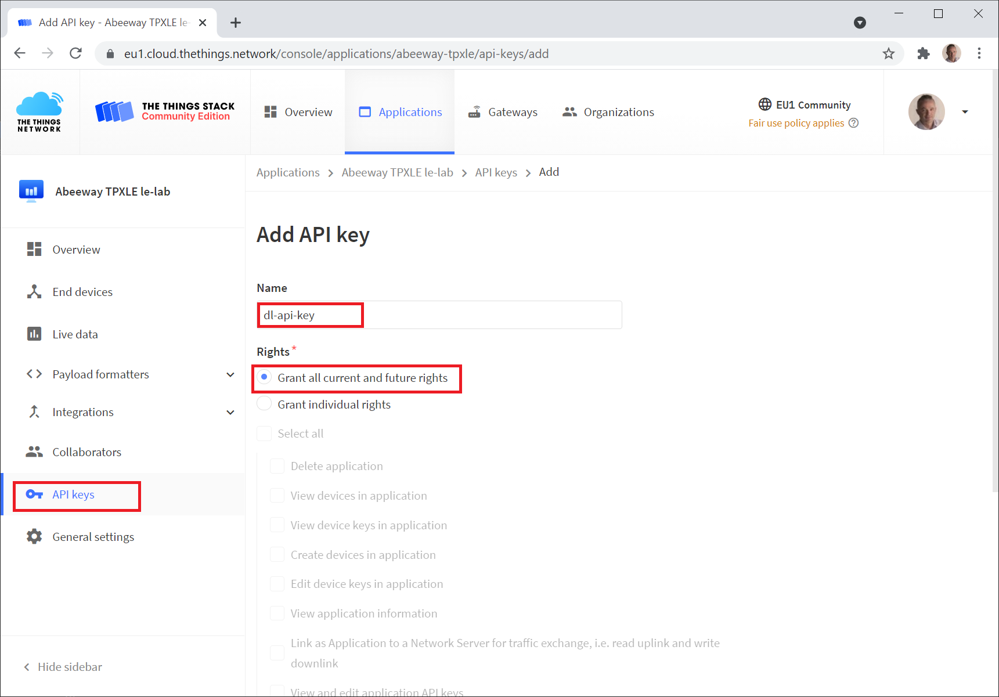

In case you use your tracker with Abeeway Device Managger or with your own application server interfaced to ThingPark X Location Engine 
create a new HTTP (webhook) integration with the following parameters:
  - Url (for TTN): `https://community.thingpark.io/tpxle-nit/uplink_from_ttn`
  - Header: `x-client-id: community-api/<your_thingpark_community_user_id>`
  - Header: `x-client-secret: <your_thingpark_community_password>`  

In case you use your tracker with the Abeeway Mobile Application and you selected the *"Abeeway - Preview"* distributor after login 
create a new HTTP (webhook) integration with the following parameters (the mobile app uses a specific realm):
  - Url (for TTN): `https://community.thingpark.io/tpxle-nit/uplink_from_ttn`
  - Header: `x-client-id: <your_mobile_app_user_id>`
  - Header: `x-client-secret: <your_mobile_app_password>`  
  - Header: `x-realm: le-lab`  
  *Please note that the screensots below are not presenting the exact headers that need to be used for the Mobile App. Please add and set the headers that are described here.*
    
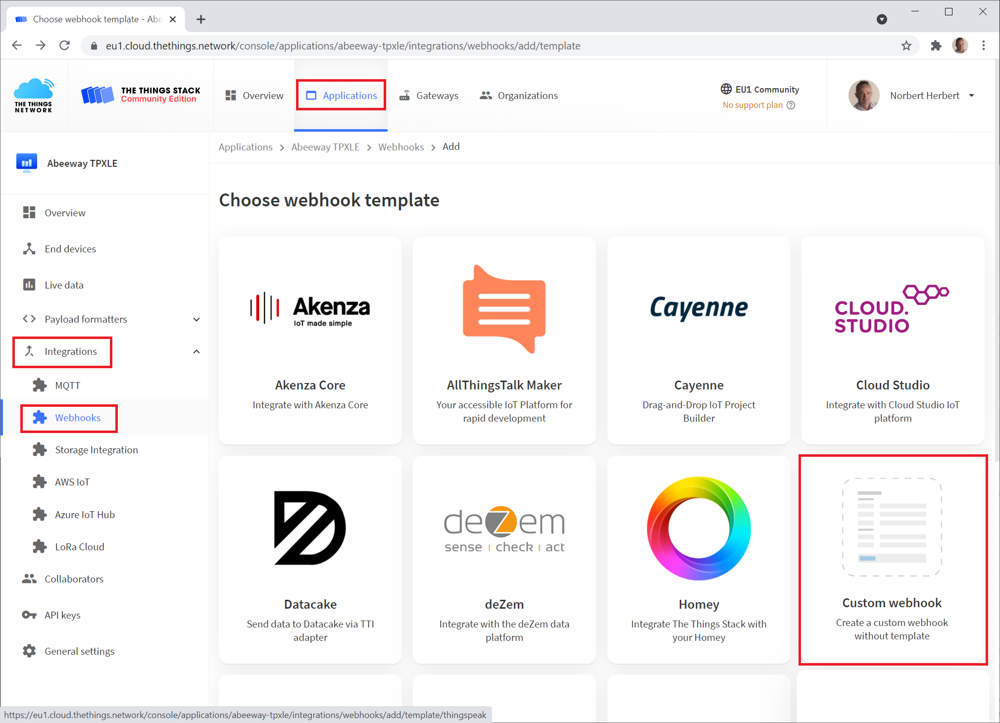

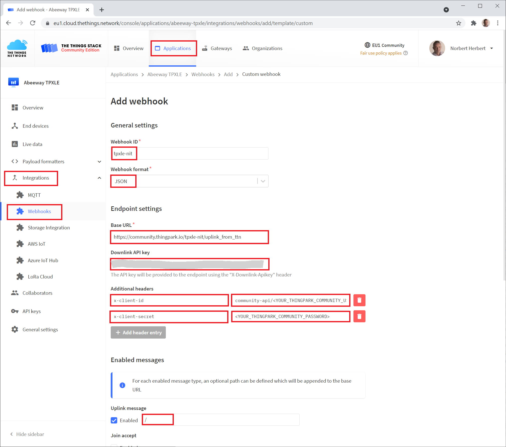

Don't forget to add your new API key as Download API key that you created earlier.

### 3. Set up the downlink message flow from ThingPark X Location Engine to the 3rd party LoRaWAN Network Server

LoRaWAN downlink commands (e.G. tracker configuration messages and on-demand location requests) are managed by the ThingPark X Location Engine (TPX LE) Binder Module, which you can coofirue through the DX Location API. You need to configure the Binder module so that tracker commands are forwarded to the Actility Network Interface Translator:

Log in to ThingPark DX API with your ThingPark Community Credentials [here][6].

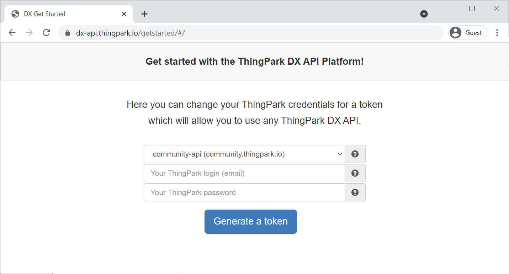

Click on **_DX Location API &gt; Swagger UI_**

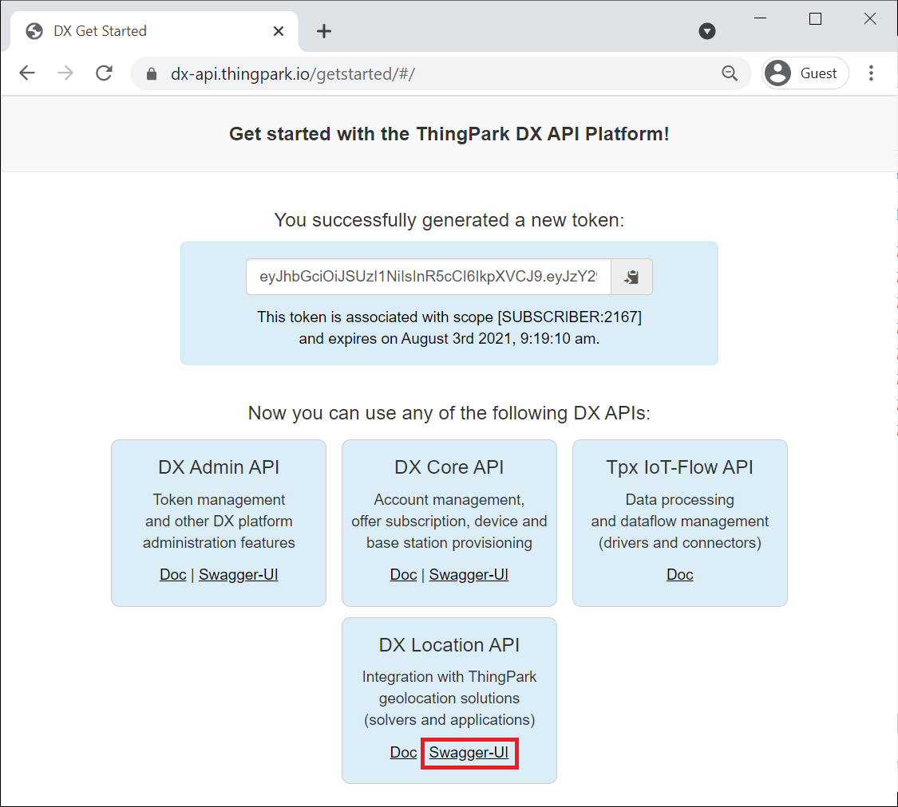

Under the **_BinderConfig_** title click on **_POST /binderConfigs_**

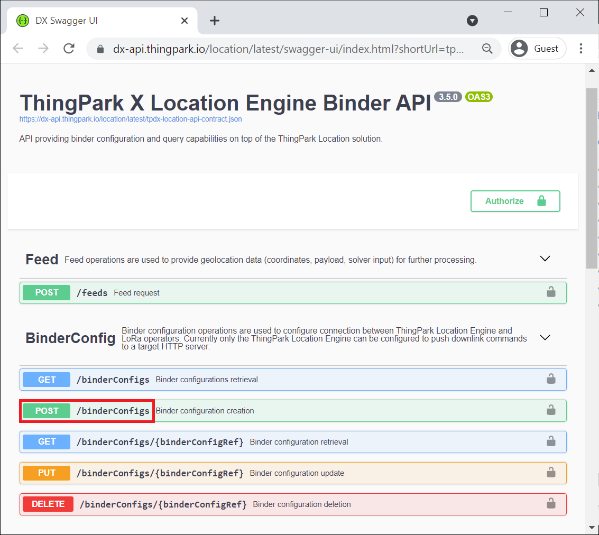

Click on the **_Try it out_** button.

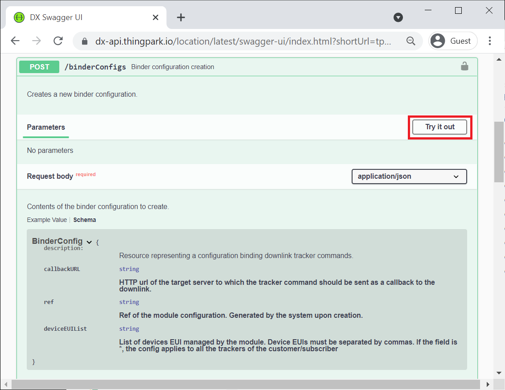

Insert the following text into the textarea:

  - for Helium:
    ```
    {
      "deviceEUIList": "*",
      "callbackURL": "https://community.thingpark.io/tpxle-nit/downlink_to_helium"
    }
    ```
  - for TTN:
    ```
    {
      "deviceEUIList": "*",
      "callbackURL": "https://community.thingpark.io/tpxle-nit/downlink_to_ttn"
    }
    ```
    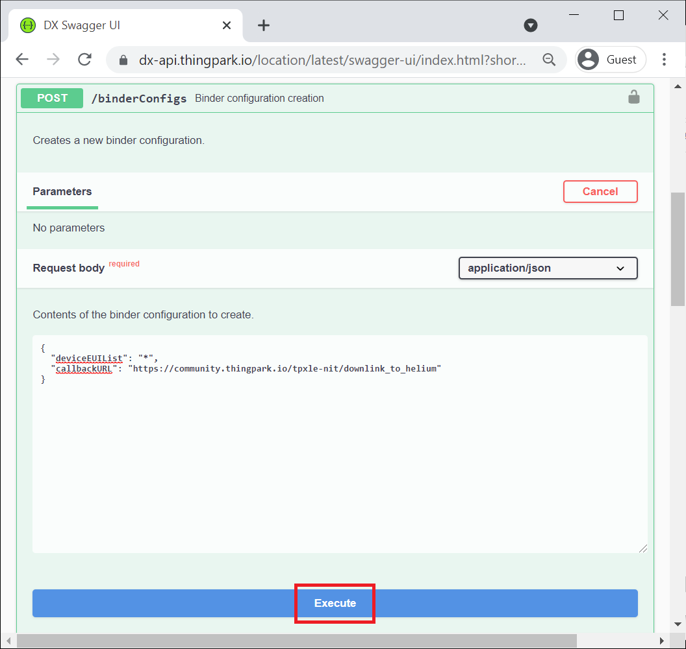

Click on the **_Execute_** button under the text area.

### 4. Test the uplink integration:

- Wait until the tracker sends a few UL messages.
- Verify on Helium/TTN Console that UL messages are forwarded to the integration you created earlier.
- Login to [Abeeway Device Manager (ADM)][3] with your ThingPark Community Credentials.

  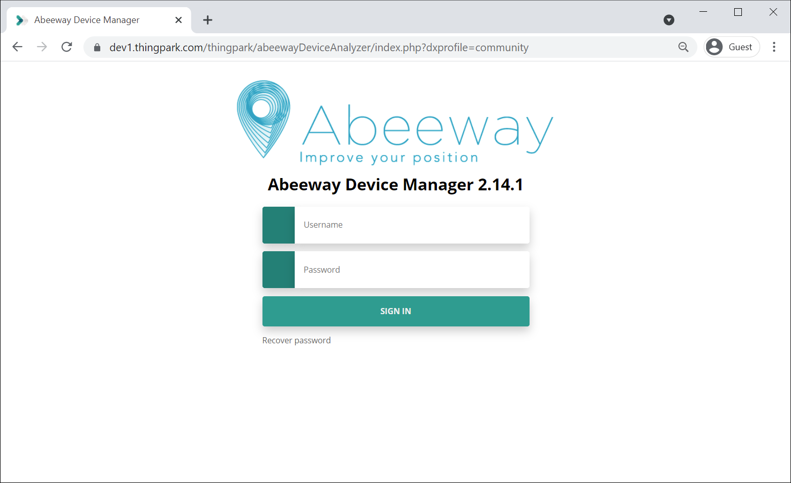

- Select your devices.
  If you cannot see any devices in the list after you logged in, then your trackers have not sent any messages to ADM yet.

  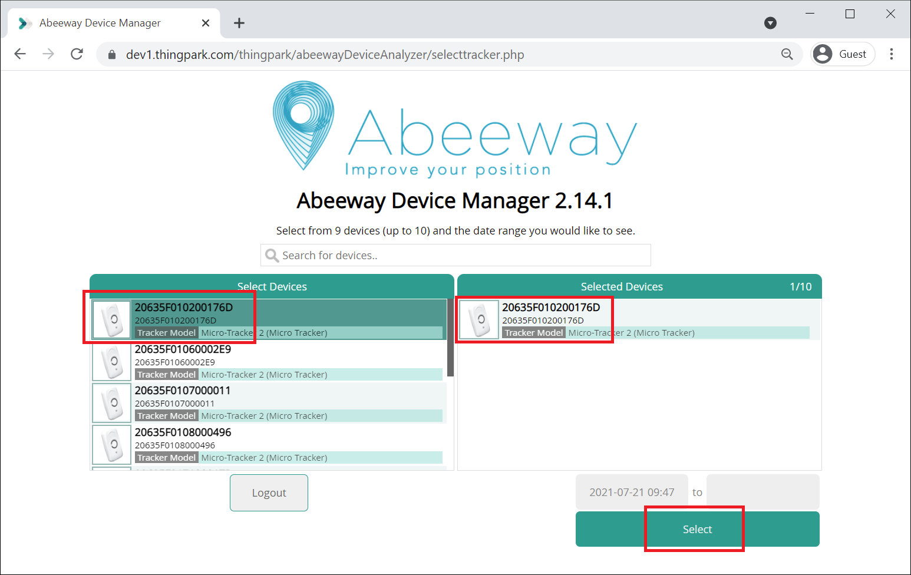

- Find your trackers on the map.

  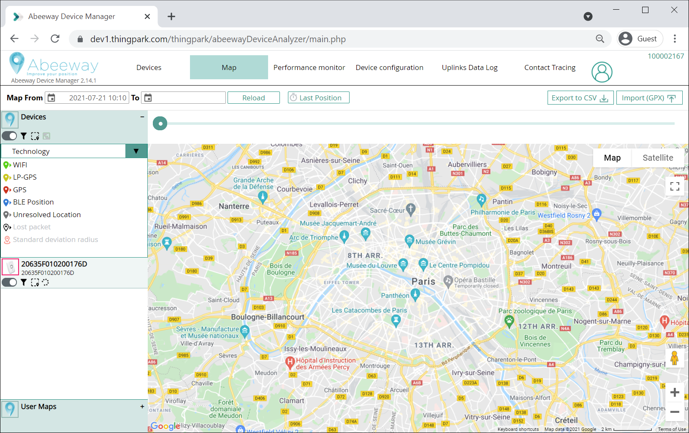

### 6. Test the downlink integration:

- Login to [Abeeway Device Manager (ADM)][3] with your ThingPark Community Credentials and select your devices. Your devices will appear here because you have registered them to the ThingPark platform in step 1.
- Click on the **_Device Configuration_** tab at the top of the ADM GUI.
- Click on the drop-dowm menu item at the bottom left of the page and select the **_Start SOS mode_** option.
- Click on the **_Send Request_** button just at the right of the drop-down menu item.  
  This should generate a downlink command that will switch the tracker to SOS mode.
  
  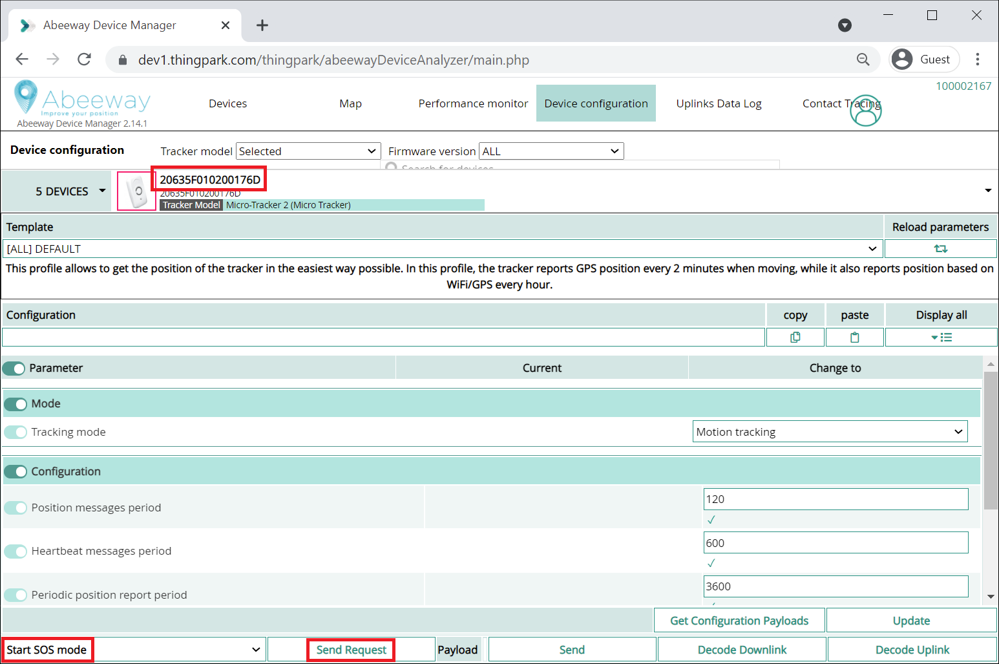

Your tracker will start SOS mode and eventually beep at downlink. Do a triple click to deactivate it.

[1]: https://community.thingpark.org/
[2]: https://community.thingpark.io/
[3]: https://community.thingpark.io/thingpark/abeewayDeviceAnalyzer/index.php?dxprofile=community-api
[4]: https://console.helium.com/welcome
[5]: https://console.cloud.thethings.network/
[6]: https://dx-api.thingpark.io/getstarted/#/
