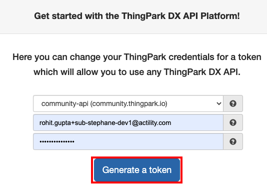
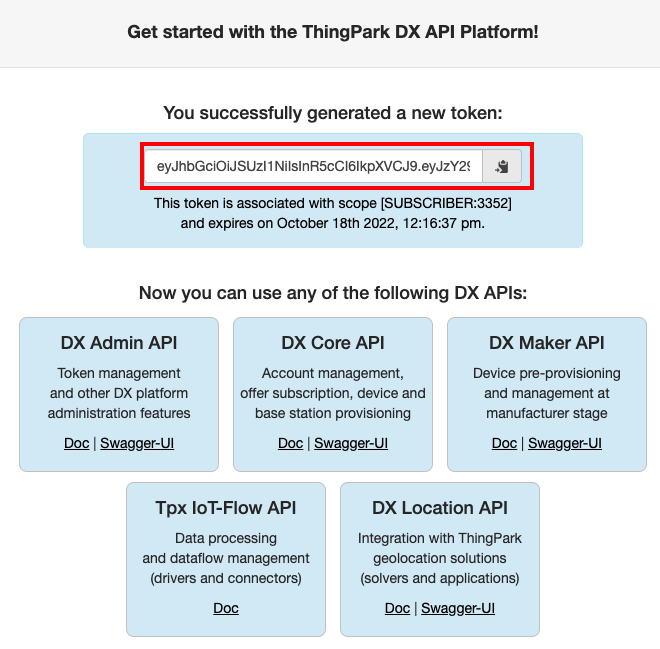

# Getting the token
In this step, we will ensure you can successfully log in to ThingPark X Location Engine.
To do so, you need:
* A valid ThingPark account 

* A token for ThingPark X Location Engine.

1. If you do not have a ThingPark account, create a free account on [https://community.thingpark.org/](https://community.thingpark.org/). If using another platform, see [ThingPark platforms URLs](../../../../troubleshooting-support/thingpark-location-urls.md). 

2. Generate the token on [DX Admin API](https://dx-api.thingpark.io/getstarted/readme.md#/) 

3. Copy the token below it as you will use it for configuring the Network Interface Converter in next step.

