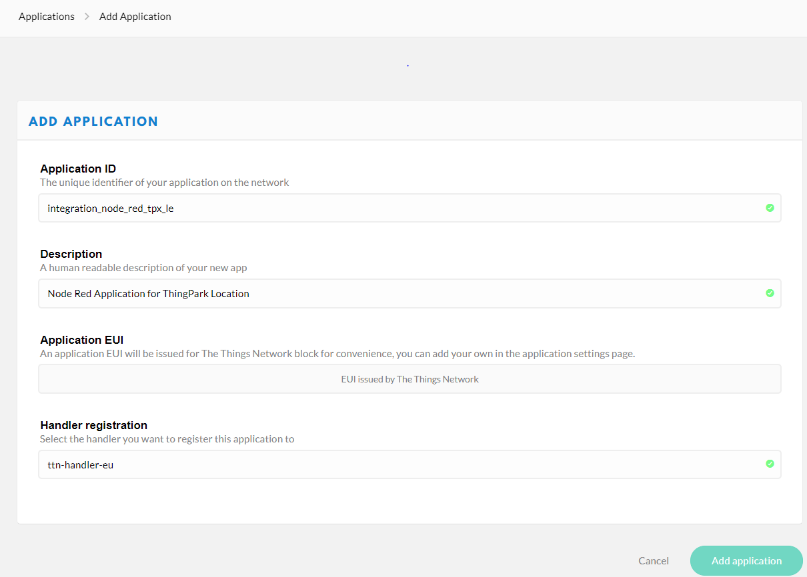
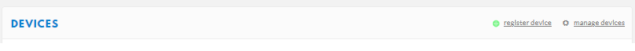
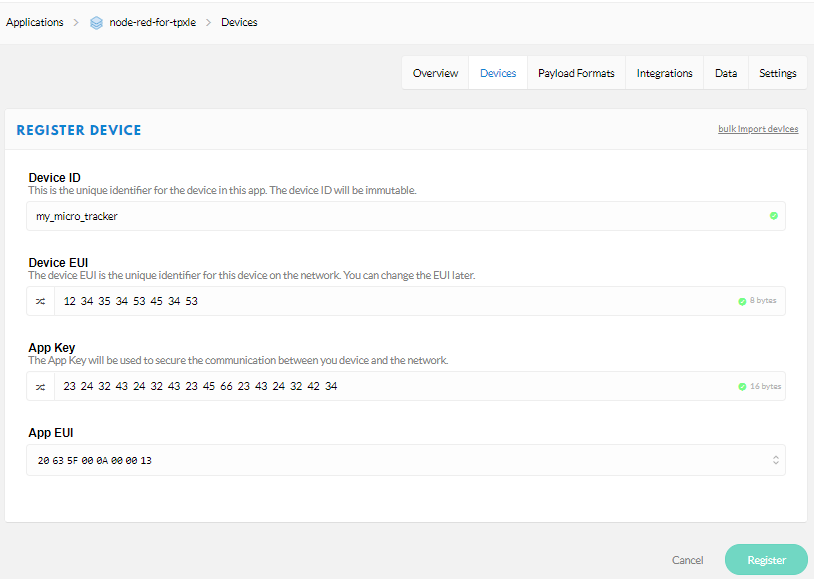

# Provisioning your trackers on a third-party network server
This task consists of configuring your trackers in your third party network server to forward all packets to and from the Network Interface Converter that you have deployed in [Integrating a third-party network server](../../../../getting-started/provisioning-your-trackers-on-lorawan-networks/provisioning-your-trackers-on-third-party-network-servers/index.md#integrating-a-third-party-network-server).
## Creating an application
Using your network server interface, you need to create an application and add the Network Interface Converter application server you have created. 
Our example is specific to TTN network server. Adapt it if using another network server.

1. Login in to your TTN console, and click **Add Application**.

2. In the **Integrations** tab, use the following information to add the integration:

| &nbsp; | Information | 
| - | ----------- | 
| **Access Key** |  Select the Access Key used to send downlinks. | 
| **URL** |  Enter the URL of the Network Interface Converter application server that you have deployed in earlier step. | 
| **Method** |  POST | 
3. Click **Add application** to save the integration.

## Creating your tracker
To provision your tracker on the application you have created in TTN, you need to create a device. Your tracker is a LoRaWAN® OTAA device. 
Adapt the procedure if using another network server.
:::warning Before you begin
 Get the DevEUI, AppEUI, and AppKey of the tracker provided in your delivery note.
:::

1. In TTN, go to the **Overview** page of the Application and click **register device**.

2. In the **REGISTER DEVICE** page that opens, apply the configuration corresponding to your tracker.

|  | Information | 
| - | ----------- | 
| **Device ID** |  This is the unique identifier for the device for this application. The device ID will be immutable. Use lower case, alphanumeric characters and nonconsecutive - and _. | 
| **Device EUI** |  Globally unique identifier of the tracker. Provided within the tracker delivery note, it is composed of 16 hexadecimal digits (0 to 9, and A to F). | 
| **App Key** |  The Application Key is an AES-128 key assigned by the application owner to the tracker to encrypt the join communication. It is provided within the tracker delivery note. | 
| **AppEUI** |  Global application identifier that uniquely identifies the application provider of the tracker. Provided within the tracker delivery note, it is composed of 16 hexadecimal digits (0 to 9, and A to F). | 

3. Click **Register**. 
-&gt; You are redirected to the newly registered device page.
