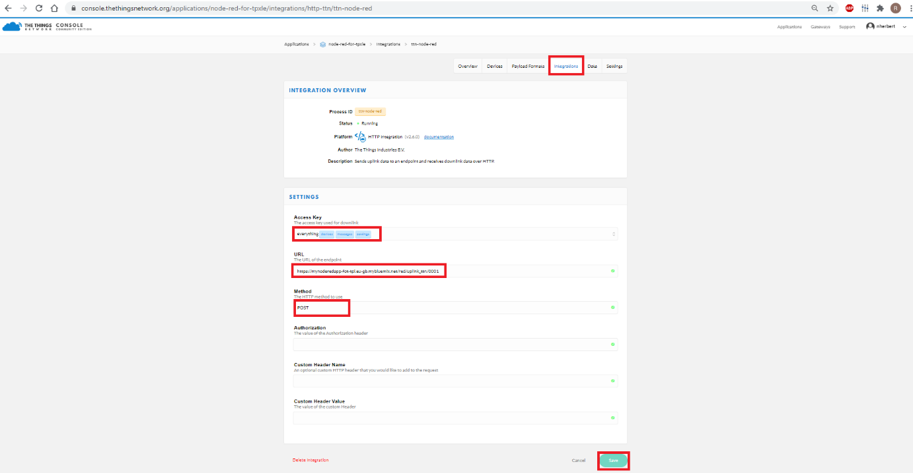

# Rerouting the uplinks
In this step, we route the uplinks from the network server to the Network Interface Converter.
&nbsp;
1. The routing URLs for different network servers are shown below. 

    | Third Party Network Server | Routing URL | Interface | 
    | -------------------------- | ----------- | --------- | 
    |  **Kerlink** |  [URL_Interface_Converter]/uplink_kerlink/0001 |  REST | 
    | **Loriot** |  [URL_Interface_Converter]/uplink_loriot/0001 |  REST | 
    | **Multitech** |  Multitech only supports the MQTT interface. The network server is publishing uplink messages in the `/lora/<dev-eui>/up` MQTT topic.On NodeRED server, you have to set the Hostname of your MQTT broker by opening the `[mqtt subscribe] lora/<dev-eui>/up` node.  |  MQTT | 
    | **Senet** |  [URL_Interface_Converter]/uplink_senet/0001 |  REST | 
    | **Senra** |  [URL_Interface_Converter]/uplink_senra/000 `1` |  REST | 
    | **TTN** |  [URL_Interface_Converter]/uplink_ttn/0001 |  REST | 
    | **Helium** |  [URL_Interface_Converter]/uplink_helium/0001 |  REST | 
2. Here is the example routing that needs to be set for TTN. 
:::tip Note
 The URL needs to be adapted based on where the Network Interface Converter is deployed.
:::

