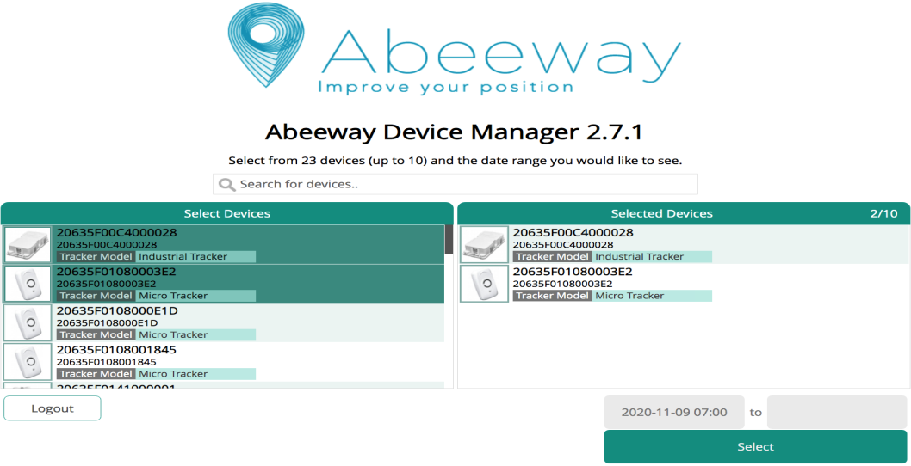
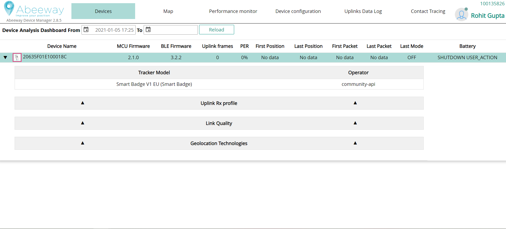
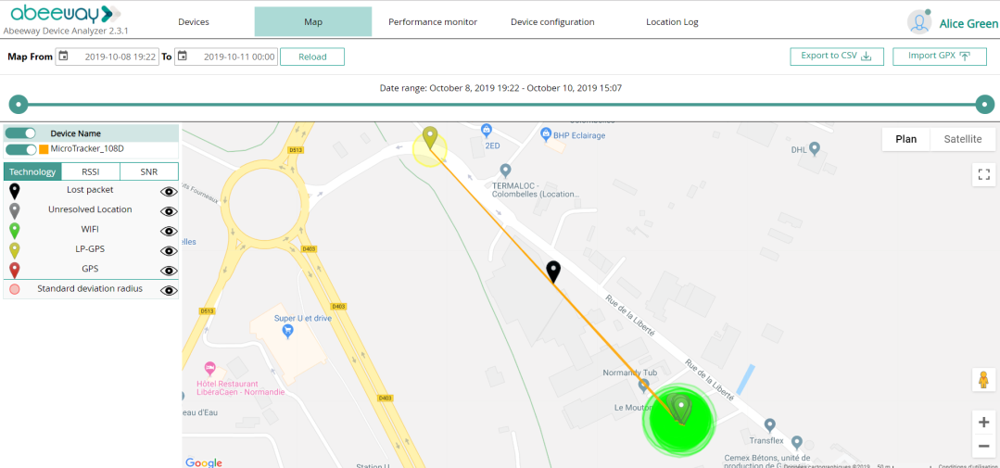
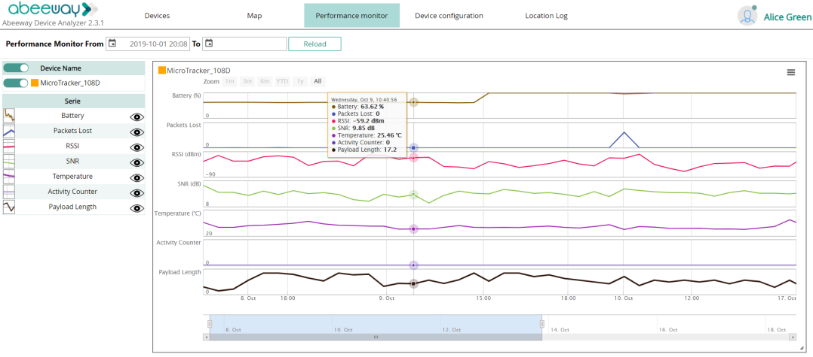

# Tracking your assets
Start to track your assets using the Abeeway Device Manager application. At the end of this step, you will be able to view your trackers on a map and monitor their performance, such as battery level.
Abeeway Device Manager is a ThingPark Location application designed to help you manage your fleet of trackers efficiently. With Abeeway Device Manager, you can:
* **Track** your assets on a map, displaying its latest position or its position history 

* **Manage** your trackers configuration, using our predefined configuration templates or building your customized parameter set
* **Assess** trackers performance: radio performance monitoring, location technology usage, battery level monitoring.

:::warning Before you begin
 We recommend you do a drive or walk test with your tracker staying in the coverage of your network to display and analyze a number of reported locations. You can also place the tracker in a moving asset you want to locate.
:::

1. Log in to Abeeway Device Manager using the URL that applies to your environment.
    * Abeeway Device Manager on [ThingPark Community platform](https://community.thingpark.org/) : [here](https://community.thingpark.io/thingpark/abeewayDeviceAnalyzer/index.php?dxprofile=community-api) 

    * Abeeway Device Manager on IoT platform: [https://iot.thingpark.com/abeewayDeviceAnalyzer/?dxprofile=iot](https://iot.thingpark.com/portal/web/) 

    If using another platform, see [ThingPark platforms URLs](/troubleshooting-support/thingpark-location-urls.md). 

2. In the **Select Devices** column of Abeeway Device Manager, select the tracker you want to change the mode, and click **Select**.
    :::tip Note
    You can select up to ten trackers to be shown and analyzed at the same time.
    :::
   

3. In the **Device Analysis Dashboard** that opens, the tracker you have selected displays its status details and statistics. Click the arrow to expand the tracker information. The information relevant to notice is:
    * **MCU Firmware** : It gives the tracker MCU firmware version. Please refer to the [Abeeway trackers reference guide](../../abeeway-trackers-reference-guide/AbeewayRefGuide/introduction/index.md) matching the MCU Firmware version running on the tracker to know the supported features.
    * **First Position** and **Last Position** of the tracker
    * **Last Mode** : Current mode of the tracker
    * **Battery** : Percentage of remaining battery

4. In the **Device Analysis Dashboard** that opens, the tracker you have selected displays its status details and statistics. Click the arrow to expand the tracker information. The information relevant to notice is:
   

5. Click the **Map** tab to see the reported locations of your tracker.
    * Once you have located your tracker positions on the map, **zoom** in or out to get the best view of them.
    * Click all the **eyes** to close them, then click them again slowly one by one to display each packet separately and discriminate the information. When **Standard Deviation Marker** is selected, a green circle is displayed around the location representing the position accuracy.
    * Click a **marker** to display more information.
    * Use the **slider** slowly to monitor a period of time where you want to display locations on the map accordingly.
    

6. Click the **Performance monitor** tab to display statistics about your tracker.
    * When opening, only the **battery** chart is displayed.
    * Click the **eyes** to display more charts.
    * Pause the mouse over the charts to display the date and details of the packets.
    * Use the **slider** to change the monitoring period range. 
    :::tip Note
    For a given tracker, all the sliders are synchronized between each other.
    :::
    

7. For more information about how to use Abeeway Device Manager, see [Abeeway Device Manager User Guide](//trackers-overview/abeeway-device-manager/index.md).
