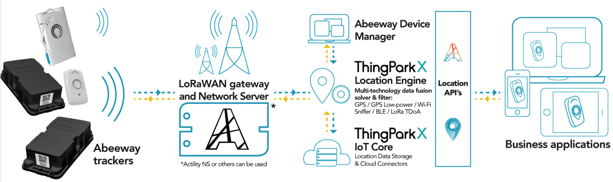

# ThingPark Location overview
ThingPark Location is a LPWAN-enabled geolocation service that provides IoT applications with the optimal position of assets and/or people, ensuring:
* A seamless outdoor/indoor positioning 

* The lowest energy consumption possible

This solution is the combination of **low-power multi-technology Abeeway trackers** with **ThingPark X location engine**, which communicates over a LoRaWAN® network, in order to process the positioning information at the edge of the LPWA network.

**Abeeway trackers** are LoRaWAN® devices ensuring asset localization by leveraging multiple geolocation technologies: **GPS**, **Low Power-GPS (LP-GPS)**, **Wi-Fi** sniffing, **LoRaWAN®**, and **BLE** radios. Multiple form factors are available to match the wide variety of vertical applications.

**TP X Location Engine** is a multi-technology solver that computes and exposes the best location information possible by combining the various information transmitted by the tracker. The location engine also exposes a set of APIs to interact with the trackers – for example to request a position, change configuration, etc.

**Abeeway Device Manager (ADM)** is TP X location Engine's companion application to efficiently manage your fleet of trackers. With ADM you can:
* Manage your trackers configuration 

* Visualize your trackers on a map
* Assess your trackers' behavior and performance, visualizing their key metrics at a glance.

