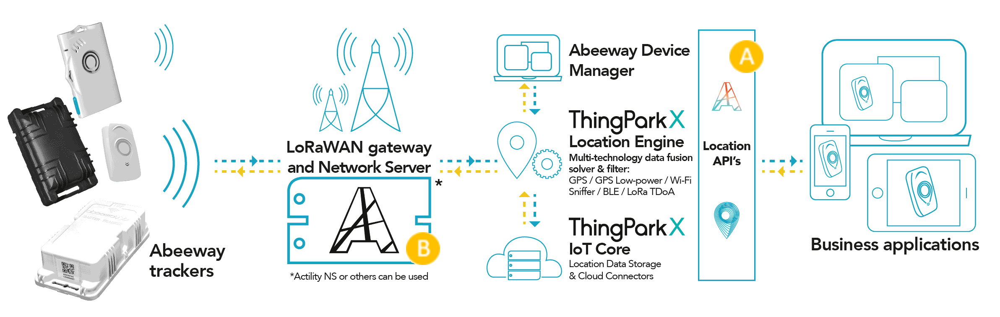

# Integrating your application with ThingPark Location
The purpose of ThingPark Location is to allow third-party IoT applications to unlock the value of LPWAN-enabled geolocation delivered by Abeeway low-power multitechnology trackers. 
Depending on your requirements, two options are available to interface your application with Abeeway trackers:

[comment]: &lt;&gt; ()

- Through **ThingPark Location API**

- Interfacing directly with the Network Server API and using our packaged **Abeeway driver**

Using  is the best option as you will benefit from:

* **An optimal position** : We combine the various positioning technology available (GPS, LP-GPS, Wi-Fi, BLE) with our post processing algorithm to deliver the most accurate and reliable position.
* **Device management capabilities** : We allow you to manage Abeeway trackers configuration and behavior from your application.
* **Value-added geolocation services** : We offer features like geofencing, Differential Assisted-GPS (DA-GPS).
However, using the  option can be suitable in some specific cases. For example, if your application is isolated and cannot be connected to our SaaS service.
## Starting to integrate your application
* [Using ThingPark Location API](/B-Feature-Topics/UseTPLocationAPI_C/) 

* [Using Abeeway driver](/C-Procedure-Topics/UseAbeewayDriver_T/)
