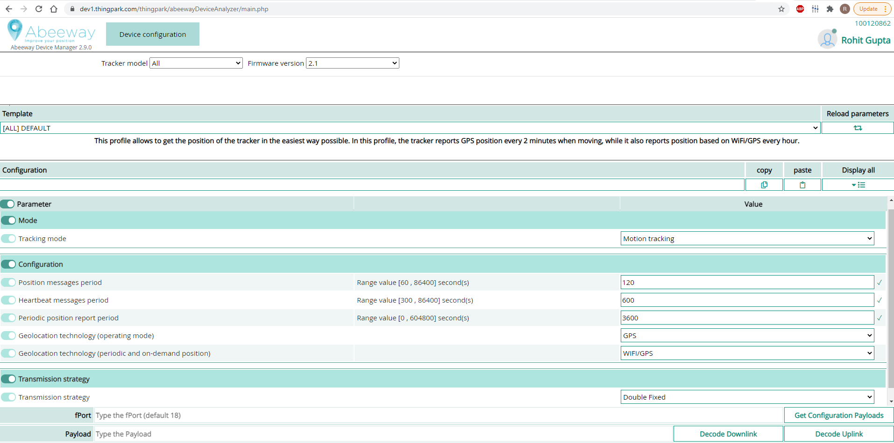
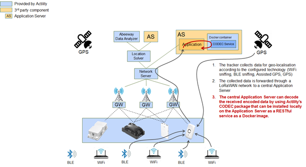

# Encoding/Decoding LoRaWAN payloads

There are multiple ways to encode/decode LoRaWAN payloads. 
1. Abeeway device Manager
2. Abeeway driver

Both the methods are described below.

## Using Abeeway Device Manager
The easiest way to encode or decode Abeeway tracker payloads is to use [Abeeway Device Manager](../../trackers-overview/abeeway-device-manager/index.md). You can do that even if you do not have trackers linked to ThingPark Location.
&nbsp;
1. Create a free account on: [https://community.thingpark.org/](https://community.thingpark.org/)
2. Log in to Abeeway Device Manager at the following URL: [here](https://community.thingpark.io/thingpark/abeewayDeviceAnalyzer/index.php?dxprofile=community-api). If using another platform, see&nbsp;[ThingPark platforms URLs](../../troubleshooting-support/thingpark-location-urls.md).
3. You can then encode or decode Abeeway payloads from the device configuration page.

## Using Abeeway driver
In this scenario, your application will directly interface with the LoRaWAN® network server to communicate with Abeeway trackers.
Our Abeeway driver docker service will run directly within your application framework to help you decode/encode uplink/downlink messages from/to Abeeway trackers.

### Installing the Abeeway driver
The Abeeway driver gives you access to the driver service and the relative API documentation.
1. Install Docker on the customer’s server using the following URL: [https://hub.docker.com/search/?type=edition&amp;offering=community](https://hub.docker.com/search/?type=edition&amp;offering=community) 

2. Download Docker image from the public Docker repository. You can do it by executing the following command:
<code>docker pull actility/iot-flow-drivers</code>
3. Run Docker image from the public Docker repository. You can do it by executing the following command:
<code>docker run -d -p 8095:8095 actility/iot-flow-drivers</code>
4. After the command has been executed successfully, the container will download autonatically the latest driver version before been accessible and the driver service will be available locally on port 8095
5. Access the API documentation using the following url:
[http://localhost:8095/v1/swagger-ui/](http://localhost:8095/v1/swagger-ui/)

### Using the Abeeway driver - Some examples
You will use the following examples that you can apply to your application:
* **Example 1** [Decoding an uplink message](../../integrating-your-application-with-thingpark-location/encoding-decoding-lorawan-payloads/decoding-an-uplink-message.md).

* **Example 2** [Encoding a downlink message](../../integrating-your-application-with-thingpark-location/encoding-decoding-lorawan-payloads/encoding-a-downlink-message.md).

* **Example 3** [Decoding a downlink message](../../integrating-your-application-with-thingpark-location/encoding-decoding-lorawan-payloads/decoding-a-downlink-message.md).

### Abeeway driver documentation
You can access the comprehensive documentation of Abeeway driver below.

|            | Resource                                                                                                                    | 
|------------|-----------------------------------------------------------------------------------------------------------------------------| 
| **Driver** | [Asset Tracker Driver User Guide](../../documentation-library/abeeway-trackers-documentation.md#reference-guides-and-tools) | 

:::warning WARNING
We recommend to use Abeeway driver to decode the payloads and NOT by implementing your own decoder using the payload structure in Abeeway Trackers reference guide. The payload formats can change between firmware versions, but we do our best to keep the backward compatibility with Abeeway driver.
:::
