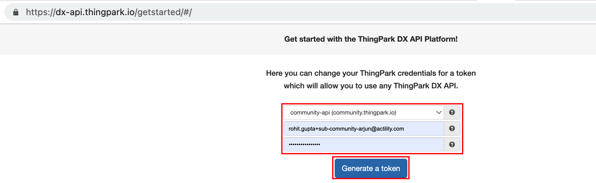
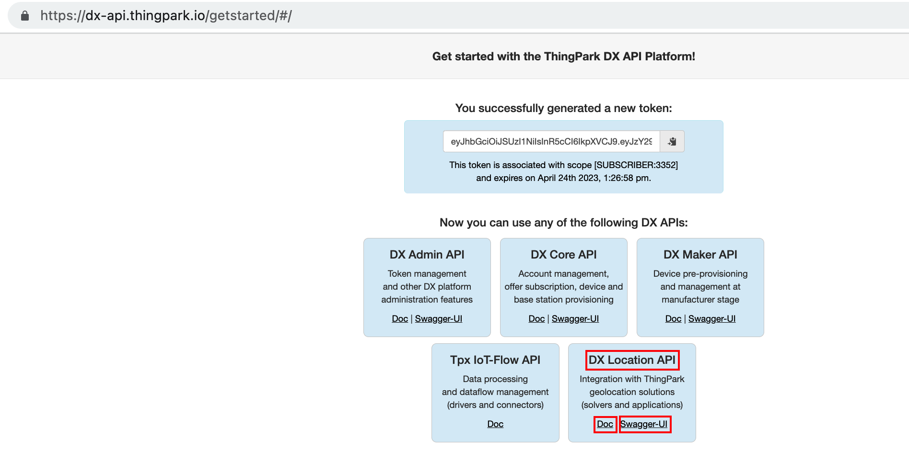
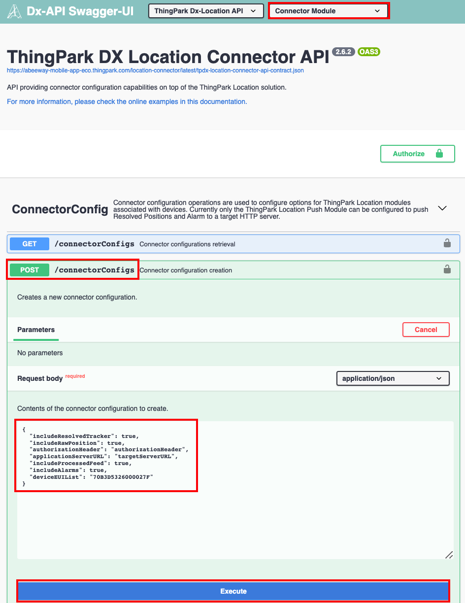

# Using ThingPark Location API
ThingPark Location provides developers with a comprehensive set of web-services based on the ThingPark DX framework.
The following API are to be considered when interfacing with ThingPark Location.

## Push locations to external application server

This section outlines the basic steps to configure ThingPark Location to send locations to external application server.

1. The first step is to authenticate with ThingPark Location using your credentials. If you are using community platform, see [here](https://dx-api.thingpark.io/getstarted/#/). For other platforms, see [here](/D-Reference/ThingParkLocationURLs/#how-to-create-a-free-account).



2. Once authenticated, you can access the ThingPark Location API documentation and swagger UI to interact with APIs.



2. Goto Connector module and configure the URL of the external application server.



ThingPark Location will post JSON object [ResolvedPosition](https://dx-api.thingpark.io/location-connector/latest/doc/index.html#resolvedposition) to the external application server for the future positions sent by the tracker.

```
{
  "deviceEUI" : "20635f028100003e",
  "time" : "2022-09-02T08:04:25.731Z",
  "customerId" : "100009247",
  "modelCfg" : "1:TPX_ba3df8fb-bc93-45ee-aa0d-b2f873b9bbc6",
  "dxProfileId" : "community-api",
  "coordinates" : [ 103.924992, 1.3143296, 0.0 ],
  "age" : 0,
  "validityState" : "NEW",
  "horizontalAccuracy" : 129,
  "incomingSubscriberId" : "100009247",

....

}
```

| Use Case | Example JSON Object | Object type |&nbsp;
| ------------ | -------- | -------- | 
| **Example JSON [geofenceAlarm](https://dx-api.thingpark.io/location-connector/latest/doc/index.html#geofencealarm) object sent when entering Geofence** | [here](/D-Reference/tpxle-sample-payloads-main_R/tpxle-alarm-geofence-entering.md) | For more information on setting up Geofence, see [ThingPark Location Introduction (Section: Setting up Geofencing)](/D-Reference/DocLibrary_R/ThingParkLocationEngine_R.md#thingpark-x-location-engine-trainings) |&nbsp; 
| **Example JSON [geofenceAlarm](https://dx-api.thingpark.io/location-connector/latest/doc/index.html#geofencealarm) object sent when leaving Geofence** | [here](/D-Reference/tpxle-sample-payloads-main_R/tpxle-alarm-geofence-leaving.md) | For more information on setting up Geofence, see [ThingPark Location Introduction (Section: Setting up Geofencing)](/D-Reference/DocLibrary_R/ThingParkLocationEngine_R.md#thingpark-x-location-engine-trainings) | 
| **Example JSON [ResolvedTracker](https://dx-api.thingpark.io/location-connector/latest/doc/index.html#resolvedtrackerasassettracker) object sent when the tracker sends its configuration parameters** | [here](/D-Reference/tpxle-sample-payloads-main_R/tpxle-output-configuration.md) | The tracker sends its configuration when either there is change of its [configuration parameter](/AbeewayRefGuide/downlink-messages/parameters-configuration/) by sending LoRaWAN downlink or when the parameter values are requested by sending [device configuration downlink](/AbeewayRefGuide/downlink-messages/request-device-configuration/) |  
| **Example [geofencingNotification](https://dx-api.thingpark.io/location-connector/latest/doc/index.html#geofencingnotification) JSON object sent when entering/exiting the different BLE geozones.** | [BLE Geozoning entry](/D-Reference/tpxle-sample-payloads-main_R/tpxle-output-event-geofencing-entry.md)<br/>[BLE Geozoning exit](/D-Reference/tpxle-sample-payloads-main_R/tpxle-output-event-geofencing-exit.md)<br/>[BLE Geozoning hazard](/D-Reference/tpxle-sample-payloads-main_R/tpxle-output-event-geofencing-hazard.md)<br/>[BLE Geozoning safe](/D-Reference/tpxle-sample-payloads-main_R/tpxle-output-event-geofencing-safe.md)| This JSON object is related to BLE Geozoning feature. For more details about BLE Geozoning feature, see [BLE Geozoning](/D-Reference/DocLibrary_R/AbeewayTrackers_R.html#abeeway-firmware-trainings) and [AN-011_BLE_geozoning](/documentation-library/abeeway-trackers-documentation.md#application-notes) |  
| **Example [TrackerAsAssetTracker](https://dx-api.thingpark.io/location/latest/doc/index.html#trackerasassettracker) JSON object which contains *eventType* object for the tracker events** | [Geolocation Start Event](/D-Reference/tpxle-sample-payloads-main_R/tpxle-output-event-geoloc-start.md)| This JSON object is sent when the tracker reports events. The *geoloc_start* event is configured in the tracker firmware by setting bit 6=0 in *config_flags*. | 
| **Example [TrackerAsAssetTracker](https://dx-api.thingpark.io/location/latest/doc/index.html#trackerasassettracker) JSON object which contains *eventType* object for the tracker events** | [Motion Start Event](/D-Reference/tpxle-sample-payloads-main_R/tpxle-output-event-motion-start.md)<br/>[Motion End Event](/D-Reference/tpxle-sample-payloads-main_R/tpxle-output-event-motion-end.md)| This JSON object is sent when the tracker reports events. The *motion_start* and *motion_end* events are configured in the tracker firmware by setting bit 8=1 &amp; bit 9=1 in *config_flags*. | 
| **Example [TrackerAsAssetTracker](https://dx-api.thingpark.io/location/latest/doc/index.html#trackerasassettracker) JSON object which contains *eventType* object for the tracker events** | [SoS Start Event](/D-Reference/tpxle-sample-payloads-main_R/tpxle-output-event-sos-mode-start.md)<br/>[SoS End Event](/D-Reference/tpxle-sample-payloads-main_R/tpxle-output-event-sos-mode-stop.md)| This JSON object is sent when the tracker reports events. The *sos_start* and *sos_end* events are sent when the tracker enters [SoS](/AbeewayRefGuide/functioning/sos/) mode.| 
| **Example [TrackerAsAssetTracker](https://dx-api.thingpark.io/location/latest/doc/index.html#trackerasassettracker) JSON object which contains *messageType* object for the tracker heartbeat message** | [Heartbeat](/D-Reference/tpxle-sample-payloads-main_R/tpxle-output-heartbeat.md)| This JSON object is sent when the tracker reports [heartbeat message](/AbeewayRefGuide/uplink-messages/heartbeat/).| 
| **Example [TrackerAsAssetTracker](https://dx-api.thingpark.io/location/latest/doc/index.html#trackerasassettracker) JSON object which contains *messageType* object for the tracker position message** | [BLE position](/D-Reference/tpxle-sample-payloads-main_R/tpxle-output-position-ble.md)<br/>[GPS position](/D-Reference/tpxle-sample-payloads-main_R/tpxle-output-position-gps.md)<br/>[GPS timeout](/D-Reference/tpxle-sample-payloads-main_R/tpxle-output-position-gps_timeout.md)<br/>[LPGPS position](/D-Reference/tpxle-sample-payloads-main_R/tpxle-output-position-lpgps.md)<br/>[LPGPS no position](/D-Reference/tpxle-sample-payloads-main_R/tpxle-output-position-lpgps-no_position.md)<br/>[WiFi position](/D-Reference/tpxle-sample-payloads-main_R/tpxle-output-position-wifi.md)| This JSON object is sent when the tracker reports [position messages](/AbeewayRefGuide/uplink-messages/position/) or [Extended position messages](/AbeewayRefGuide/uplink-messages/extended-position/). The filtered positions from the backend are in [ResolvedPosition](https://dx-api.thingpark.io/location-connector/latest/doc/index.html#resolvedposition) object|
| **Example [TrackerAsAssetTracker](https://dx-api.thingpark.io/location/latest/doc/index.html#trackerasassettracker) JSON object which contains *messageType* object for the tracker Scan Collection messages** | [BLE Scan collection Eddystone](/D-Reference/tpxle-sample-payloads-main_R/tpxle-output-scancollection-ble-eddystone-id.md)<br/>[BLE Scan collection MAC Address](/D-Reference/tpxle-sample-payloads-main_R/tpxle-output-scancollection-ble-mac.md)<br/>[Wifi Scan collection](/D-Reference/tpxle-sample-payloads-main_R/tpxle-output-scancollection-wifi.md)| This JSON object is sent when the tracker reports [Scan Collection messages](/AbeewayRefGuide/uplink-messages/collection-scan/). For more details about Scan Collection feature, see [Scan Collection](/D-Reference/DocLibrary_R/AbeewayTrackers_R.html#abeeway-firmware-trainings) and [AN-003_ScanCollection](/documentation-library/abeeway-trackers-documentation.md#application-notes) | 
| **Example [TrackerAsAssetTracker](https://dx-api.thingpark.io/location/latest/doc/index.html#trackerasassettracker) JSON object which contains *messageType* object for the tracker shock detection message** | [Shock detection](/D-Reference/tpxle-sample-payloads-main_R/tpxle-output-shock_detection.md)| This JSON object is sent when the tracker reports [shock detection message](/AbeewayRefGuide/uplink-messages/shock-detection/#accelerometer-shock-data).| 
| **Example [TrackerAsAssetTracker](https://dx-api.thingpark.io/location/latest/doc/index.html#trackerasassettracker) JSON object which contains *messageType* object for the tracker shock detection message** | [Shutdown](/D-Reference/tpxle-sample-payloads-main_R/tpxle-output-shutdown.md)| This JSON object is sent when the tracker reports [shutdown message](/AbeewayRefGuide/uplink-messages/shutdown/).| 
## DX Admin API
DX Admin API provides a standard-based token management and administration features for the ThingPark DX API platform.
### Useful links

| DX Admin API | Resource | 
| ------------ | -------- | 
| **DX Admin Swagger UI** | [https://dx-api.thingpark.io/admin/latest/swagger-ui/index.html?shortUrl=tpdx-admin-api-contract.json](https://dx-api.thingpark.io/admin/latest/swagger-ui/index.html?shortUrl=tpdx-admin-api-contract.json) | 
| **DX Admin latest documentation** | [https://dx-api.thingpark.io/admin/latest/doc/index.html](https://dx-api.thingpark.io/admin/latest/doc/index.html) | 

## DX Location API
The purpose of this API is to provide the best experience for all developers who intend to interface their application with ThingPark Location features.
### Modules

<html>
<table>
    <tr>
        <th>
            Module
        </th>
        <th>
            Description
        </th>
    </tr>
    <tbody>
    <tr>
        <td>
            <strong>Binder module</strong>
        </td>
        <td>
            <p>API providing binder configuration and query capabilities on top of theThingPark Location solution.The Binder module has:</p>
            <ul>
                <li>
                    Southbound interface ofThingPark Location , usually interfacing with LoRaWAN® network servers.
                </li>
                <li>
                    Feed API interface to integrate with third party LoRaWAN® network servers.
                </li>
            </ul>
        </td>
    </tr>
    <tr>
        <td>
            <strong>Tracker command module</strong>
        </td>
        <td>
            <p>Tracker command operations are used to send downlink commands to supported Abeeway trackers.</p>
        </td>
    </tr>
    <tr>
        <td>
            <strong>Connector module</strong>
        </td>
        <td>
            <p>API providing connector configuration capabilities on top of the ThingPark Location solution.The Binder module has the northbound interface of ThingPark Location, usually interfacing with IoT application servers.</p>
        </td>
    </tr>
    <tr>
        <td>
            <strong>Driver module</strong>
        </td>
        <td>
            <p>API providing ability to encode or decode Abeeway tracker payloads.</p>
        </td>
    </tr>
    <tr>
        <td>
            <strong>Alarm configuration module</strong>
        </td>
        <td>
            <p>API providing operations to enable notifications on tracker parameters and configure geofences.</p>
        </td>
    </tr>
    <tr>
        <td>
            <strong>Firmware Update module</strong>
        </td>
        <td>
            <p>API providing operations to retrieve the firmware binaries</p>
        </td>
    </tr>
    <tr>
        <td>
            <strong>Key Management module</strong>
        </td>
        <td>
            <p>API providing operations to store the Keys for Operator interface configuration to integrate with LoRaWAN® Network servers</p>
        </td>
    </tr>
    <tr>
        <td>
            <strong>Notification module</strong>
        </td>
        <td>
            <p>API providing operations to configure push notifications to be sent to the Abeeway Mobile APP</p>
        </td>
    </tr>
    <tr>
        <td>
            <strong>Profile Management module</strong>
        </td>
        <td>
            <p>API providing operations to manage the profiles of Abeeway trackers</p>
        </td>
    </tr>
    <tr>
        <td>
            <strong>Location Integration module</strong>
        </td>
        <td>
            <p>API providing operations to register/de-register the tracker to the Abeeway Mobile APP</p>
        </td>
    </tr>
    </tbody>
</table>
</html>

### Useful links

| DX Location API | Resource | 
| --------------- | -------- | 
| **DX Location Swagger UI** | [https://dx-api.thingpark.io/location/latest/swagger-ui/index.html?shortUrl=tpdx-location-api-contract.json](https://dx-api.thingpark.io/location/latest/swagger-ui/index.html?shortUrl=tpdx-location-api-contract.json) | 
| **DX Location - Binder module documentation** | [https://dx-api.thingpark.io/location/latest/doc/index.html](https://dx-api.thingpark.io/location/latest/doc/index.html) | 
| **DX Location - Tracker Command module documentation** | [https://dx-api.thingpark.io/location-trackercommand/latest/doc/index.html](https://dx-api.thingpark.io/location-trackercommand/latest/doc/index.html) | 
| **DX Location - Connector module documentation** | [https://dx-api.thingpark.io/location-connector/latest/doc/index.html](https://dx-api.thingpark.io/location-connector/latest/doc/index.html) | 
| **DX Location - Driver Module documentation** | [https://dx-api.thingpark.io/location-driver/latest/doc/index.html](https://dx-api.thingpark.io/location-alarm-config/latest/doc/index.html) | 
| **DX Location - Alarm Config module documentation** | [https://dx-api.thingpark.io/location-alarm-config/latest/doc/index.html](https://dx-api.thingpark.io/location-alarm-config/latest/doc/index.html) | 
| **DX Location - Location Integration Module documentation** | [https://dx-api.thingpark.io/location-integration-module/latest/doc/index.html](https://dx-api.thingpark.io/location-integration-module/latest/doc/index.html) | 
| **DX Location - Key Management Module documentation** | [https://dx-api.thingpark.io/location-key-management/latest/doc/index.html](https://dx-api.thingpark.io/location-key-management/latest/doc/index.html) | 
| **DX Location - Notification Module documentation** | [https://dx-api.thingpark.io/location-notification/latest/doc/index.html](https://dx-api.thingpark.io/location-notification/latest/doc/index.html) | 
| **DX Location - Firmware Update Module documentation** | [https://dx-api.thingpark.io/abeeway-firmware-update/latest/doc/index.html](https://dx-api.thingpark.io/abeeway-firmware-update/latest/doc/index.html) | 
| **DX Location - Profile Management Module documentation** | [https://dx-api.thingpark.io/location-profile-management/latest/doc/index.html](https://dx-api.thingpark.io/location-profile-management/latest/doc/index.html) | 

You can find more information on using ThingPark Location API, [ThingPark Location Training](https://actilitysa.sharepoint.com/:f:/t/aby/EqVIEMaqJfVHoNAi90G068UB8K4HMfB1t2eyttWIGlIwbQ?e=aqnuDd).

If you are using some other ThingPark Location platform, see [ThingPark Location Platform URLs](/D-Reference/ThingParkLocationURLs/)

