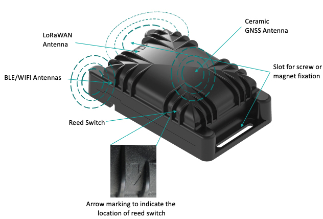

# Compact tracker best placement
:::warning WARNING
 The tracker is resistant to water but must never be placed either fully/partially submerged in water or under the influence of high pressure water spray jets for significantly long periods of time. To avoid water entering in the casing, the tracker must not be placed upside down. **The warranty of the tracker is void if used incorrectly**.
:::

To get optimum radio performance and accuracy of your compact tracker, apply these rules when using it:
* Always lay the compact tracker flat as shown below (**The top of the tracker is marked with TOP engraved in the casing**):

* You can fix your compact tracker on an asset with a magnet, screws or a double-sided tape.
* Avoid contact of fewer than five centimeters with skin, magnetic and metallic objects.
* Avoid strong radio interferences with a cellular phone, unless using BLE where a cellular phone must be in reach.
