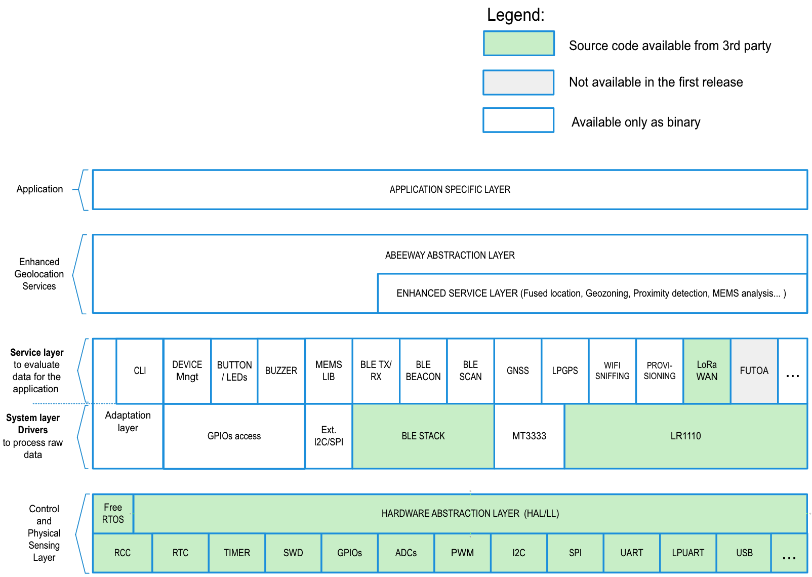

# Module Firmware Introduction

The module firmware architecture is divided in three distinct layers:

1. **The application layer:** This layer implements the actual applications, which implement desired functionality and orchestrate service and system layer functions.
2. **The service layer:** This is an additional layer that will be developed by Abeeway. This layer relies on system layer functionality
3. **The system layer:** This is the system level code consisting of the operating system, hardware drivers, HAL, and various other middlewares.

The firmware is designed with priority to meet a low power consumption by using FreeRTOS and entering the MCU in the lowest power mode when MCU is idle.
