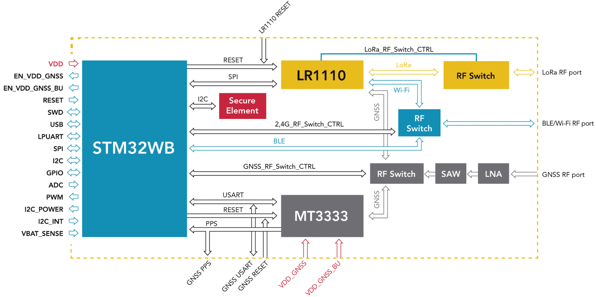

# Type 1WL Geolocation module Overview
The **Abeeway-Murata Geolocation Module** is a **multi-technology fused location LPWAN module** designed as the ideal platform to **develop a wide range of IoT tracking solutions, minimizing the Total Cost of Ownership (TCO) of IoT geolocation use cases**. It allows your engineering to focus on the use case, to **optimize time-to-market and cost** by using less complex PCBs (all high-density devices being encapsulated), to reduce certification risk and budget, as well as testing time and cost for mass production. This LoRaWAN® fused location module is a **cost effective, ultra-low power and small foot print SiP (System in Package)** integrating the high performance STM32WB micro-controller (MCU) with integrated Bluetooth 5.x Low Energy transceiver, the latest LoRaWAN® radio transceiver from Semtech, and an optimized arrangement of multi-technology RF engines for indoor and outdoor positioning.

The module contains 3 main chips: a **high end MCU STM32WB** associated with **BLE radio**, a  high-performance multi-constellation **GNSS receiver** (GPS, GLONASS, Beidou, and Galileo) and the **LR1110 Semtech transceiver** to provide LoRa &amp; FSK sub-GHz radio, low power WIFI and GNSS RX. 

## Key product features
The module contains a high-performance multi-constellation GNSS receiver (GPS, GLONASS, Beidou, and Galileo) and supports a patented ultra Low-Power GPS (LP GPS) mode which can provide a network
assisted first fix in 3 to 5 seconds from cold start at -157dBm, while requiring extremely low power during geolocation. Indoor positioning can be achieved by
combining the Bluetooth Low Energy receiver and the ultra-low power Wi-Fi receiver. The LoRaWAN® radio supports the worldwide unlicensed sub-GHz spectrum also supports device-to-device time-of-flight ranging.

The highly configurable peripherals include multiple digital interfaces: I2C/SPI/UART/USB/GPIOs, an ADC
channel input, and I/Os to support various power management schemes. These I/Os and the power of the
STM32WB make it possible to use the module not only as fused location provider, but also as the main MCU
for any LoRaWAN® application, and to drive an external LTE-M or NB-IoT modem for cellular LPWAN support.

### Outdoor Geolocation

* High performance GNSS chipset: Mediatek MT3333
* Supports GPS, GLONASS, GALILEO, BEIDOU constellations including QZSS, SBAS ranging
* Low power consumption: Acquisition 37mW, Tracking 27 mW
* Superior Sensitivity: Acquisition -148 dBm (cold)/ -163 dBm (hot), Tracking -165 dBm
* Includes RF Front-end Module (FEM) with external LNA, SAW filter and matching
* Separate correlator-only system for patented ultra-low power GPS mode (LPGPS) providing first fix in 3 to 5 seconds from cold start at -157dBm 

### Short range geolocation :
* **Wifi passive sniffing** with 802.11 b/g. -90dBm sensitivity at 802.11 b. DQBSK (2Mb/s)
* **BLE scan**: -90dBm in BLE mode
* **Ranging feature:** LoRaWAN® time-of-flight distance measurement between supporting devices

### LPWAN and unlicensed RF:
* 850-960MHz Semtech LR1110 LoRa®/FSK transceiver and 2.4GHz sniffer/correlator
* High Efficiency 14dBm Tx path, +20dBm PA enabled output power
* High performance LoRa® Rx:-140dBm sensitivity, 4.6mA Rx current
* LoRaWAN® Class A/B/C, all LoRaWAN regions in 850-960MHz spectrum.
* Firmware update over the air support for compressed delta firmware upgrade
* Optional Secure Element

### MCU platform:
* Ultra-Low Power MCU: STM32WB55
* 32 bits ARM -based Cortex- M4
* 1MB of Flash Memory and 256KB of SRAM memory

### I/Os:
* Digital: USB 2.0, UART Host, SPI, I2C, serial wire debug bus
* 10xGPIOs, 1xAIO, Application cross trigger inputs &amp; outputs

### Additional features:
* Low-Power 32KHz clock, independent TCXOs for MCU and LR1110
* Power supply &amp; battery monitoring with energy usage monitor
* Device management: RTC, BOR, timeouts, on chip temperature sensor
* Communication with the Android/iOS over Bluetooth interface
* BLE scan function for inventory of tools and accessories
* Indoor BLE/WiFi fingerprinting with HERE Tracking (requires subscription)
* Indoor BLE based geolocation with Quuppa Intelligent Location (requires Quuppa infrastructure)
* BLE based safe/hazard zone detection

### Standards and Certifications
* LoRa Alliance: EU868, US915, AS923, AU915
* Radio: EC, FCC, IC, TELEC, ATEX

### Datasheet
The datasheet of the module can be downloaded from [here](/D-Reference/DocLibrary_R/AbeewayTrackers_R.html#data-sheets).
