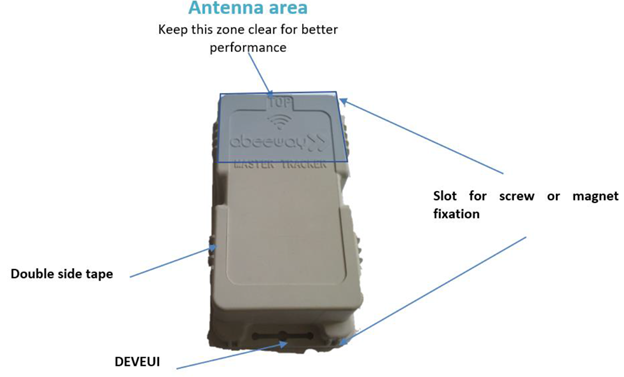

# Industrial tracker best placement
:::warning WARNING
 The tracker is resistant to water but must never be placed either fully/partially submerged in water or under the influence of high pressure water spray jets for significantly long periods of time. To avoid water entering in the casing, the tracker must not be placed upside down. The warranty of the tracker is avoid if used incorrectly.
:::

To get optimum radio performance and accuracy of your industrial tracker, apply these rules when using it:
* Always lay the industrial tracker flat as shown bellow:  

* You can fix your industrial tracker on an asset with a magnet, screws or a double-sided tape.
* Avoid contact of fewer than five centimeters with skin, magnetic and metallic objects.
* Avoid strong radio interferences with a cellular phone, unless using BLE where a cellular phone must be in reach.
