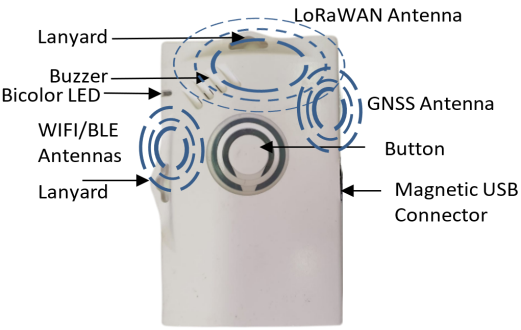

# Smart badge best placement
:::warning WARNING
 The tracker is resistant to water but must never be placed either fully/partially submerged in water or under the influence of high pressure water spray jets for significantly long periods of time. The warranty of the tracker is avoid if used incorrectly.
:::

To get optimum radio performance and accuracy of your smart badge, apply these rules when using it:
* Orient the LoRa/GPS antenna to the sky to be in reach of LoRaWAN® base stations and GPS satellites.

  

* Avoid contact of fewer than five centimeters with skin, magnetic and metallic objects.
* Avoid strong radio interferences with a cellular phone, unless using BLE where a cellular phone must be in reach.
