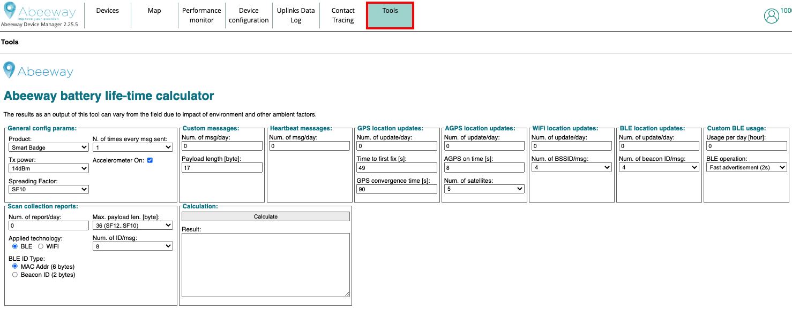

# Abeeway Power Consumption tool

<iframe width="700" height="500" src="https://www.youtube.com/embed/6o_AWqu_8hw?list=PLrtUhsI_mcGR_RQHVd0vohNFut4GpcId9" title="YouTube video player" frameborder="0" allow="accelerometer; autoplay; clipboard-write; encrypted-media; gyroscope; picture-in-picture" allowfullscreen></iframe>

Abeeway power consumption tool can be used in one of the following ways:
* [Abeeway Device Manager (tools tab)](#abeeway-device-manager-tools-tab)
* [Directly on the web browser](#directly-on-a-web-browser)

## Abeeway Device Manager (tools tab)

<html>

<a href="" >Abeeway device manager</a> (tools tab) integrates the power consumption tool of Abeeway trackers. It can be easily used to compute the average battery lifetime of the tracker

</html>

## Directly on a web browser

The power consumption tool can also be used directly on a web browser if you do not have access to Abeeway Device Manager. The link to the tool is available [here](../../other/D-Reference/DocLibrary_R/AbeewayTrackers_R.md#reference-guides-and-tools)

