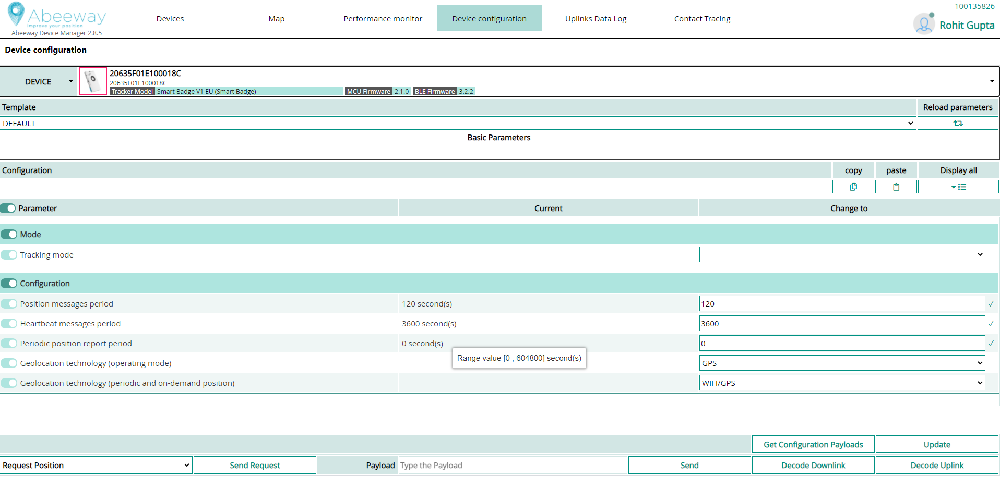

# Changing the tracker configuration
You can change quickly your tracker configuration by applying a predefined location template that suits a specific use for your tracker. 
You can choose between the following templates to easily get positions from the trackers most frequent use-cases:
* **Default** : The easiest way to get a position from the tracker.
* **Tracking rented assets** : For tracking rented assets movement, especially at the beginning or end of the movement.
* **Find my asset on demand**: Useful for getting the asset location on demand.
* **Activity monitoring**: Sends activity reports instead of positions using the accelerometer to count the amount of motions.
* **Proximity alert**: Enables proximity detection and contact tracing when two trackers are brought close to each other.
* **Scan collection**: Allows to scan once per hour up to 20 WiFi Aps or BLE beacons.

For more information, see [Location templates](../../trackers-overview/abeeway-device-manager/location-templates.md).
:::warning Before you begin
 * We recommend you do a drive or walk test with your tracker to display and analyze a number of reported locations. You can also place the tracker in a moving asset you want to locate.
 * The tracker must be provisioned on a ThingPark platform. To create a free account, see [ThingPark platforms URLs](../../troubleshooting-support/thingpark-location-urls.md).
:::

1. Log in to Abeeway Device Manager using the URL that applies to your environment:
    * Abeeway Device Manager on [ThingPark Community platform](https://community.thingpark.org/) : [here](https://community.thingpark.io/thingpark/abeewayDeviceAnalyzer/index.php?dxprofile=community-api)
    * Abeeway Device Manager on IoT platform: [https://iot.thingpark.com/abeewayDeviceAnalyzer/?dxprofile=iot](https://iot.thingpark.com/portal/web/)

If using another platform, see [ThingPark platforms URLs](../../troubleshooting-support/thingpark-location-urls.md). 

2. In the **Select Devices** column of Abeeway Device Manager, select the tracker you want to change the configuration, and click **Select**.
3. Click the **Device Configuration** tab, then select the tracker you want to change the device configuration. 
:::warning Important
 In this tab, you can also check the **MCU Firmware** and **BLE Firmware** versions of the tracker.
:::

4. In the **Template** list, select the predefined profile you want to apply to your tracker.
    a. **DEFAULT** : This profile allows to get the position of the tracker in the easiest way possible. In this profile, the tracker reports GPS position every 2 minutes when moving, while it also reports position based on WiFi/GPS every hour. Here are the key parameters of the profile: 
   
   | Firmware parameter name | Value | 
   | ----------------------- | ----- | 
   | `mode` |  1 (Motion tracking) | 
   | `ul_period` |  120 seconds | 
   | `lora_period` |  600 seconds | 
   | `periodic_pos_period` |  36000 seconds | 
   | `geoloc_sensor` |  1 (GPS Only) | 
   | `geoloc_method` |  3 (WiFi-GPS) | 
   
    b. **TRACKING RENTED ASSETS** : This profile is useful for tracking rented assets movement especially at the beginning or end of the movement. In this profile, the tracker is reporting positions based on WiFi/GPS every 2 minutes once the tracker detects motion start/end event. Here are the key parameters of the profile:

    | Firmware parameter name | Value | 
    | ----------------------- | ----- | 
    | `mode` |  3 (Motion start/end tracking) | 
    | `ul_period` |  120 seconds | 
    | `lora_period` |  600 seconds | 
    | `periodic_pos_period` |  36000 seconds | 
    | `geoloc_sensor` |  6 (WiFi-GPS) | 
    | `geoloc_method` |  3 (WiFi-GPS) | 
    c. **FIND MY ASSET ON DEMAND** : This profile is useful for getting the asset location on demand. In this profile, the tracker is reporting positions based on WiFi/GPS every hour. However, the tracker position can be requested by user by sending downlink message. Here are the key parameters of the profile:

    | Firmware parameter name | Value | 
    | ----------------------- | ----- | 
    | `mode` |  0 (Standby) | 
    | `lora_period` |  900 seconds | 
    | `periodic_pos_period` |  36000 seconds | 
    | `geoloc_method` |  3 (WiFi-GPS) | 
    d. **ACTIVITY MONITORING** : This profile sends an activity reports instead of positions by counting the amount of motions with the accelerometer. Each motion detection increases a counter (if 3 motion events are detected during a 2 seconds period interval) and the counter value is reported at the `ul_period` frequency. Here are the key parameters of the profile:

    | Firmware parameter name | Value | 
    | ----------------------- | ----- | 
    | `mode` |  4 (Activity tracking) | 
    | `ul_period` |  120 seconds | 
    | `lora_period` |  900 seconds | 
    e. **PROXIMITY ALERT** : This profile enables proximity detection and contact tracing when two trackers are brought close to each other. Here are the key parameters of the profile:

    | Firmware parameter name | Value | 
    | ----------------------- | ----- | 
    | `mode` |  0 (Standby) | 
    | `lora_period` |  3600 seconds | 
    | `prox_alarm_remanence` |  30 seconds | 
    | `prox_warn_remanence` |  30 seconds | 
    | `prox_bcn_tx_power` |  -41 dBm | 
    | `prox_warn_dist_immediate` |  0.1 meters | 
    | `prox_alarm_dist_immediate` |  2 meters | 
    | `prox_record_dist_immediate` |  2 meters | 
    | `Prox_scan_pwr_min` |  -60 dBm | 
    | `Prox_contact_policy` |  5 | 
    f. **SCAN COLLECTION** : This profile enables the scan collection feature which allows to scan and up to 20 WiFi Aps or BLE beacons once per hour. Here are the key parameters of the profile:

    | Firmware parameter name | Value | 
    | ----------------------- | ----- | 
    | `mode` |  1 (Motion Tracking) | 
    | `ul_period` |  120 seconds | 
    | `lora_period` |  600 seconds | 
    | `periodic_pos_period` |  3600 seconds | 
    | `geoloc_sensor` |  6 (WiFi/GPS) | 
    | `geoloc_method` |  3 (WiFi/GPS) | 
    | `collection_scan_type` |  1 (BLE Beacons) | 
    | `collection_nb_entry` |  20 | 
    | `collection_ble_filter_type` |  0 (No filter) | 
    | `collection_ble_filter_main_1` |  0 (No filter) | 
    | `collection_ble_filter_main_2` |  0 (No filter) | 
    | `collection_ble_filter_sec_value` |  0 (No filter) | 
    | `collection_ble_filter_sec_mask` |  0 (No filter) | 

5. Click **Update** to apply the configuration profile.
    :::warning Important
    Depending on the number of parameters selected, the profile update can take some time as the LoRaWAN® downlinks can be sent only when the tracker sends the next uplink.
    :::
6. After a few minutes, refresh the Abeeway Device Manager's Configuration page in your browser for the profile change to take effect.
   
7. For more information about how to use Abeeway Device Manager, see [Abeeway Device Manager User Guide](../../documentation-library/abeeway-trackers-documentation#abeeway-device-manager-application).
