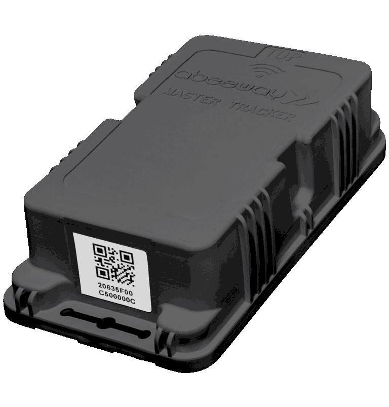

# Industrial tracker
The Abeeway industrial tracker is a multi-mode tracker with large battery for long battery lifetime. It combines **GPS**, **Low Power-GPS (LP-GPS)**, **Wi-Fi**, **LoRaWAN®** and **BLE** radios with embedded sensors to support accurate **outdoor** and **indoor** geolocation. 
This tracker is equipped with the rugged casing which is designed to withstand harsh surroundings enabling seamless asset tracking and management in any industrial environment – whether it is for heavy duty assets, inventory or livestock.

## Key product features
Abeeway industrial tracker provides you with the flexibility you need to adapt your tracker's behavior to your use case, selecting the right operating mode and geolocation technology.
### Multiple operating modes

* **Motion tracking** : Tracker reports real-time position only when motion is detected. This is the default configuration that you can discover applying instructions given in this guide.
* **Permanent tracking** : Tracker reports periodic real time positions.
* **Start/End motion tracking** : Tracker reports positions only at the start and end events of the motion.
* **Position on-demand** : Tracker sends its position only when requested from the end-user (very low power operating mode). The position request can be made from the geolocation backend platform.
* **Activity tracking** : Monitor activity rate with embedded sensors.
* **Standby** : The tracker sends periodically short LoRaWAN® messages, called heartbeat, at the configured interval. The tracker positions can be obtained in this mode by using the side operations features. Once the tracker has joined the LoRaWAN® network, the tracker is set to standby mode to save battery. **We recommend to put the tracker in standby mode when not in testing to save the battery lifetime**.

:::warning WARNING
* For more information on the battery lifetime of the tracker, visit [here](../abeeway-device-manager/abeeway-power-consumption-tool.md)
* For more information on tracker documentation, visit [here](../../documentation-library/abeeway-trackers-documentation.md#reference-guides-and-tools).
* The Industrial tracker is activated by default to make LoRaWAN joins indefinately. There is delay between different join attempts which range from 15 minutes to 1 hour.
:::

### Geolocation technologies
* **GPS** : For **precise outdoor** positioning
* **Low Power-GPS (LP-GPS)** : For **power-efficient outdoor** and **daylight indoor** positioning
LP-GPS is an Actility proprietary technology based on GPS. Enabling Fast Time to First Fix, it results in **improved battery lifetime**.
* **Wi-Fi** : For **indoor** and **outdoor** location services in **urban areas**
It leverages the Wi-Fi access point scanning capabilities of the industrial tracker.

### Other features
* **Temperature** monitoring
* **LoRaWAN® Class A radio**
* Dust-proof and powerful water jets ( **IP65** )
* Geofencing zone detection
* Edge computing for Proximity detection and exposure assessment
* Temperature monitoring
* BLE Communication link with a phone
* Firmware Upgrade via USB or Bluetooth
* BLE scan function for inventory of tools and accessories
* Indoor BLE/WiFi fingerprinting with HERE Tracking or Combain (requires subscription)
* Indoor BLE based geolocation with Quuppa Intelligent Location (requires Quuppa infrastructure)
* BLE based safe/hazard zone detection

### Standards and Certifications
* LoRa Alliance: EU868, US915, AS923, AU915
* Radio: EC, FCC, IC, TELEC

:::warning WARNING
* The latest information on certification can be found [here](/documentation-library/abeeway-trackers-documentation.md#certifications).
* The tracker is resistant to water but must never be placed either fully/partially submerged in water or under the influence of high pressure water spray jets for significantly long periods of time. To avoid water entering in the casing, the tracker must not be placed upside down. 
* **The warranty of the tracker is avoid if used incorrectly**.
:::

### Datasheet
The datasheet of the tracker can be downloaded from [here](/documentation-library/abeeway-trackers-documentation.md#data-sheets).
