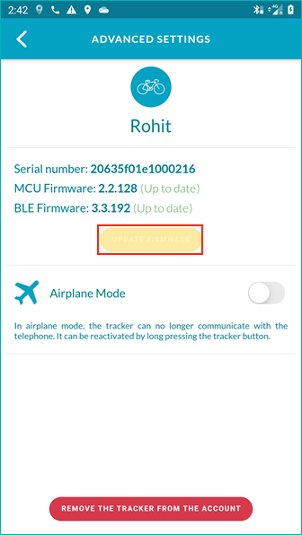
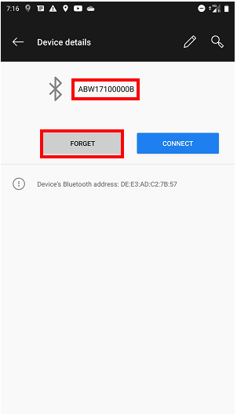

# Firmware Update (Using Abeeway tracking App)

Abeeway tracking app can be used easily to upgrade both MCU and BLE Firmware of the tracker. It is a very useful option to upgrade the trackers in the field with a smart phone using Bluetooth without opening the tracker casing.

This section describes how to carry out the firmware update using Abeeway updater. There are two important firmware in the tracker that need frequent update (MCU Firmware and BLE Firmware). Here are the keys steps to carry out for the firmware update:

:::warning WARNING
* Ensure the correct MCU and Firmware binaries from [here](https://actilitysa.sharepoint.com/:f:/t/aby/EgDe93KPylRIhhdRE4tdGXkBWYtF9kchJAAZqq_FS14aRQ?e=xjaE7a) are selected that match the tracker model. **Incorrect firmware might damage the tracker permanently and will void the warranty**.
* Ensure that the MCU firmware config file has no invalid or non-existing parameters that are not present in the MCU/Application firmware. Please cross-check the config file parameters and their values are in the ranges present in [Abeeway Firmware Reference Guide](../../AbeewayRefGuide/introduction/). Any invalid or non-existing parameters in firmware config file that do not match the firmware binary will be rejected and the configuration will not be applied correctly. 
* **The parameters in the firmware config file must be present in the [Abeeway Firmware Reference Guide](../../AbeewayRefGuide/introduction/) that corresponds to the MCU Firmware versionn you are trying to flash into the tracker**.
* The config file should only have parameters that are changed from **factory default** to reduce the size of the config file. The factory default of all the firmware parameters can be found in [Abeeway Firmware Reference Guide](/AbeewayRefGuide/factory-default-config/)
* The flash size of the firmware is very limited. Please avoid putting large number of parameters in the config file. The config file is appended to the firmware binary at the end of firmware update process. **If this appended file is bigger than the flash size, the tracker might be damaged permanently. We advise to not put more than 10 firmware parameters in the config file. The tracker warranty is void if used incorrectly**. For changing more than 10 parameters, please refer to [Abeeway Updater](https://github.com/Abeeway/Abeeway-updater) (see chapter: Updating ONLY the tracker configuration). Alternatively, you can also use [Abeeway Device Manager (device configuration tab)](../../../trackers-overview/AbeewayDeviceManager_C/ChangeTrackerConfiguration_T/) to send LoRaWAN downlinks.
* Before carrying out the firmware update for large number of trackers in the field, please carry out the firmware update of few trackers and check the configuration using [Tera term](https://ttssh2.osdn.jp/index.html.en) or similar serial communication tool. You can check the configuration of the tracker by entering **config show** on the serial console. This will avoid potential mistake when carrying out firmware update for the large number of trackers. Please visit [here](../../D-Reference/UsingCLI_R/) on how to interact with the CLI over USB port. 
* There are no programs running on the mobile phone that are using Bluetooth extensively during the firmware update. Examples of such program are applications which stream music over Bluetooth
* Please do not put the mobile app in background during the firmware update process
* For more details on the Abeeway tracking app, please click [here](https://actilitysa.sharepoint.com/:f:/t/aby/Ep7oeKyEGeZIolF4avQrmf8BBsOOJoFQhjon7jacL4Koig?e=S1c1aa)
:::

## Prerequisites

1. Install the Abeeway tracking app:
- Android: [here](https://play.google.com/store/apps/details?id=com.abeeway.mobile&hl=en_US&gl=US)
- iOS: [here](https://apps.apple.com/us/app/abeeway-wifi-gps-tracking/id1572268239)

2. Abeeway tracking app only supports the following tracker models. The tracker models can be identified from [here](/D-Reference/IdentifyTrackerModel).
-	Micro Tracker V3.x
-	Smart Badge
-	Industrial Tracker V2
-	Compact Tracker

3. Ensure the tracker MCU and BLE Firmware version is compatible. The firmware version on the tracker can be found from [here](/D-Reference/IdentifyInstalledFirmware)
- Minimum MCU Firmware: 2.3.0
- Minimum BLE Firmware: 3.3.0

:::warning Note
Please do not use the mobile app if the installed firmware on the tracker or the target firmware to upgrade is older than above. If you intend to update trackers to older firmware versions or if the installed firmware on the tracker is older than the versions listed above, please use [Abeeway updater](../../D-Reference/AbeewayFirmwareUpdate_R/).
:::

## Firmware Update of the trackers inside the Mobile app end user account
If the tracker is already added to the mobile app end user account, then the firmware update can be easily carried out by going to the tracker advanced settings UI once the tracker is Bluetooth connected to the mobile app.

:::warning WARNING
- If you wish to upgrade the firmware with custom firmware binary and config file, please REPORT A PROBLEM from the app HELP menu asking to upgrade your account to the admin profile. The admin profile is reserved to operations team, distributors and advanced users.
:::

## Firmware Update of the trackers without adding to the Mobile app end user account
This option is meant for Abeeway operations team, distributors and integrators who wish to carry out the firmware update without adding the trackers to the account. Here are the steps:

1. Open a ticket on [Abeeway support](../../FAQ_R/README.md) to upgrade the mobile app account to admin role. Once the Abeeway support team confirms that the mobile app account has been assigned the admin role, please log out/login to the app to enable the admin features.

2. **Prepare the mobile phone**:

 **Remove the Bluetooth bond on the phone**: You can search for Abeeway trackers in your phone’s Bluetooth settings and you should not see Abeeway device matching your DEVEUI in your phone’s Bluetooth settings. If the Abeeway device is present, then you can click “FORGET” to remove the Bluetooth bond on the phone for this device. The name of Abeeway trackers in phone's bluetooth settings is ABW followed by 9 last digits of DEVEUI. In the example below, the DEVEUI of Abeeway tracker is 20635F017100000B.
 
 

3. **Prepare the trackers**:

 **Remove the Bluetooth bond on the tracker**: When you restart the tracker, you should hear the [Bluetooth advertisement melody](https://actilitysa.sharepoint.com/:u:/t/aby/EWdjoLPV12BGiHsZptjIOrABxRdVpqTLLJM72K795IUQsg?e=rngKdO) for 15 seconds and the tracker will continue to advertise for 10 minutes(1). After 10 minutes, you must restart the tracker again for it to advertise if it’s not bonded. If you do not hear this melody, and you flashed the tracker correctly with the right firmware and config files, then you need to remove the Bluetooth bond on the tracker in either one of the following ways:
   * **With the button sequence** (This is applicable only to Micro Tracker/Smart Badge): 
      * **MCU FW 2.3.x and above:** Hold the button for more than 14 sec to enter ESC sequence. The tracker will play melody indicating the fact that special sequence can be started. Once inside the special sequence, do the following: 1 click, 1 click, 1x press (between 1 - 4 sec). If the sequence is successful, the tracker will play Bluetooth advertisement melody indicating the Bluetooth bond is removed for about 10 minutes (which is the default configuration).
   * **Sending the LoRaWAN downlink ff0202** on downlink port = 2 to the Abeeway tracker (This is applicable to ALL the trackers. It requires access to the LoRaWAN account where the tracker is provisioned.)
   * **Reed Switch Sequence(2)**. The special magnet sequence can be used to activate Bluetooth on the compact tracker if there is no Bluetooth bond on the tracker. 
   * **[Using CLI with the tracker connected over USB port](/D-Reference/UsingCLI_R/)**. The tracker can be connected to USB port and then communicate it with serial tool like Tera term. Once connected to Tera term, enter the password **123** as this is the default password to interact with the tracker. Then type **ble clear** to clear the BLE bond on the tracker. For more information, please refer to [AN-013_CLI_Description](../../../documentation-library/AbeewayTrackers_R.md#application-notes). (This is applicable to ALL the trackers)
 
4. Goto Add a tracker UI to search for the tracker
 

5. Select the **FIRMWARE UPDATE ONLY** option from the UI and select your tracker
 

6. After clicking **FIRMWARE UPDATE ONLY** option on the UI, you will see the menu to select the firmware files from your phone or the ones from ThingPark X Location Engine
 

:::warning Note
(1) The Bluetooth advertisement duration can be configured by modifying the value of firmware parameter, *ble_cnx_adv_duration* (Parameter ID:0x6F). Please visit [here](../../AbeewayRefGuide/downlink-messages/parameters-configuration/#ble-communication-parameters) for more details.

(2) The compact trackers are shipped with default value of *reed_switch_configuration=3*, which is required for the magnet to activate Bluetooth advertising if its not bonded to any other smart phone. For more information on reed switch sequence, visit [here](../../AbeewayRefGuide/functioning/user-interfaces/#reed-switch-interface). The video showing this procedure is [here](../../../trackers-overview/CompactTracker_C/)
:::

