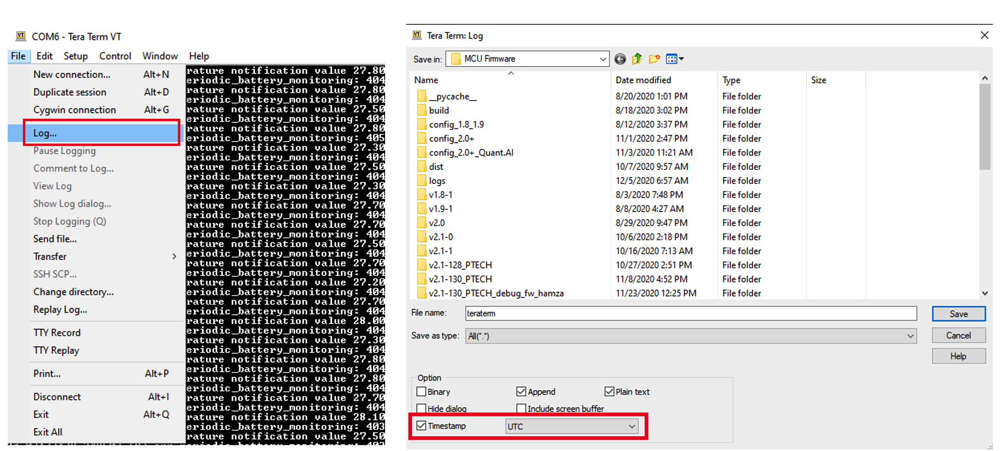

# Using Command Line Interface (CLI)

<iframe width="700" height="500" src="https://www.youtube.com/embed/X_6mVa-eQFY?list=PLrtUhsI_mcGRt8T_WngKRutpymnq2t8Qc" title="YouTube video player" frameborder="0" allow="accelerometer; autoplay; clipboard-write; encrypted-media; gyroscope; picture-in-picture" allowfullscreen></iframe>

All the Abeeway trackers are equipped with USB port that can be connected with **USB Data cable** to connect the trackers to [Tera Term](https://ttssh2.osdn.jp/index.html.en) or similar serial port communication application. This can be very useful for debugging purposes under the following scenarios:

1. Recover the firmware version of the tracker
2. Reset the tracker
3. Get the logs to send the support team.
4. Inspect the behavior of the feature from the CLI traces

## Here are the main steps to use CLI:
:::warning WARNING
* The USB port for Compact/Industrial tracker is inside the casing which needs to be opened to access it.
* The instructions below are for MCU Firmware version 2.2 and above. If you are using older MCU firmware version or need an overview of full feature set of CLI commands, please refer to [CLI Usage Training](https://actilitysa.sharepoint.com/:f:/t/aby/EgxRhivJUIVNrq1Lwa3qBigBip9FcMMHhBD_ZaA9m8IT6w?e=WLr48X)
* There is also more detailed application note on CLI Usage which is available here, [AN-013_CLI_Description](../../D-Reference/DocLibrary_R/AbeewayTrackers_R.md#application-notes)
* If there are issues connecting to USB port, please ensure you are using USB data cable and connect the tracker to different computer to check if the USB port is properly detected. You can find more troubleshooting steps in [Abeeway Updater](https://github.com/Abeeway/Abeeway-updater) (chapter: Troubleshooting the USB port)
* When sending the logs to the support team, please ensure the Tera Term(CLI) traces are timestamped with UTC or local time. See [CLI Usage Training](../../D-Reference/DocLibrary_R/AbeewayTrackers_R.md#abeeway-firmware-trainings) on how to timestamp CLI traces with local/UTC time. This is very useful when correlating the tracker logs with those of Network server uplinks.
:::

1. Connect the tracker to the USB port and open Tera Term to connect to the serial port on which the tracker is connected.
2. The tracker will prompt for the password. The default password is **123**
3. If the password is successful, the CLI will show the traces and can be used to interact with the tracker.

Here is the list of most important commands and their purpose:

| CLI command                                 | Description                                                                                                                                                                                                                                                                                                                                                                   | 
|---------------------------------------------|-------------------------------------------------------------------------------------------------------------------------------------------------------------------------------------------------------------------------------------------------------------------------------------------------------------------------------------------------------------------------------| 
| ?                                           | Displays all the available commands                                                                                                                                                                                                                                                                                                                                           |
| system info                                 | Retrieve MCU Firmware version                                                                                                                                                                                                                                                                                                                                                 |
| ble info                                    | Retrieve information about BLE Firmware                                                                                                                                                                                                                                                                                                                                       |
| system reset                                | Reset MCU Firmware to trigger JOIN procedure                                                                                                                                                                                                                                                                                                                                  |
| config show                                 | Display the configuration of existing firmware parameters                                                                                                                                                                                                                                                                                                                     |
| lora deveui                                 | Display LoRaWAN devEUI of the tracker                                                                                                                                                                                                                                                                                                                                         |
| ble clear                                   | Remove the BLE bond on the tracker                                                                                                                                                                                                                                                                                                                                            |
| system boot                                 | Enter MCU Bootloader to upgrade MCU Firmware (We do not recommend to this. Please use Abeeway Updater to do MCU firmware update)                                                                                                                                                                                                                                              |
| ble bootloader                              | Enter the BLE bootloader to do BLE firmware update                                                                                                                                                                                                                                                                                                                            |
| system mode motion                          | To change the value of parameter, mode = motion_tracking                                                                                                                                                                                                                                                                                                                      |
| config save                                 | To save the firmware configuration in flash. This is required to preserve firmware settings across device resets.  The configuration on the tracker is saved across power on/off of the device.  **The flash lifetime is limited so, please do not write too many times into the flash during the testing. The warranty of the tracker is void if used incorrectly.** |
| config set `&lt;**parameter_ID**&gt; &lt;**value**&gt;` | Change the parameter value. For ex, **config set 1 500** will change the value of Parameter ID (1) (lora_period) to 500. The parameter ID can be found from [Abeeway trackers reference guide](../../AbeewayRefGuide/downlink-messages/parameters-configuration/)                                                                                                             |
| gnss show `<gps, beidou="">`                   | Read the GPS or Beidou almanac status of constellation                                                                                                                                                                                                                                                                                                                        |
| sys accelero show                           | It shows the accelerometer chip used in the tracker along with other statistics such as cumulative motion duration                                                                                                                                                                                                                                                            |

## Reporting CLI traces on our support portal
It is important that the tracker logs are captured in a trace file with the absolute timestamp of your PC or UTC. This is required to correlate the traces from the tracker to those of LoRaWAN uplinks. The timestamps from Tera term can be enabled as shown in the image below.

