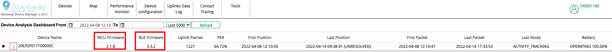
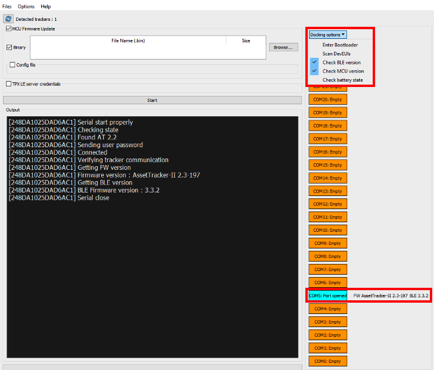
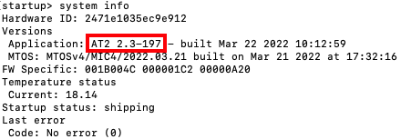
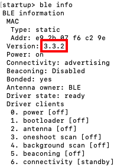
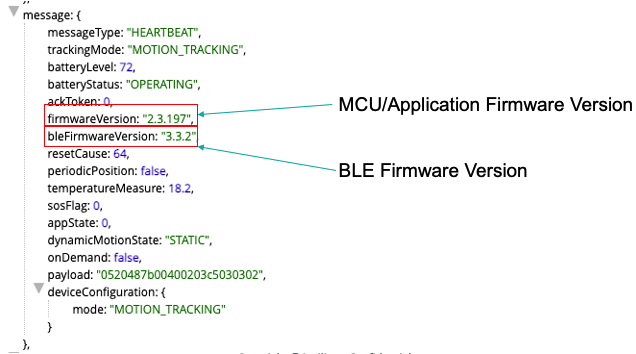

# Identifying the Firmware version installed on the tracker

There are two main firmware installed on the tracker. One is called MCU/Application firmware and another is BLE Firmware. It is important to be aware of the firmware versions installed on the tracker to refer the correct documentation. 
:::warning Important
* All the application notes and Abeeway trackers reference guide are always w.r.t. the MCU/Application firmware installed on the tracker
:::

Here are the different methods to identify firmware installed on the tracker.

## Method 1 (Delivery note):
If the tracker was purchased from Actility/Abeeway or [Marketplace](https://market.thingpark.com/), the delivery note usually contains the MCU/BLE Firmware version.

## Method 2 (Abeeway Device Manager):

<html>

If the tracker is connected to ThingPark X Location Engine and has already sent heartbeat uplink messages, then the <a href="/B-Feature-Topics/AbeewayDeviceManager_C/" >Abeeway device manager</a> already shows the MCU Firmware and BLE Firmware Version.

</html>

:::warning Important
* This information is based on the last uplinks sent from the tracker.
:::

The tracker example in figure below has **MCU Firmware Version: 2.1.8** and **BLE Firmware Version: 3.3.2** 

## Method 3 (Abeeway Updater):
[Abeeway updater](../../D-Reference/AbeewayFirmwareUpdate_R/) is very useful firmware update tool that can also be ued to retrieve the MCU/BLE Firmware version. You can connect the tracker over USB port with a computer and retrieve firmware version based on the options that can be selected on **Docking options** panel. 

:::warning Important
* The tracker must be connected with the **USB data cable** for this operation.
* If for some reason, USB port is not detected, refer to [Chapter: Troubleshooting the USB port, Abeeway updater](https://github.com/Abeeway/Abeeway-updater) 
:::

In the example below, the MCU Firmware version is **2.3-197** and BLE Firmware version is **3.3.2**

## Method 4 (CLI over USB):
The tracker can be connected to the USB port and a serial terminal tool like [Tera Term](https://ttssh2.osdn.jp/index.html.en) can be used to communicate with the tracker over USB port. For more details on CLI feature, please refer to [CLI Usage training](../../D-Reference/DocLibrary_R/AbeewayTrackers_R.md#abeeway-firmware-trainings)

:::warning Important
 * The tracker must be connected the USB data cable for this method to work
 * The instructions below are only valid if the tracker is running MCU Firmware &gt;= 2.2. For older Firmware versions, please refer to [CLI Usage Training](https://actilitysa.sharepoint.com/:f:/t/aby/EgxRhivJUIVNrq1Lwa3qBigBip9FcMMHhBD_ZaA9m8IT6w?e=WLr48X)
 * If for some reason, USB port is not detected, refer to [Chapter: Troubleshooting the USB port, Abeeway updater](https://github.com/Abeeway/Abeeway-updater) 
:::

1. Connect the tracker over USB port and open [Tera Term](https://ttssh2.osdn.jp/index.html.en) or any other Serial application that can communicate over USB port. 

2. Identify the correct serial port by running [Abeeway updater](../../D-Reference/AbeewayFirmwareUpdate_R/). In the example below, the serial port is COM5

[//]: # (![img]&#40;../../C-Procedure-Topics/FindFirmwareVersion_R/images/retrieve_fw_abw_updater.png&#41;)
:::warning Important
 * Abeeway updater must be closed before interacting with the tracker using Tera term or any other application. The device cannot interact with two serial applications at the same time.
 * The serial port can also be identified in Windows device manager by plugging/unplugging the device from USB port. 
:::

3. The tracker will prompt for the password. The default password is **123**.

4. The example request to enter on Tera term console is **system info** to retrieve the MCU Version information. In the example below, the MCU Firmware Version is **2.3-197**

5. The example request to enter on Tera term console is **ble info** to retrieve the BLE Version information. In the example below, the BLE Firmware Version is **3.3.2**

## Method 5 (Decoding LoRaWAN heartbeat uplinks)

The tracker sends heartbeat uplinks periodically which also include the MCU and BLE Firmware version information. The payloads can be decoded using [Asset Tracker Driver](../../../integrating-your-application-with-thingpark-location/UseAbeewayDriver_T/).

In the example below, the MCU Firmware Version is **2.3.197** and BLE Firmware version is **3.3.2**.

