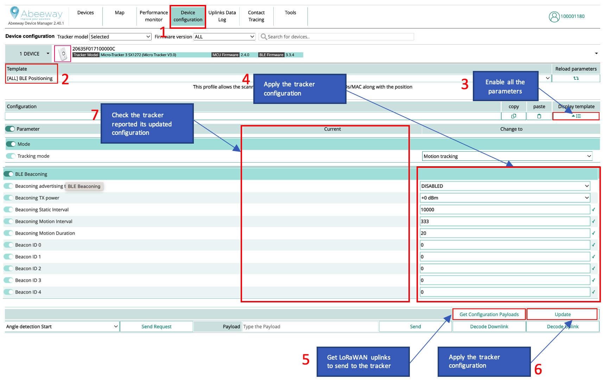

# Using Abeeway trackers as Bluetooth beacons

This section describes step by step procedure to use Abeeway trackers to transmit bluetooth beacons. Abeeway trackers can transmit the following beacon types:
- Quuppa
- AltBeacon
- Eddystone UUID
- iBeacon
- Proximity (This feature is available only until MCU FW 2.3.x and below)

We assume that the tracker is already connected to LoRaWAN network server and the LoRaWAN uplinks are routed to ThingPark Location (see [here](/getting-started/provisioning-your-trackers-on-lorawan-networks/index.md) for more details).

## Tracker Placement
It is important that the tracker is placed without any obstructions (for ex. human body, metallic objects, etc) blocking the Bluetooth antenna. The tracker placement instructions are below:
1. [Micro Tracker](/trackers-overview/micro-tracker/micro-tracker-best-placement.md)
2. [Smart Badge](/trackers-overview/smart-badge/smart-badge-best-placement.md)
3. [Industrial Tracker](/trackers-overview/industrial-tracker/index.md)
4. [Compact Tracker](/trackers-overview/compact-tracker/compact-tracker-best-placement.md)
5. [Industrial Manageable ATEX Beacon](/trackers-overview/industrial-manageable-atex-beacon/beacon-best-placement.md)

## Tracker Firmware versions
We highly recommend to update the tracker to the latest [MCU and BLE Firmware version](/troubleshooting-support/identify-tracker-model.md). The firmware update instructions are [here](/troubleshooting-support/firmware-update-overview/index.md).

## Configuring the tracker using Abeeway Device Manager (ADM)

The next step is to configure the tracker with the right parameters using Abeeway Device Manager (ADM). 

Here are the steps:

1. Goto Device Configuration tab.
2. Select the **BLE beaconing** template. If this template is not available, then you can enable all the firmware parameters in step 3 and proceed to the next steps
3. Enable all the firmware parameters.
4. Apply the necessary BLE beaconing parameters. For more information on the BLE beaconing parameters, see [BLE Beaconing training](/documentation-library/abeeway-trackers-documentation.md#abeeway-firmware-trainings) and [AN-019_BLE Beacon transmission](/documentation-library/abeeway-trackers-documentation.md#application-notes)
5. Get the LoRaWAN configuration payloads that can be sent on LoRaWAN port = 2 with the network server. This step is not required when using Abeeway Device manager to send LoRaWAN downlinks.
6. Apply the tracker configuration which will result in multiple downlinks.
7. Ensure the tracker configuration is applied correctly. The tracker will send the uplinks to indicate its tracker configuration which will be visible in Abeeway Device Manager.

:::warning Note
Even if you plan to use your own location solver, we recommend to use ThingPark X Location Engine (TPX-LE) when preparing your tracker for first use for the following reasons:
- **Support for Low-Power GPS (LP-GPS) feature which allows faster GNSS fix with much lower power consumption on the tracker.**
- Support for averaging and filtering of positions with multiple geolocation technologies (GPS/LP-GPS/WiFi/Bluetooth) in the backend to remove outliers.
- Visualizations of positions in the map with various filtering options using [Abeeway Device Manager](//trackers-overview/abeeway-device-manager/index.md).
- Easily change the tracker's configuration with pre-configured templates using [Abeeway Device Manager](/trackers-overview/abeeway-device-manager/change-tracker-configuration.md). 
- The tracker configuration can also be changed using [ThingPark Location APIs (Downlink tracker command)](https://dx-api.thingpark.io/location-trackercommand/latest/doc/index.html). Note: The URL is for ThingPark Location on Community platform. For other platforms, see [here](/troubleshooting-support/thingpark-location-urls.md).
:::

## Beacon Configuration considerations

:::warning Warning
**Please review the section: Beacon settings &amp; Calibration in [BLE Position Filtering training](/documentation-library/abeeway-trackers-documentation.md#abeeway-firmware-trainings) to ensure the trackers and beacons are correctly configured. Faulty beacon or tracker configuration will result in incorrect location resolution from Thingpark location or with third party solver.**
:::

### Beacon Advertising interval

The beacon advertising interval has direct impact on:

- Battery lifetime: a smaller value of advertising interval will consume the battery of beacon faster
- Latency of detection: Larger advertising duration results in larger latency for beacon detection, but also improves the battery lifetime of the beacon.  

In order to ensure that the beacon is correctly detected by the tracker when the tracker is sniffing the beacon, you must ensure  the following condition:

`*Beacon_advertising_interval &lt;&lt; ble_beacon_timeout*` 
In general, you can set *beacon_advertising_interval = ble_beacon_timeout/10*

We highly recommend to use the same Advertising Interval value on all the beacons.

### Beacon transmit power

We highly recommend to use the same beacon transmit power on all the beacons.

## Using Abeeway trackers to sniff BLE beacons for indoor geolocation

If you wish to use Abeeway trackers to sniff BLE beacons for indoor geolocation, please follow the instructions [here](./use-case-ble-indoor-geolocation.md).

